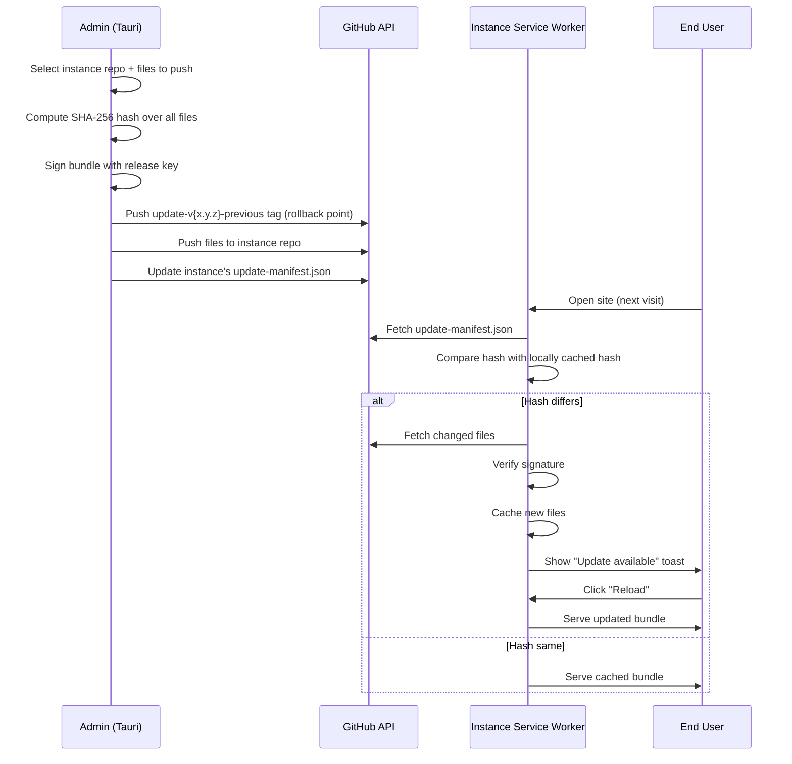

# Bundle Updates

Osler has a two-tier update system. **Tier 1** is the admin dashboard
self-update (covered in [Settings](settings.md)). **Tier 2** — covered on
this page — pushes engine and content updates to already-deployed Osler
instances without regenerating the entire site bundle.

## When to use Tier 2 updates

Use Tier 2 when:

- You shipped a bug fix to an engine (e.g., `quiz-engine.js` had a scoring
  bug) and want to push it to all deployed instances without rebuilding each
  site.
- You added new content items to the content repo and want to push them to
  instances that already have the bundle.
- You patched the service worker or shared lib (`src/lib/*.js`).

Use full regeneration instead when:

- You're changing which engines a site includes (add/remove an engine).
- You're changing the theme, auth mode, or deploy target.
- You're bumping the schema version (Tier 2 cannot migrate content schema).
- You're pushing a major V2 → V3 cutover.

## How Tier 2 works



The key invariants:

1. **The rollback tag is pushed BEFORE the new files.** If the push fails
   midway, the instance is in a weird state but the previous tag is intact —
   the admin can roll back.
2. **The SHA-256 hash is computed over all files in the bundle, not just the
   changed ones.** This catches partial pushes.
3. **The signature is verified by the service worker before applying.** If
   the signature doesn't match (e.g., a MITM attack), the SW refuses the
   update.
4. **Updates are lazy-applied on next visit.** Users who don't visit stay on
   the old version until they do.

## The Push Update UI

The admin's **Updates** tab has:

1. **Instance picker** — dropdown of GitHub repos the admin has write access
   to (filtered to those with an `update-manifest.json` in the root).
2. **File picker** — multi-select of files to push. Defaults to all changed
   files since the last push.
3. **Version field** — semantic version for this update (e.g. `1.2.4`).
4. **Release notes** — markdown, shown to users in the "Update available"
   toast.
5. **Push button** — runs the push flow.
6. **Status panel** — shows progress: hash computed, signed, tag pushed,
   files pushed, manifest updated.

## Pushing an update

1. Go to **Updates**.
2. Pick the instance from the dropdown.
3. Select the files to push (or click **Select all changed**).
4. Enter the new version (must be higher than the current version).
5. Enter release notes.
6. Click **Push update**.

The admin:

1. Computes SHA-256 over the selected files.
2. Signs the bundle with the release key (configured in
   `tauri.conf.json` → `plugins.updater.pubkey`).
3. Pushes the `update-v{current}-previous` tag to the instance repo.
4. Pushes the files to the instance repo (in a single commit).
5. Updates `update-manifest.json` in the instance repo with the new version,
   hash, and file list.
6. Reports success or failure.

If any step fails, the admin rolls back the partial push (deletes the
rollback tag, restores the previous file state) and reports the error.

## Verifying an update

After pushing, you can verify the update landed:

```bash
# In the instance repo
git pull
cat update-manifest.json
# Verify: version, bundleHash, files list match what you pushed
```

Or use the admin's **Verify** button on the Updates tab, which fetches the
instance's `update-manifest.json` and compares it to the local manifest.

## Rolling back an update

If an update is broken (e.g., a pushed engine file has a runtime bug), roll
back:

1. Go to **Updates** → **History**.
2. Pick the instance.
3. Find the update to roll back.
4. Click **Roll back**.

The admin:

1. Reads the `update-v{previous}-previous` tag from the instance repo.
2. Resets the instance repo to that tag.
3. Pushes a new commit with the previous file state.
4. Updates `update-manifest.json` with the previous version + hash.
5. Users see the rollback on next visit (the SW detects the hash change and
   re-fetches).

The last 5 updates per instance are kept in the history. Older updates are
pruned.

## Service worker behavior

The deployed instance's service worker (`sw.js`) handles updates as follows:

1. On every page load, the SW fetches `update-manifest.json` (with
   `cache: 'no-cache'`).
2. Compares the manifest's `bundleHash` with the locally stored hash (in
   IndexedDB, `meta` store).
3. If the hashes match, the SW serves the cached bundle (offline-first).
4. If the hashes differ, the SW:
   a. Fetches the new `files` list from the manifest.
   b. For each file, fetches it (with `cache: 'no-cache'`).
   c. Verifies the file's SHA-256 against the manifest's per-file hash.
   d. Verifies the bundle signature against the configured pubkey.
   e. If all checks pass, writes the new files to the Cache Storage API.
   f. Updates the locally stored hash.
   g. Posts a message to the page: `{ type: 'UPDATE_AVAILABLE' }`.
5. The page shows a toast: "Update available — reload to apply."
6. On reload, the SW serves the new bundle.

If any verification step fails, the SW logs the error and falls back to the
cached bundle. The user is not notified of failed updates (silent failure is
preferred over a broken update).

## Configuring the signing key

Bundle signing requires a release key. If you haven't generated one:

```bash
cargo install tauri-cli
cd tauri-admin
cargo tauri signer generate -w ~/.osler/osler-updater.key
# Enter a password (store it in your password manager)
```

This produces:

- `~/.osler/osler-updater.key` — the private key (KEEP SECRET, NEVER COMMIT)
- A public key printed to stdout

Paste the public key into `tauri-admin/tauri.conf.json`:

```json
"plugins": {
  "updater": {
    "pubkey": "PASTE_PUBLIC_KEY_HERE",
    ...
  }
}
```

In CI, set these secrets:

- `TAURI_SIGNING_PRIVATE_KEY` — path to the private key file (or the key
  content base64-encoded)
- `TAURI_SIGNING_PRIVATE_KEY_PASSWORD` — the password you chose

Without these, the admin will refuse to push signed updates, and deployed
instances will refuse to apply unsigned updates.

## Common issues

### "Signature verification failed" on the instance

The instance's `tauri.conf.json` pubkey doesn't match the signing key. Either:

- The instance was deployed before the signing key was configured.
- The signing key was regenerated but the instance wasn't updated.

Fix: redeploy the instance with the current `tauri.conf.json`.

### "Hash mismatch" on push

One of the files changed between hash computation and push. This is rare
(usually means another admin pushed in parallel). Re-run the push — the
admin will recompute the hash.

### Instance not appearing in the dropdown

The admin filters the repo list to those with `update-manifest.json` in the
root. If your instance repo doesn't have one, either:

- It was deployed before the manifest existed (V1 instances from before
  Phase 7).
- It's a non-Osler repo.

Fix: regenerate the site bundle (which writes `update-manifest.json`) and
redeploy.

## What's next

- [Settings](settings.md) — signing key configuration.
- [Architecture → Security Model](../architecture/security-model.md) — full
  update security details.
- [Operations → Incident Response](../operations/incident-response.md) — what
  to do when an update breaks.
