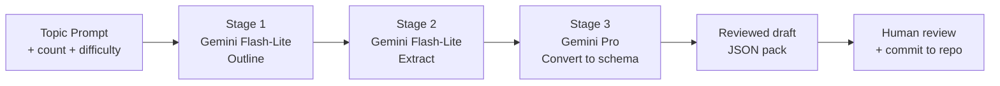

# AI Content Generation

Osler V1 ships a 3-stage Gemini pipeline for generating draft content from a
topic prompt. V2 preserves this pipeline unchanged. The pipeline lives in
`src/lib/content-gen.js` and is invoked from the admin dashboard's
**Generate** tab.

## The 3-stage pipeline

The pipeline uses three Gemini model calls in sequence, each with a specific
role. The stages are designed to maximize quality while controlling cost —
cheap models do the broad work, the expensive model does the final conversion.



### Stage 1 — Outline (Gemini Flash-Lite)

**Input:** topic (e.g. "cardiac arrhythmias"), count (e.g. 20), difficulty
(easy/medium/hard), content type (quiz/bank/flashcard/written/osce).

**Output:** a structured outline — for a quiz, this is a list of question
stems without options or answers. For flashcards, it's a list of front
prompts. For OSCE, it's a list of case scenarios.

**Model:** Gemini Flash-Lite (the cheapest model, fastest inference). This
stage is broad-generation — quality matters less here, coverage matters more.

**Cost:** ~$0.001 per call (10x cheaper than Pro).

### Stage 2 — Extract (Gemini Flash-Lite)

**Input:** the outline from Stage 1, plus the topic context.

**Output:** for each outline item, the model extracts the correct answer, 3-4
distractors (for multiple choice), and a brief explanation. Still using
Flash-Lite because the work is mechanical — extract facts, don't synthesize.

**Cost:** ~$0.002 per call.

### Stage 3 — Convert (Gemini Pro)

**Input:** the extracted items from Stage 2, plus the target JSON Schema.

**Output:** a validated JSON pack matching the schema exactly. Gemini Pro
handles the schema-mapping work — it's better at structured output than
Flash-Lite.

**Cost:** ~$0.01 per call (5-10x more expensive than Flash-Lite, but only
called once per generation batch).

**Total cost per 20-item quiz:** ~$0.015. At the daily cap of $20, you can
generate ~1,300 items per day. At the monthly cap of $200, ~13,000 items per
month.

## Cost caps

`src/lib/content-gen.js` exports:

```javascript
export const DAILY_CAP = 20;    // USD per day
export const MONTHLY_CAP = 200; // USD per month
```

The admin dashboard imports these constants and tracks spend in
`tauri-plugin-store` (under `gemini-spend/{date}`). If a generation would
exceed the daily or monthly cap, the admin refuses the call and shows a
message:

> Generation blocked: would exceed daily cap ($18.50 / $20.00 used). Try
> again tomorrow or adjust the cap in Settings.

Caps are conservative — they protect against runaway costs from a typo'd
prompt or a runaway loop. Adjust them in **Settings** → **AI Generation** if
you need higher throughput.

## The Generate tab

The admin's **Generate** tab has a single form:

| Field | Type | Description |
|-------|------|-------------|
| Topic | text | Free-text topic (e.g. "cardiac arrhythmias", "renal physiology") |
| Content type | select | quiz / bank / flashcard / written / osce |
| Count | number | 1-50 items per generation |
| Difficulty | select | easy / medium / hard |
| Language | select | en / ar / mixed (V2 — author writes prompt in target language) |
| Additional context | textarea | Optional: textbook chapter, learning objectives, target audience |

Click **Generate**. The admin:

1. Validates inputs (count in range, topic non-empty).
2. Checks cost caps.
3. Calls Stage 1 (Flash-Lite outline).
4. Streams Stage 1 output to the UI (so you can see the outline forming).
5. Calls Stage 2 (Flash-Lite extract).
6. Streams Stage 2 output.
7. Calls Stage 3 (Pro convert).
8. Validates the final JSON against the schema.
9. Opens the result in the content editor for human review.

You can cancel mid-pipeline (the cancel button calls `AbortController.abort()`
on the fetch). Partial results are not saved.

## Human review is mandatory

The pipeline produces **drafts**, not finished content. The admin opens the
result in the content editor with a yellow "AI-generated — needs review"
banner. You must:

1. Read every item.
2. Verify factual accuracy (especially medical claims — Gemini hallucinates).
3. Rewrite awkward phrasing.
4. Remove duplicates.
5. Add or improve explanations.
6. Tag with appropriate metadata (tags, difficulty, estimated time).
7. Save (commits to the content repo).

Until you save, the draft lives in `tauri-plugin-store` under
`ai-drafts/{topic}-{timestamp}`. Drafts auto-expire after 7 days.

## Limitations

The pipeline has known limitations:

- **Hallucination** — Gemini can produce plausible-sounding but incorrect
  medical facts. Always verify against a trusted source (UpToDate, Harrison's,
  Robbins, etc.) before committing.
- **Repetition** — at high counts (>30), the model repeats questions with
  minor rewording. Generate in batches of 10-20 for best diversity.
- **Schema strictness** — Stage 3 (Pro convert) occasionally produces JSON
  that validates but is semantically wrong (e.g., a "select all that apply"
  question with only one correct option). Review for semantic correctness,
  not just schema correctness.
- **Bias** — Gemini's training data is US-centric. Cases may not reflect
  epidemiology or standard-of-care in other regions. Adjust as needed.
- **AR content** — V2 does NOT auto-translate. To generate AR content, write
  the prompt in Arabic. Stage 1 and 2 produce Arabic output; Stage 3 still
  produces schema-valid JSON. Quality is lower than English (less training
  data) — review extra-carefully.

## Anti-goals

The pipeline does NOT:

- **Generate audio or TTS** — no audio is produced. (V2 anti-goal §5.8)
- **Translate content** — no EN→AR or AR→EN translation. (V2 anti-goal §5.7)
- **Optimize spaced repetition** — SM-2 (V1) stays. No ML model. (V2 anti-goal
  §5.10)
- **Act as a tutor** — the AI tutor (Phase 12) is a separate chat modal,
  scoped to the current item, with no RAG. This pipeline is for content
  generation only.
- **Curate or filter** — generated content goes straight to the editor for
  human review. There is no automated curation.

## Configuring the Gemini API key

The admin uses the same Gemini API key as the PWA. Configure it in
**Settings** → **AI Generation** → **Gemini API key**. The key is stored in
the OS keychain (not in `tauri-plugin-store`).

If you don't have a key, get one from
[aistudio.google.com/app/apikey](https://aistudio.google.com/app/apikey).
The free tier covers ~50 generations per day.

## What's next

- [Content CMS](content-cms.md) — where generated content lands after review.
- [AI Tutor → Overview](../ai-tutor/overview.md) — the separate Phase 12
  tutor (chat modal, not generation).
- [AI Tutor → Cost Caps](../ai-tutor/cost-caps.md) — how the cost caps work
  for both generation and tutor.
