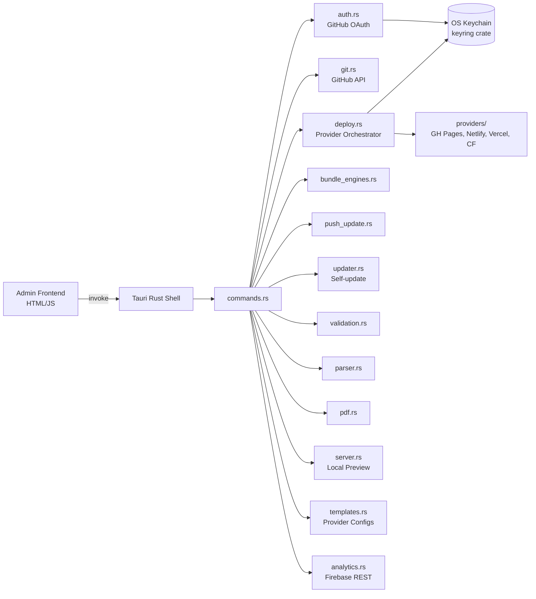

# Admin Dashboard Overview

The Osler Admin Dashboard is a Tauri v2 desktop application (Rust shell +
HTML/JS frontend) that serves as the single entry point for content authoring,
site generation, and deployment. V1 shipped the admin as a CMS for GitHub-hosted
content; V2 extends it into a full site generator wizard with deploy-target
integrations.

## What the admin does

The admin dashboard is the only way to:

1. **Author admin-managed content** — quiz, bank, flashcard, written, and OSCE
   JSON files are created and edited here, then committed to a GitHub content
   repo via the GitHub API.
2. **Generate AI content** — a 3-stage Gemini pipeline (Flash-Lite outline →
   Flash-Lite extract → Pro convert) produces draft content packs from a
   topic prompt, ready for human review.
3. **Generate site bundles** — the V2 wizard picks engines, content, theme,
   auth mode, and deploy target, then assembles a deployable zip.
4. **Deploy to hosting providers** — one-click deploy to GitHub Pages,
   Netlify, Vercel, or Cloudflare Pages. Credentials stored in OS keychain.
5. **Push engine updates** — Tier 2 updates push new engine bundles to already
   deployed instances without regenerating the whole site.
6. **Self-update** — Tier 1 updates check GitHub releases for new admin
   versions, download, verify, and swap.

## Architecture



The frontend (`tauri-admin/frontend/`) is plain HTML + vanilla JS, served by
Tauri's custom protocol (`osler-admin://localhost/`). It calls Rust functions
via `window.__TAURI__.invoke('command_name', args)`. The Rust side exposes
~30 commands registered in `lib.rs`.

## Capabilities

The admin dashboard can:

- Sign in with GitHub (Device Flow) — token stored in OS keychain
- Sign out (clears keychain entry)
- List the user's GitHub repos (for picking the content repo)
- Create / read / update / delete content files in the content repo
- Run the 3-stage Gemini pipeline with topic + count + difficulty inputs
- Validate content against schemas (mirrors `src/lib/validate.js` in Rust)
- Bundle a chosen subset of engines + content into a deployable zip
- Compute SHA-256 hash over all bundle files
- Sign the bundle with the release key (if configured)
- Deploy to GitHub Pages / Netlify / Vercel / Cloudflare Pages
- Roll back to any of the last 5 deployments per provider
- Push Tier 2 engine updates to deployed instance repos
- Check GitHub releases for new admin versions
- Download, verify (SHA-256), and apply self-updates
- Open a local preview server on `localhost:5500` with the generated bundle
- Export content as PDF (via `scripts/pdf_generator.py` subprocess)
- Export content as Anki CSV (via `src/lib/anki.js`)
- Configure Firebase service account (Settings page)
- Configure provider credentials (Settings page, stored in keychain)
- Toggle auto-update check (Settings page)

## What the admin cannot do

Per V2 anti-goals:

- Cannot deploy to AWS / GCP / Azure
- Cannot manage custom domains (use provider dashboards)
- Cannot push content to a public registry (file-based sharing only)
- Cannot run the AI tutor (the tutor is PWA-only, scoped to the current item)
- Cannot author user custom content (that's the PWA's job, in IndexedDB)
- Cannot run real-time collaboration (single-author model)

## Admin app versioning

The admin app has its own version (`5.1.0` at V1 ship, bumped independently
from the PWA's version). The version lives in:

- `tauri-admin/Cargo.toml` → `version`
- `tauri-admin/tauri.conf.json` → `version`
- `tauri-admin/tauri.conf.json` → `productName` (display name)

The admin's self-updater checks `api.github.com/repos/osler-app/osler/releases/latest`
for new versions. When a new release is found, the user is prompted to update.
The update is downloaded, SHA-256 verified, and the binary is swapped on next
launch.

See [Settings](settings.md) for the auto-update toggle and
[Bundle Updates](bundle-update.md) for the Tier 2 update mechanism.

## Opening the admin

After [installation](installation.md):

```bash
# Linux
./osler-admin

# macOS
open /Applications/Osler\ Admin.app

# Windows
C:\Program Files\Osler Admin\Osler Admin.exe
```

On first launch, the admin prompts for GitHub sign-in (Device Flow). Open
the displayed URL in a browser, enter the 8-digit code, and authorize. The
token is exchanged once and stored in the OS keychain — subsequent launches
skip the sign-in step.

## Admin dashboard layout

The admin dashboard window has a left sidebar with these tabs:

| Tab | Purpose |
|-----|---------|
| **Dashboard** | Overview cards: # of content items, # of deployed sites, recent activity |
| **Content** | List of admin-managed content, with create/edit/delete actions |
| **Generate** | 3-stage AI content generation pipeline |
| **Sites** (V2) | List of generated site bundles + the wizard |
| **Deploy** (V2) | Per-provider deploy page: pick provider, enter credentials, deploy |
| **Updates** | Tier 2 bundle push UI |
| **Analytics** | Firebase Analytics aggregation (requires service account) |
| **Settings** | Credential management, auto-update toggle, Firebase config, theme |

The V2 wizard (Sites tab) is the new headline feature — see
[Site Generation → Wizard](../site-generation/wizard.md).

## What's next

- [Installation](installation.md) — install or build the admin from source.
- [Content CMS](content-cms.md) — the GitHub CMS workflow.
- [AI Content Generation](content-generation.md) — the 3-stage Gemini pipeline.
- [Bundle Updates](bundle-update.md) — Tier 2 engine update pushes.
- [Settings](settings.md) — credential management and configuration.
