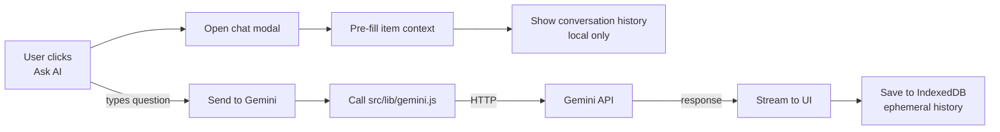

# AI Tutor Overview

The Osler V2 AI tutor (Phase 12) is a lightweight chat modal scoped to the
current study item. It pre-fills the item context (question + options +
correct answer + explanation) and lets the user ask follow-up questions,
which are answered by Gemini.

This page describes the tutor's design, what it does, and what it
explicitly does NOT do.

## What the tutor is

The tutor is a slide-out chat modal that appears on every quiz question,
bank item, flashcard card, written prompt, and OSCE stage. It pre-fills
the item context, so the user can ask:

- "Why is option B wrong?"
- "Can you explain the mechanism in more detail?"
- "What's the clinical relevance of this?"
- "Give me an example of this in practice."

The tutor responds using Gemini, with the current item as context. No RAG,
no embeddings, no vector database — just the current item.

## What the tutor is NOT

V2 explicitly limits the tutor (anti-goal §5.13 — "No general-purpose
chatbot. AI tutor is scoped to the current item"):

- **Not a general-purpose chatbot.** The tutor cannot answer questions
  unrelated to the current item. If the user asks "What's the weather in
  Cairo?", the tutor declines: "I can only answer questions about the
  current item."
- **Not a RAG system.** No embeddings, no vector search, no retrieved
  context from other items. The tutor sees only the current item.
- **Not a content generator.** The tutor cannot create new content items.
  Use the [AI Content Generation pipeline](../admin-dashboard/content-generation.md)
  for that.
- **Not conversation-synced.** Conversation history is local-only
  (IndexedDB). It does NOT sync to Firestore. Each device has its own
  history.
- **Not an SR optimizer.** The tutor doesn't adjust the SM-2 algorithm.
  SM-2 (V1) stays as the spaced-repetition algorithm.
- **Not a TTS engine.** The tutor produces text only. No audio.
- **Not a translation tool.** The tutor responds in the language the user
  writes in (or English by default). No auto-translation.

## Architecture



The tutor consists of:

- `src/lib/tutor.js` (V2 — Phase 12) — the API. Exports
  `askTutor(question, itemContext, history)`.
- A chat modal UI component — slide-out panel, message list, input box.
- An "Ask AI" button on every engine page (visible when Firebase mode is
  on and a Gemini API key is configured).
- IndexedDB storage for conversation history (in the `tutorHistory` store).

## The system prompt

The tutor uses a fixed system prompt:

```
You are a medical education tutor. The student is looking at this item:

{item context — type, question, options, correct answer, explanation}

Answer their question. If the answer isn't clear from the item, use your
general medical knowledge but say so. Stay focused on the current item —
if the student asks about something unrelated, politely decline.

Keep responses concise (3-5 sentences). Use markdown for structure.

If you're uncertain, say "I'm not sure" — do not hallucinate medical
facts.
```

The item context is JSON-serialized and inserted into the prompt:

```json
{
  "type": "quiz",
  "question": "A 65-year-old male presents with palpitations...",
  "options": [...],
  "correctAnswer": "Atrial fibrillation",
  "explanation": "The absence of P waves..."
}
```

## Cost caps

The tutor reuses the same cost caps as the content generation pipeline
(see [Cost Caps](cost-caps.md)):

- `DAILY_CAP = $20` — total Gemini spend per day (generation + tutor)
- `MONTHLY_CAP = $200` — total per month

Each tutor call is ~$0.001 (Flash-Lite) to ~$0.01 (Pro) depending on the
model. At $0.005 average, $20/day covers ~4,000 tutor calls per day.

When the cap is hit, the tutor shows a message:

> Daily AI limit reached ($20.00). Try again tomorrow or adjust the cap in
> Settings.

## Conversation history

Conversation history is stored in IndexedDB per item:

```json
{
  "itemUid": "cardio-arrhythmias-001_q1",
  "messages": [
    { "role": "user", "content": "Why is option B wrong?", "timestamp": "..." },
    { "role": "assistant", "content": "Option B (atrial flutter)...", "timestamp": "..." }
  ]
}
```

History is:

- **Local-only** — never synced to Firestore (anti-goal: "conversation
  history sync").
- **Per-item** — each item has its own conversation thread. Switching
  items switches the conversation.
- **Capped at 100 messages per item** (Phase 12 open question §7.4 — the
  cap may be adjusted based on usage).
- **Clearable** — a "Clear history" button in the modal deletes all
  messages for the current item.

## The "Ask AI" button

Every engine page has an "Ask AI" button (bottom-right corner, a chat icon).
The button is:

- **Visible** when Firebase mode is on AND a Gemini API key is configured.
- **Hidden** when Firebase mode is off OR no Gemini key (the tutor can't
  function).
- **Disabled** when the daily cost cap is reached.

Clicking the button opens the chat modal (slide-out from the right in LTR,
from the left in RTL).

## The chat modal

The modal has:

- **Header** — "AI Tutor" + close button + clear history button.
- **Message list** — scrollable, alternating user/assistant bubbles.
- **Item context card** — a collapsible card at the top showing the current
  item (so the user remembers what they're asking about).
- **Input box** — textarea + send button.
- **Thinking indicator** — animated dots while waiting for Gemini.

The modal can be:

- Resized (drag the edge).
- Minimized (collapses to a small floating bubble).
- Closed (clicking outside or pressing Esc).

## Streaming responses

Gemini supports streaming responses. The tutor uses streaming for a
better UX — the user sees the response appear word-by-word instead of
waiting for the full response.

Implementation: `src/lib/gemini.js` exposes `streamChat(messages, onToken)`
which calls Gemini's streaming endpoint and invokes `onToken(text)` for
each chunk. The tutor appends each chunk to the current assistant message.

If streaming fails (network error, Gemini API error), the tutor falls back
to non-streaming and shows the error.

## Error handling

Common errors and how the tutor handles them:

| Error | Tutor response |
|-------|----------------|
| Network error | "I couldn't reach the AI. Check your internet connection." |
| 401 Unauthorized | "Gemini API key is invalid. Ask the admin to check Settings." |
| 429 Too Many Requests | "Rate limited. Please wait a moment and try again." |
| Daily cap reached | "Daily AI limit reached ($20.00). Try again tomorrow." |
| Monthly cap reached | "Monthly AI limit reached ($200.00). Try again next month." |
| Gemini returned empty | "I'm not sure how to respond to that. Try rephrasing?" |
| Item context too large | "This item is too large for me to process. Try a smaller item." (rare) |

All errors are logged to the console with context (`[tutor] ...`). Failed
calls do NOT count against the cost cap (the cap tracks successful API
spend).

## Anti-hallucination measures

Medical hallucination is dangerous. The tutor has multiple safeguards:

1. **System prompt** — explicitly instructs the model to say "I'm not sure"
   when uncertain.
2. **Item-scoped** — the tutor sees the current item with the correct
   answer. It can use the item's explanation as ground truth. If the user
   asks about something not in the item, the tutor is told to use general
   knowledge but flag it.
3. **No external retrieval** — the tutor cannot browse the web or look up
   references. It only has Gemini's training data + the item context.
4. **Concise responses** — the prompt limits responses to 3-5 sentences,
   reducing the chance of fabricating detail.
5. **User feedback mechanism** — a "Report this response" button on every
   assistant message. Reports go to Firebase Analytics as
   `tutor_response_reported` events, monitored by the Osler team.

Despite these measures, the tutor CAN hallucinate. Users are warned in the
modal: "AI responses may be inaccurate. Verify important medical
information with trusted sources."

## What's next

- [Cost Caps](cost-caps.md) — how the cost caps work.
- [Admin Dashboard → AI Content Generation](../admin-dashboard/content-generation.md)
  — the separate 3-stage generation pipeline.
- [Engines](../engines/quiz.md) — where the tutor button appears.
