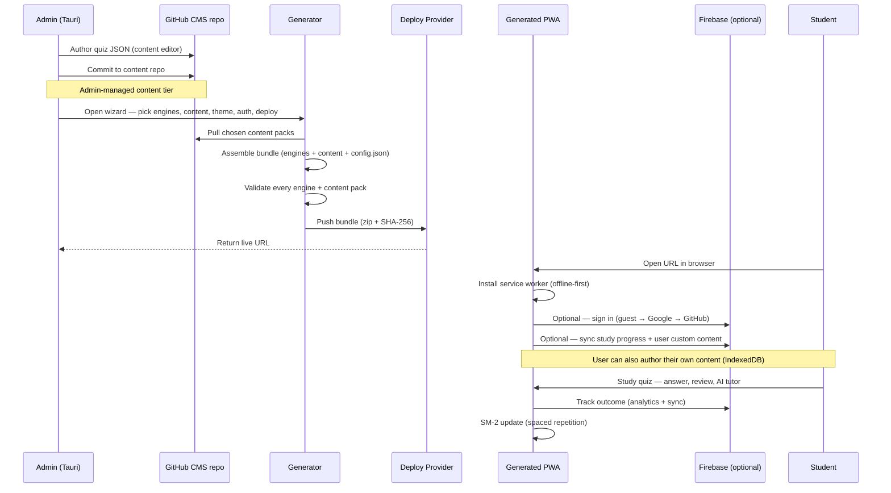

# Data Flow

This page traces how a piece of content moves through the Osler V2 system —
from the moment an educator authors it in the admin CMS, through generation
and deploy, to the moment a student studies it on their device.

## End-to-end flow

## Content tiers

Osler V2 distinguishes two tiers of content. Both are JSON, both validated
against the same schemas, but they have different lifecycles.

### Tier 1 — Admin-managed content

Admin-managed content lives as JSON files in `/content/` in the project
repository. The Tauri admin dashboard's CMS workflow commits these files to a
GitHub repo (the "content repo") via the GitHub API. When the generator
assembles a site bundle, it pulls the chosen content packs from the content
repo and bundles them into the generated site's `/content/` directory.

All users of a generated site see the same admin-managed content. Updates to
admin-managed content require regenerating and redeploying the site bundle
(unless the bundle-update mechanism is used to push content updates to already
deployed instances — see [Bundle Updates](../admin-dashboard/bundle-update.md)).

### Tier 2 — User custom content

User custom content is authored by individual users directly in the PWA. It
lives in the `userContent` IndexedDB store (V1 already provisions this store).
When a Firebase backend is configured, user custom content also syncs to
Firestore at `userContent/{uid}/items/{itemId}` — owner-only read/write per
the security rules.

User custom content is private to each user. It is never bundled into the site
itself. Users can export it as a JSON file (`osler-content-pack-{date}.json`)
and share it offline — email, USB, chat — and recipients import it via the
"Import content pack" button. This is file-based sharing, like Anki decks
today. There is no public registry.

## Sync flow (when Firebase is configured)

Sync is unidirectional per field: the local IndexedDB store is the source of
truth, and Firestore is the replica. The sync layer (`src/lib/sync.js`)
resolves conflicts using one of five strategies, chosen per store:

| Store | Merge strategy | Behavior |
|-------|---------------|----------|
| `quizTracker`, `bankTracker`, etc. | `fieldMergeByUpdatedAt` | Each field is merged independently; the most recent `updatedAt` wins per field. |
| `flashcardTracker` | `sm2Merge` | SM-2 specific — later review wins for review-state fields, but streak counts use `maxStreak`. |
| `streaks` | `maxStreak` | Numeric streak counters take the max across devices. |
| `userContent` items (V2) | `fieldMergeByUpdatedAt` | Same as tracker stores. |
| `events` (analytics log) | `appendOnly` | Never merged — events are appended on both sides. |

For deeper details, see [Firebase → Sync Strategies](../firebase/sync-strategies.md).

## Deploy flow

When the generator wizard finishes assembling a bundle, the admin picks a
deploy target. The deploy step is provider-specific:

- **GitHub Pages** — creates a `gh-pages` branch (orphaned), pushes the bundle
  as the branch root, enables Pages on the repo settings. The site is live at
  `https://{user}.github.io/{repo}/` within ~30 seconds.
- **Netlify** — creates a new site via the Netlify API, uploads the bundle as
  a zip, returns a `*.netlify.app` URL.
- **Vercel** — creates a project, deploys the bundle, returns a `*.vercel.app`
  URL.
- **Cloudflare Pages** — creates a project, deploys the bundle, returns a
  `*.pages.dev` URL.

Each provider module exposes the same contract:
`deploy(bundle_path, credentials) -> Result<Url, Error>`,
`rollback(deployment_id) -> Result<(), Error>`, and
`get_status(deployment_id) -> Result<Status, Error>`.

Credentials are stored in the OS keychain via the `keyring` crate — never in
`tauri-plugin-store` (plain JSON) and never in `localStorage`.

See the [Deployment](../deployment/github-pages.md) section for per-provider
setup instructions.

## Update flow (post-deploy)

Once a site is deployed, the admin can push updates without regenerating the
whole bundle. The bundle-update mechanism (V1 Tier 2) computes a SHA-256 hash
over all bundle files, signs the bundle with the release key, and pushes it
to the deployed instance. The service worker verifies the hash before
applying the update, and a `update-v1.2.3-previous` rollback tag is pushed
before each update.

For details, see [Bundle Updates](../admin-dashboard/bundle-update.md) and
[Architecture → Security Model](security-model.md).

## What's not in scope

The following are explicitly NOT in V2's data flow — see the v2 plan's
[anti-goals](https://github.com/osler-app/osler/blob/main/v2-osler-plan-enhanced.md#5-anti-goals-cross-cutting)
section:

- **No public content registry.** Sharing is file-based (export/import), not
  a hosted index.
- **No real-time collaboration.** Single-author model per content item.
- **No cross-instance sync.** Each Firebase project is isolated.
- **No content translation pipeline.** Authors write AR content themselves if
  they want AR.
- **No audio/TTS generation.** No audio is generated, stored, or played.

## What's next

- [Security Model](security-model.md) — how tokens, credentials, and bundles
  are protected.
- [Admin Dashboard → Content CMS](../admin-dashboard/content-cms.md) — the
  authoring workflow in detail.
- [Site Generation → Wizard](../site-generation/wizard.md) — the 5-step
  generator flow.
