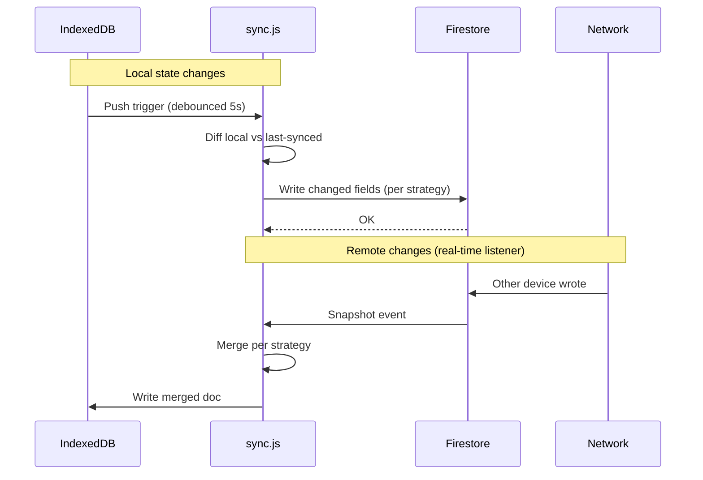

# Sync Strategies

Osler V2's sync layer (`src/lib/sync.js`) synchronizes IndexedDB stores with
Firestore. Sync is **field-level**, not document-level — each field of a
document is merged independently using a strategy chosen per store. This
page documents the five merge strategies and how to add a new one.

## Why five strategies?

Different stores have different conflict-resolution needs:

| Store | Strategy | Why |
|-------|----------|-----|
| Trackers (per-item study state) | `fieldMergeByUpdatedAt` | Each field (e.g. `lastReviewed`, `correctCount`) has its own `updatedAt`; merge per field |
| Flashcard tracker | `sm2Merge` | SM-2 specific — review-state fields use later-review-wins, streak counts use max |
| Streaks (per-type counters) | `maxStreak` | Numeric counters — take the max across devices to avoid data loss |
| User custom content | `fieldMergeByUpdatedAt` | Same as trackers — each field has `updatedAt` |
| Events (analytics log) | `appendOnly` | Never merged — events are appended on both sides |

A single "last-write-wins" strategy would lose data: if device A studies
question 1 and device B studies question 2 simultaneously, last-write-wins
would discard one of the outcomes. Field-level merge preserves both.

## The sync flow



Sync is bidirectional:

- **Push** — local changes are pushed to Firestore with a 5-second debounce.
  The push reads the local IndexedDB doc, computes the diff against the
  last-synced snapshot, and writes only the changed fields.
- **Pull** — a real-time Firestore listener fires on any remote change. The
  merge strategy is applied, and the merged doc is written back to IndexedDB.

Both directions use the same merge strategies, so conflicts are resolved
consistently regardless of which device wrote first.

## Strategy: `appendOnly`

Used for: `events` collection (analytics log).

Behavior: each event is appended to both sides without modification. No
merge logic — if both devices created events, both sets of events are kept.

Implementation: events have a client-generated `eventId` (UUID). The push
writes each new event as a new document. The pull listener adds any unseen
remote events to IndexedDB.

Conflict: none — events are immutable and uniquely identified.

## Strategy: `fieldMergeByUpdatedAt`

Used for: `users/{uid}/trackers/*`, `userContent/{uid}/items/*`.

Behavior: each field in the document is merged independently. For each
field, the version with the most recent `updatedAt` wins.

Document shape (example tracker doc):

```json
{
  "itemId": "quiz-001",
  "correctCount": { "value": 5, "updatedAt": "2026-06-27T10:00:00Z" },
  "wrongCount": { "value": 2, "updatedAt": "2026-06-27T09:00:00Z" },
  "lastReviewed": { "value": "2026-06-27T10:00:00Z", "updatedAt": "2026-06-27T10:00:00Z" }
}
```

(Note: in practice, the tracker doc uses a flat structure with per-field
`{field}_updatedAt` companions. The principle is the same.)

When merging:

1. For each field, compare the local `updatedAt` and remote `updatedAt`.
2. Take the value with the later `updatedAt`.
3. If timestamps are equal, take the remote (server is authoritative on
   timing).

Conflict: a field updated on both devices within the same millisecond is
resolved in favor of the remote. This is rare and the impact is minor (one
update is lost).

## Strategy: `sm2Merge`

Used for: `users/{uid}/trackers/flashcard`.

Behavior: SM-2 specific. The flashcard tracker has fields like:

- `ease` — the easiness factor (float, starts at 2.5)
- `interval` — days until next review (int)
- `reps` — total correct reviews (int)
- `lapses` — total times the card was forgotten (int)
- `due` — next review date (ISO date)
- `lastReviewed` — last review timestamp

Merge logic:

| Field | Strategy | Rationale |
|-------|----------|-----------|
| `ease` | later-review-wins | Ease is recalculated on each review; the latest review is the most accurate |
| `interval` | later-review-wins | Same — recalculated on each review |
| `reps` | max | Reps is monotonic; taking max avoids losing progress if one device's review hasn't synced yet |
| `lapses` | max | Same as reps — monotonic, take max |
| `due` | later-review-wins | Derived from `interval` and `lastReviewed` |
| `lastReviewed` | later-review-wins | Authoritative timestamp |

Why `max` for `reps` and `lapses`? If device A studies a card 5 times and
device B studies the same card 3 times (both offline), the merged state
should reflect 5 reps, not 8 (which would over-count) or 3 (which would
lose progress). The `max` strategy handles this — but it can under-count if
both devices increment from the same base. The next sync cycle (after both
devices come online) will reconcile.

This is a known trade-off. SM-2 is forgiving — minor count drift doesn't
break the algorithm.

## Strategy: `maxStreak`

Used for: `users/{uid}/streaks/*`.

Behavior: numeric fields take the max across devices. Non-numeric fields use
later-write-wins.

Document shape (example streak doc):

```json
{
  "type": "quiz",
  "currentStreak": 7,
  "maxStreak": 21,
  "lastStudyDate": "2026-06-27",
  "updatedAt": "2026-06-27T10:00:00Z"
}
```

Merge:

- `currentStreak` — max of local and remote.
- `maxStreak` — max of local and remote.
- `lastStudyDate` — later date wins.
- `updatedAt` — later timestamp wins.

Conflict: if both devices studied on the same day, both increment
`currentStreak` from the same base. The `max` strategy picks the higher
value, but the underlying count may be wrong (one device's study session
was effectively lost from the streak count).

This is acceptable — streaks are motivational, not authoritative. A user
who studies on two devices simultaneously still "studied today".

## Strategy: `lwwBodyKeepTitles`

Used for: `userContent/{uid}/items/*` body fields (rare — only when an item
is renamed on one device and edited on another).

Behavior: the body of the document uses last-write-wins, but the `title`
field is preserved from whichever version had it last set. This prevents a
title rename from being silently reverted by an older edit.

This is a niche strategy, only triggered when:

- Device A renames an item from "Cardio Quiz" to "Cardio Arrhythmias Quiz"
  at time T1.
- Device B (offline) edits the body of the item at time T2 (T2 > T1 but
  device B hasn't received the rename).
- Both devices come online.

Without `lwwBodyKeepTitles`, the body edit (which includes the old title in
the document snapshot) would overwrite the rename. With this strategy, the
title from the rename is preserved, and the body from the edit is applied.

## Adding a new strategy

To add a new merge strategy (rare — the 5 existing strategies cover all V2
needs):

1. Add the strategy name to `src/lib/sync.js`'s `MERGE_STRATEGIES` enum.
2. Implement the merge function:

   ```javascript
   function mergeMyStrategy(localDoc, remoteDoc) {
     // Return the merged doc
     // Must be deterministic — same inputs always produce same output
     // Must be commutative — merge(a, b) === merge(b, a)
     // Must be idempotent — merge(merge(a, b), b) === merge(a, b)
   }
   ```

3. Register the strategy in the per-store config:

   ```javascript
   const STORE_SYNC_CONFIG = {
     [STORE_NAMES.quizTracker]: { strategy: 'fieldMergeByUpdatedAt' },
     [STORE_NAMES.myNewStore]: { strategy: 'myStrategy' },
     // ...
   };
   ```

4. Add tests to `tests/unit/sync/` covering:
   - Happy path (no conflict)
   - Field-level conflict (both sides changed different fields)
   - Same-field conflict (both sides changed the same field)
   - Idempotency (sync twice produces same result)
   - Commutativity (order doesn't matter)

5. Update the store's documentation in this file.

## Conflict resolution: examples

### Example 1 — quiz tracker, no conflict

Device A studies question 1 (correct). Device B studies question 2 (wrong).
Both come online.

- Local A: `{ q1: { correct: 1, updatedAt: T1 } }`
- Local B: `{ q2: { wrong: 1, updatedAt: T2 } }`
- Remote (initial): `{}`

After sync:

- Remote: `{ q1: { correct: 1, updatedAt: T1 }, q2: { wrong: 1, updatedAt: T2 } }`
- Local A: same as remote (pulls q2)
- Local B: same as remote (pulls q1)

No conflict — different fields, simple merge.

### Example 2 — quiz tracker, same field conflict

Device A studies question 1 (correct) at T1. Device B studies question 1
(wrong) at T2 (T2 > T1). Both come online.

- Local A: `{ q1: { correct: 1, wrong: 0, updatedAt: T1 } }`
- Local B: `{ q1: { correct: 0, wrong: 1, updatedAt: T2 } }`
- Remote (initial): `{}`

After sync (with `fieldMergeByUpdatedAt`):

- Remote: `{ q1: { correct: 0, wrong: 1, updatedAt: T2 } }` (T2 > T1, B wins)
- Local A: same as remote
- Local B: same as remote

A's correct answer is lost. This is acceptable — the user studied the
question twice, and the later study is more recent. (If you need to preserve
both, the events collection has the full history.)

### Example 3 — flashcard, multi-device study

Device A reviews flashcard F (rating "good") at T1. Device B reviews the
same flashcard F (rating "again") at T2 (T2 > T1). Both come online.

- Local A: `{ F: { ease: 2.5, interval: 6, reps: 5, lapses: 1, due: T1+6d, lastReviewed: T1 } }`
- Local B: `{ F: { ease: 2.3, interval: 1, reps: 6, lapses: 2, due: T2+1d, lastReviewed: T2 } }`
- Remote (initial): `{ F: { ease: 2.5, interval: 3, reps: 4, lapses: 1, ... } }` (last sync)

After sync (with `sm2Merge`):

- `ease` — later review wins → 2.3 (B)
- `interval` — later review wins → 1 (B)
- `reps` — max → 6 (B)
- `lapses` — max → 2 (B)
- `due` — later review wins → T2+1d (B)
- `lastReviewed` — later wins → T2 (B)

Result: B's review is the "current" state. A's review is effectively
discarded (it was superseded). The reps count (6) reflects both devices'
reviews (4 base + 1 from A + 1 from B).

## What's next

- [Bring Your Own](bring-your-own.md) — Firebase project setup.
- [Firestore Rules](firestore-rules.md) — security rules.
- [API Reference → Lib Modules](../api-reference/lib-modules.md) — `sync.js`
  API.
