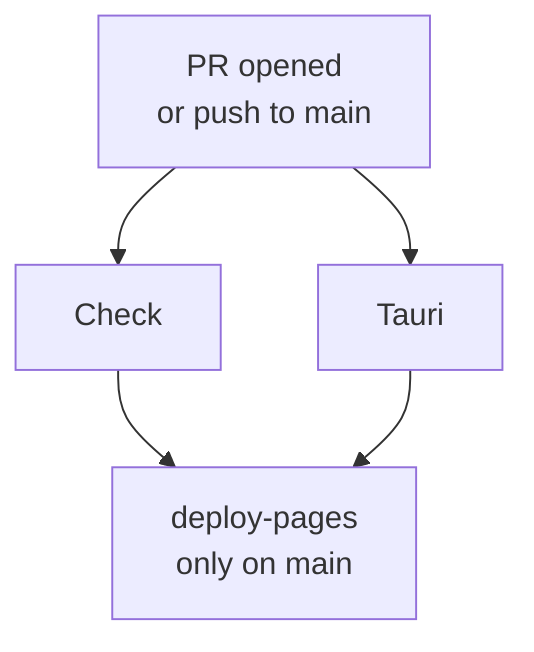

# CI/CD

Osler V2 uses GitHub Actions for continuous integration and continuous
deployment. This page documents the pipeline, how to extend it, and how
to debug failures.

## Pipeline overview

The CI pipeline lives at `.github/workflows/ci.yml` and has three jobs:



### `check` job

Runs on every PR and every push to `main`. Steps:

1. **Checkout** — `actions/checkout@v4`
2. **Setup Node 20** — `actions/setup-node@v4` with npm cache
3. **Install dependencies** — `npm ci` (strict, fails if lockfile drifted)
4. **Build** — `npm run build` (esbuild bundles all engines + content)
5. **Unit + integration tests** — `npm test` (Vitest)
6. **Validate content** — `npm run validate` (ajv against every content file)
7. **Validate schemas** — `npm run validate-schemas` (ajv meta-schema)
8. **Install Playwright Chromium** (only on `main`) —
   `npx playwright install chromium`
9. **E2E tests** (only on `main`) — `npm run test:e2e`

Total runtime: ~3 minutes (without E2E) to ~8 minutes (with E2E).

### `tauri` job

Runs on every PR and every push to `main`. Steps:

1. **Checkout**
2. **Restore Cargo cache** — keyed on `tauri-admin/Cargo.lock` hash
3. **Install Linux deps** — webkit2gtk, etc.
4. **Build Tauri** — `cargo build` in `tauri-admin/`

Total runtime: ~5-15 minutes (first build, ~2 minutes cached).

### `deploy-pages` job

Runs only on `main` after `check` and `tauri` succeed. Steps:

1. **Checkout**
2. **Setup Pages** — `actions/configure-pages@v5`
3. **Setup Node 20**
4. **Install dependencies** — `npm ci`
5. **Build** — `npm run build`
6. **Upload artifact** — `actions/upload-pages-artifact@v3` with `path: dist`
7. **Deploy to GitHub Pages** — `actions/deploy-pages@v4`

Total runtime: ~2 minutes.

## Concurrency control

```yaml
concurrency:
  group: ${{ github.workflow }}-${{ github.ref }}
  cancel-in-progress: true
```

This cancels in-progress CI runs when a new commit is pushed to the same
branch. Saves CI minutes, especially on active PRs.

## Caching

### npm cache

```yaml
- uses: actions/setup-node@v4
  with:
    node-version: 20
    cache: 'npm'
```

Caches `~/.npm` based on `package-lock.json` hash. Saves ~30 seconds per
run.

### Cargo cache

```yaml
- uses: actions/cache@v4
  with:
    path: |
      ~/.cargo/registry
      ~/.cargo/git
      tauri-admin/target
    key: ${{ runner.os }}-cargo-${{ hashFiles('tauri-admin/Cargo.lock') }}
```

Caches the Cargo registry + git checkout + the `target/` directory. Saves
~10 minutes on cached Tauri builds.

### Playwright browsers

```yaml
- name: Install Playwright browsers
  if: github.ref == 'refs/heads/main'
  run: npx playwright install chromium
```

Not cached (Chromium is ~150 MB, the cache hit savings are minimal vs the
cache restore time).

## Matrix strategy

The `check` job uses a matrix:

```yaml
strategy:
  matrix:
    node-version: [20]
```

Currently only Node 20 (LTS). To add Node 22 when it becomes LTS:

```yaml
matrix:
  node-version: [20, 22]
```

The Tauri job doesn't use a matrix — it runs only on Linux because the
Linux deps are the most restrictive. macOS and Windows builds happen via
the release process (Tauri's GitHub Action builds per-platform installers
on tag push).

## Secrets

The pipeline uses these GitHub secrets (configured in repo settings →
Secrets and variables → Actions):

| Secret | Used by | Purpose |
|--------|---------|---------|
| `TAURI_SIGNING_PRIVATE_KEY` | Release workflow | Signs update bundles |
| `TAURI_SIGNING_PRIVATE_KEY_PASSWORD` | Release workflow | Password for the signing key |
| `FIREBASE_SERVICE_ACCOUNT` | Deploy workflow (if deploying to Firebase Hosting) | Service account JSON for Firebase CLI |
| `NETLIFY_AUTH_TOKEN` | Nightly deploy test (optional) | Tests Netlify deploy in CI |
| `VERCEL_TOKEN` | Nightly deploy test (optional) | Tests Vercel deploy in CI |

The `ci.yml` workflow doesn't use any secrets — only the release workflow
(`.github/workflows/release.yml`, to be added in Phase 16) does.

## Extending the pipeline

### Adding a new job

Add a new job under `jobs:`:

```yaml
jobs:
  lint:
    runs-on: ubuntu-latest
    steps:
      - uses: actions/checkout@v4
      - uses: actions/setup-node@v4
        with:
          node-version: 20
      - run: npm ci
      - run: npm run lint   # if you add a linter
```

Make sure the new job is added to the `needs:` list of `deploy-pages` if
it should block deploys.

### Adding a new step

Add a new step in the relevant job:

```yaml
- name: New check
  run: node scripts/my-new-check.js
```

If the step is slow (>30 seconds), consider caching or making it conditional.

### Adding a new matrix dimension

```yaml
strategy:
  matrix:
    node-version: [20]
    os: [ubuntu-latest, macos-latest, windows-latest]
```

This multiplies the job count (3 OSes × 1 Node = 3 jobs). Watch CI minutes
if you're on a free tier.

## Debugging CI failures

### Re-run failed jobs

In the GitHub Actions UI, click the failed run → "Re-run failed jobs" (or
"Re-run all jobs"). This is faster than pushing an empty commit.

### Download logs

In the GitHub Actions UI, click the failed run → "..." menu → "Download
logs". The logs are a zip of plain text — easier to search than the UI.

### Run locally

Most CI steps can be reproduced locally:

```bash
npm ci
npm run build
npm test
npm run validate
npm run validate-schemas
npm run test:e2e   # if you have Playwright installed
```

For Tauri:

```bash
cd tauri-admin
cargo build
cargo test
```

### Enable debug logging

Add `ACTIONS_STEP_DEBUG=true` as a repository secret (Settings → Secrets
→ Actions). Re-run the workflow — step debug logs are now visible.

For runner-level debug, add `ACTIONS_RUNNER_DEBUG=true`.

### Common failures

#### "npm ci failed — lockfile out of sync"

Cause: `package-lock.json` doesn't match `package.json`.

Fix: run `npm install` locally (regenerates the lockfile), commit the
updated `package-lock.json`, push.

#### "Build failed — Cannot find module 'esbuild'"

Cause: `node_modules/` not installed, or esbuild not in `package.json`.

Fix: verify `npm ci` ran successfully. If esbuild is missing from
`package.json`, add it as a devDependency.

#### "Tauri build failed — webkit2gtk-4.1 not found"

Cause: Linux deps not installed.

Fix: this should be handled by the `Install Linux deps` step. If it fails,
the apt mirror may be down. Re-run.

#### "E2E tests flaky"

Cause: Playwright timing issues. Common:

- Element not visible yet (add `await expect(page.locator(...)).toBeVisible()`)
- Animation not finished (add `await page.waitForLoadState('networkidle')`)
- Race condition with service worker (add `await page.waitForFunction(() =>
  'serviceWorker' in navigator && navigator.serviceWorker.controller)`)

Fix the test, not the CI. If the test is genuinely flaky, mark it with
`test.fixme('reason')` until fixed.

#### "Deploy to Pages failed"

Cause: usually a permissions issue. The `deploy-pages` job needs:

```yaml
permissions:
  contents: read
  pages: write
  id-token: write
```

These are in the workflow. If the repo settings (Settings → Pages → Source)
are not set to "GitHub Actions", the deploy fails.

## Release workflow (V2 — to be added)

Phase 16 will add `.github/workflows/release.yml`:

1. Triggered by tag push (`v*.*.*`).
2. Runs `check` and `tauri` jobs (same as CI).
3. Builds Tauri installers for all platforms (Linux, macOS, Windows).
4. Signs the installers with `TAURI_SIGNING_PRIVATE_KEY`.
5. Creates a GitHub Release with the installers attached.
6. Updates `latest.json` (the self-updater manifest).
7. Publishes the docs site to GitHub Pages (from the `docs/` directory).

The release workflow is non-blocking — it runs after the tag is pushed,
independent of CI.

## What's next

- [Contributing](../development/contributing.md) — branch model and PR
  checklist.
- [Operations → Monitoring](monitoring.md) — what to watch in production.
- [Operations → Incident Response](incident-response.md) — when CI fails
  in production.
