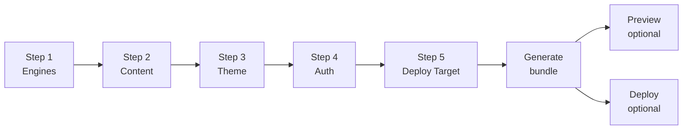

# Site Generator Wizard

The V2 site generator wizard is the headline feature of Osler V2 (Phase 13).
It turns the V1 admin dashboard into a **modular quiz-site platform**: pick
engines, content, theme, auth mode, and deploy target → get a deployable
site bundle.

This page describes the 5-step wizard flow. For per-provider deploy steps,
see [Deployment](../deployment/github-pages.md). For the content pack format,
see [Content Packs](content-packs.md).

## The 5-step flow



Each step has a "Back" and "Next" button. The wizard saves state to
`tauri-plugin-store` under `wizard-state`, so you can close the admin and
resume later. State expires after 7 days.

## Step 1 — Engines

Pick which of the 5 study engines the generated site will include:

| Engine | Required? | Description |
|--------|-----------|-------------|
| Quiz | Optional | Timed multiple-choice quiz with instant feedback |
| Bank | Optional | Untimed question bank for review |
| Flashcard | Optional | SM-2 spaced repetition flashcards |
| Written | Optional | Free-text written assessment with self-rating |
| OSCE | Optional | OSCE clinical simulation |
| Hub | Always included | Landing page listing all available content |
| Search | Always included | Cross-content full-text search |
| AI Assistant | Always included (V1) / V2 AI tutor (Phase 12) | Chat modal scoped to current item |

You can pick any subset of the 5 study engines (or all 5). Picking fewer
engines makes the bundle smaller and the site load faster.

The wizard shows the estimated bundle size impact of each engine (e.g.
"Quiz: +180 KB minified, +12 KB gzipped"). The hub, search, and AI assistant
are always bundled — they're shared infrastructure.

## Step 2 — Content

Pick which admin-managed content packs to bundle into the site. The picker
shows:

- All content items from the configured content repo (Step 1 of the CMS
  workflow).
- A search box to filter by title or UID.
- A multi-select with checkboxes.
- A "Select all" / "Deselect all" toggle.
- An "Upload local JSON" button — pick local `.json` files not yet in the
  content repo (they get bundled as-is, but not committed to the repo).

Each selected item shows:

- Title
- Type (quiz/bank/flashcard/written/osce)
- Schema version
- Item count (e.g. "20 questions")
- Estimated bundle size impact

The wizard validates every selected item against its schema before continuing.
Invalid items are highlighted in red and cannot be included.

### User custom content is NOT bundled

Step 2 only includes admin-managed content. User custom content (Tier 2) is
created in the PWA after deployment — it lives in each user's IndexedDB and
syncs to Firestore (if configured). It is never bundled into the site.

This means: if you want every user to see a piece of content, it must be
admin-managed (committed to the content repo). If you want each user to have
their own content, they author it themselves in the PWA.

## Step 3 — Theme

Pick the visual theme for the generated site:

| Setting | Type | Default |
|---------|------|---------|
| Primary color | color picker | `#3b82f6` (Tailwind blue-500) |
| Accent color | color picker | `#10b981` (Tailwind emerald-500) |
| Background | select: light / dark / system | system |
| Font family | select: Inter / IBM Plex Sans / Source Sans 3 / system | Inter |
| Heading font | select: same options | Inter |
| Logo | file upload (PNG/SVG, ≤ 100 KB) | Osler logo |
| Favicon | file upload (PNG/SVG, ≤ 50 KB) | Osler icon |
| App name | text | "Osler" |
| Tagline | text | "Medical study platform" |

The wizard generates a `theme.json` file written into the bundle, which the
PWA reads at startup to apply CSS custom properties. Theme values are
client-side only — they don't affect the admin dashboard's own theme.

### Custom CSS

Advanced users can paste custom CSS in the "Custom CSS" textarea. The CSS is
appended to the generated site's stylesheet, after the theme tokens. Use this
for one-off branding overrides (e.g., a school's colors).

## Step 4 — Auth

Pick the authentication mode:

| Mode | Description | Firebase required? |
|------|-------------|-------------------|
| None | Static site, no auth, no sync, no AI tutor. Guest-only. | No |
| Firebase | Multi-user sync + AI tutor. Users sign in via guest → Google → GitHub. | Yes |

### None mode

The generated site is a static PWA with no backend. Users can:

- Study all admin-managed content
- Author their own user custom content (stored in IndexedDB, local-only)
- Export/import content packs (file-based sharing)
- Use the in-app tour

Users cannot:

- Sync across devices
- Use the AI tutor (requires Gemini, which requires Firebase config)
- Sync user custom content to the cloud

This is the simplest mode — works on any static host (GitHub Pages, Netlify,
Vercel, Cloudflare Pages) with zero configuration.

### Firebase mode

The generated site is a PWA + Firebase backend. Users can do everything in
None mode, plus:

- Sign in (guest → Google → GitHub)
- Sync study progress across devices
- Sync user custom content across devices
- Use the AI tutor (scoped to current item, with cost caps)

Firebase mode requires a Firebase project config. If you've configured one
in [Settings → Firebase](../admin-dashboard/settings.md#firebase), the
wizard uses it. Otherwise, the wizard prompts you to paste a config JSON
(for self-hosters bringing their own project — see
[Firebase → Bring Your Own](../firebase/bring-your-own.md)).

## Step 5 — Deploy target

Pick where the generated site will be deployed:

| Target | Auth needed? | Custom domain? |
|--------|--------------|----------------|
| GitHub Pages | GitHub token (already configured) | Yes (configure in repo settings) |
| Netlify | Netlify token | Yes (configure in Netlify dashboard) |
| Vercel | Vercel token | Yes (configure in Vercel dashboard) |
| Cloudflare Pages | Cloudflare token + account ID | Yes (configure in CF dashboard) |
| Docker export | None | N/A (self-hosted) |
| Local preview only | None | N/A |

For each target, the wizard shows:

- Whether the credentials are configured (with a link to Settings if not)
- The expected URL pattern (e.g. `https://{user}.github.io/{repo}/`)
- A "Test credentials" button

You can skip deploy entirely and just generate a local bundle (zip + SHA-256)
for manual deployment later.

## Generate

After Step 5, click **Generate**. The wizard:

1. **Assembles the bundle** via `bundle_engines.rs`:
   - Copies chosen engine JS files from `engines/` (post-build).
   - Copies chosen content JSON files from the content repo.
   - Writes `config.json` with theme + auth + deploy settings.
   - Writes provider-specific config files (e.g. `netlify.toml`,
     `vercel.json`, `_redirects` for SPA routing).
   - Writes `update-manifest.json` with version, bundle hash, file list.
2. **Validates the bundle**:
   - Every engine parses (esbuild syntax check).
   - Every content pack validates against its schema.
   - `config.json` is well-formed JSON.
3. **Computes SHA-256** over all files in the bundle.
4. **Signs the bundle** if a signing key is configured (Tier 2 update
   compatibility).
5. **Writes the zip** to a temp directory.
6. **Opens the post-generate dialog**: shows bundle size, file count, hash,
   and buttons: **Preview locally**, **Deploy now**, **Save zip**.

## Preview locally

The "Preview locally" button:

1. Extracts the zip to a temp directory.
2. Starts a tiny_http server on `localhost:5500` (or the next free port).
3. Opens the default browser to `http://localhost:5500/`.
4. The preview runs the actual generated site, including Firebase (if
   configured) — but Firebase auth may not work if your Firebase project's
   authorized domains don't include `localhost`. Add `localhost` to the
   authorized domains in the Firebase console (Auth → Settings → Authorized
   domains).

Close the preview by closing the admin's preview window or clicking "Stop
preview" in the wizard.

## Deploy now

The "Deploy now" button invokes the chosen provider's deploy module:

- **GitHub Pages**: creates `gh-pages` branch, pushes bundle as branch root,
  enables Pages on the repo settings.
- **Netlify**: creates a new site via the Netlify API, uploads the zip,
  returns a `*.netlify.app` URL.
- **Vercel**: creates a project, deploys the bundle, returns a
  `*.vercel.app` URL.
- **Cloudflare Pages**: creates a project, deploys the bundle, returns a
  `*.pages.dev` URL.

See the per-provider pages in [Deployment](../deployment/github-pages.md)
for details.

## Save zip

The "Save zip" button saves the bundle to a location you choose. The zip
includes:

```
osler-site-{timestamp}.zip
├── index.html
├── manifest.webmanifest
├── sw.js
├── update-manifest.json
├── config.json
├── {provider-config-files}
├── engines/
│   ├── quiz.js
│   ├── bank.js
│   └── ...
├── content/
│   ├── sample-quiz.json
│   └── ...
├── css/
│   └── ...
├── assets/
│   └── ...
└── i18n/
    ├── en.json
    └── ar.json
```

The zip is self-contained — drop it on any static host and it works (in
None mode) or on a host with Firebase configured (in Firebase mode).

## Bundle size

Typical bundle sizes:

| Configuration | Zip size | Uncompressed |
|---------------|----------|--------------|
| None mode, 1 engine, 5 content packs, EN only | ~250 KB | ~600 KB |
| Firebase mode, 5 engines, 20 content packs, EN+AR | ~1.2 MB | ~3 MB |
| Firebase mode, 5 engines, 100 content packs, EN+AR | ~3 MB | ~8 MB |

The largest contributor to bundle size is content — each quiz with images
can be 50-100 KB. The wizard shows a running total as you select content.

## What's next

- [Content Packs](content-packs.md) — the file format for user content
  sharing.
- [Local Preview](preview.md) — detailed preview workflow.
- [Deployment → GitHub Pages](../deployment/github-pages.md) — first deploy.
