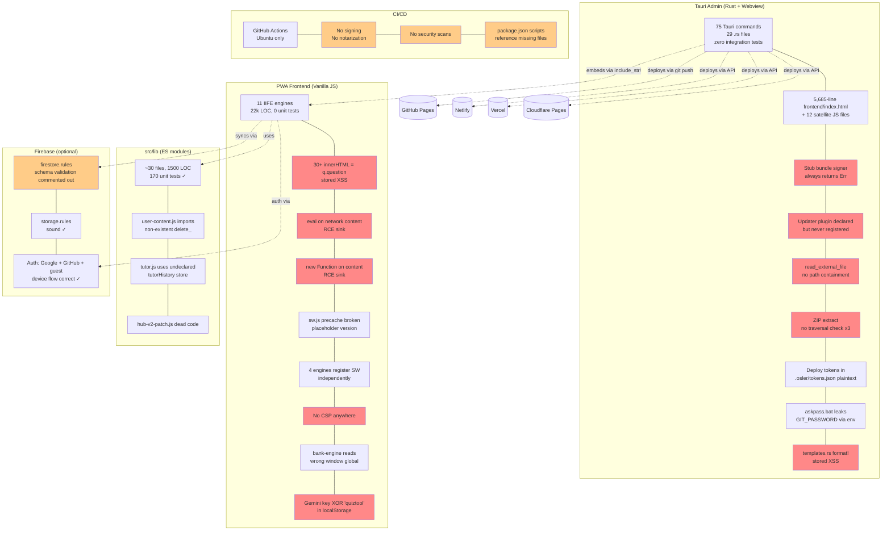
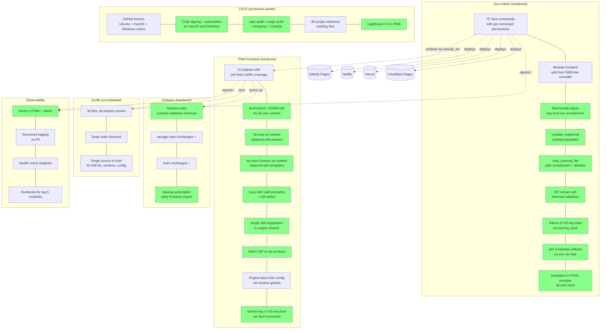
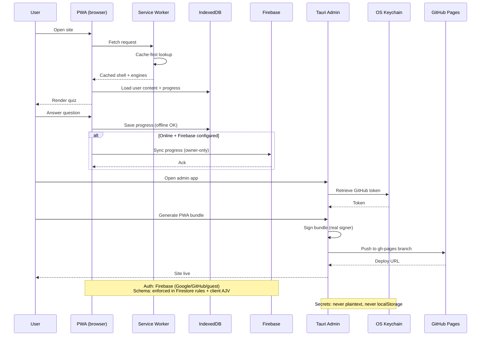

# Osler — Path Forward to Production-Class

> **Audience:** Engineering leadership (CTO, Eng Manager, Tech Leads)
> **Scope:** Full audit-to-roadmap synthesis for the Osler medical-education quiz platform
> **Source basis:** Live codebase (`osler-main/`), `v1-osler-plan-enhanced.md`, `v2-osler-plan-enhanced(1).md` (treated as reference only)
> **Strategy:** Surgical fixes — no rewrite. Patch, harden, and operationalize the existing structure.
> **Tone:** Direct and pragmatic. No hedging.
> **Status:** Draft v1.0

---

## 0. Executive Summary

Osler is not production-class today, and the gap is not cosmetic. A four-agent audit of the codebase surfaced **four trivially-exploitable critical vulnerabilities**, an auto-update chain that is broken end-to-end, a placeholder GitHub OAuth client ID shipped in `auth.rs`, a bundle signer that always returns `Err`, three ZIP-extraction sites with no path-traversal protection, **30+ `innerHTML` assignments rendering user content as raw HTML**, two `eval()`/`new Function()` sinks that execute network-fetched content data, **zero unit tests covering the 22k LOC of engine code that constitutes the product's IP**, 18 failing unit tests (all from setup bugs), a 5,685-line monolithic `frontend/index.html`, 25 npm vulnerabilities (1 critical, 3 high), and **patch-on-patch accumulation across 18 files** with phase-tagged comments like "H8 fix" and "Phase 6.5 fix #N". Documentation has drifted: 7 of 12 "Critical Rules" in `AGENTS.md` are violated by code currently in the repo, `SECURITY.md` claims `safeStorage` is in use (it is not), and the README's "esbuild for bundling" claim is false advertising — `src/build.js` uses `bundle: false` and just `fs.copyFileSync`s the engines.

The two existing plan documents (`v1-osler-plan-enhanced.md` covering Phases 0–8, `v2-osler-plan-enhanced(1).md` covering Phases 9–16) describe a vision that is materially ahead of the code. They are useful as feature-direction reference but cannot be executed as written because they assume a stable V1 baseline that does not exist. This document supersedes neither — it sits beneath them, defining the **production-readiness baseline** that must exist before V2 work resumes.

The path forward is **surgical**: keep the existing architecture (PWA engines + Tauri admin + optional Firebase), patch the critical issues in place, add the missing operational scaffolding (CI, tests, monitoring, runbooks), tighten boundaries where code is duplicated, and lock down the security perimeter. No rewrite. No new framework. The plan is organized into 10 phases (Phase 0 through Phase 9), each with entry/exit criteria, ticket-ready work items, and explicit dependencies. Estimated total effort is on the order of **14–18 engineering-weeks for a 2–3 person team**, with Phase 0–2 (security + reliability) consuming roughly half of that.

The single most important decision in this plan: **do not begin V2 feature work (Phases 9–16 in the existing plan docs) until Phase 0–3 of this plan are complete and the success metrics in §3 are met.** Every additional feature shipped on top of the current foundation multiplies the surface area of the existing security and reliability debt.

---

## 1. Current State Assessment

### 1.1 Project Identity

Osler is a medical-education quiz platform with three user-facing surfaces: a PWA frontend that hosts multiple quiz engines (bank, flashcard, quiz, uworld, osce, written, search, ai-assistant, index), a Tauri v2 desktop admin app that generates and deploys these PWA sites to GitHub Pages / Netlify / Vercel / Cloudflare Pages, and an optional Firebase backend that adds multi-user sync, cross-device progress, and a lightweight AI tutor. The intended user base spans solo learners, educators, and self-hosters. The product vision is sound; the implementation is not.

### 1.2 Tech Stack Inventory

| Layer | Technology | Version | Notes |
|---|---|---|---|
| PWA frontend | Vanilla JS (IIFE engines) | n/a | 11 engine files, ~22k LOC, mean readiness 2.2/5 |
| PWA shared lib | ES modules (`src/lib/`) | n/a | ~30 files, ~1,500 LOC, 170 unit tests |
| PWA bundler | esbuild | declared in devDeps | **Used with `bundle: false`** — effectively a syntax check + copy |
| PWA service worker | `sw.js` (custom) | n/a | Precache list broken; placeholder `__SW_VERSION__` |
| Tauri admin | Tauri v2 | 2.11.2 | 75 commands, 29 `.rs` files, ~10.5k LOC |
| Tauri admin frontend | Vanilla JS | n/a | 5,685-line `index.html` + 12 satellite files |
| Tauri updater | `tauri-plugin-updater` | declared | **Never registered in `main.rs`** — dead code |
| Tauri signing | custom `sign_bundle()` | n/a | **Always returns `Err`** — stub |
| Backend (optional) | Firebase (Firestore, Storage, Auth) | web SDK via CDN importmap | `firebase` declared as runtime dep but never resolved by bundler |
| Test runner (JS) | Vitest + Playwright | n/a | 18 of 195 unit tests fail (setup bugs); E2E specs are smoke tests |
| Test runner (Rust) | `cargo test` | n/a | 26 tests, all pure-function; **zero Tauri commands tested** |
| CI | GitHub Actions | n/a | Single Ubuntu workflow; no signing, no matrix, no security scans |
| MCP server | custom (in Tauri) | n/a | `analytics_query` always returns `Err`; `list_files` only matches `*.html` |

### 1.3 Top Critical Findings

The table below ranks the most damning issues by severity. Every entry is exploitable today on the current `main` branch. File:line citations are from the audit; verify against current code before patching.

| # | Severity | Finding | Location |
|---|---|---|---|
| C1 | Critical | Stored XSS via OAuth `displayName` raw-interpolated into `innerHTML` — a GitHub account named `` compromises any viewer | `hub/index.html:134,135,161,162,166` |
| C2 | Critical | `eval()` on network-fetched content data — any content-pack author gets RCE in the user's browser | `engines/search-engine.js:150`, `engines/index-engine.js:1199`, `engines/osce-engine.js:137,140` |
| C3 | Critical | `new Function()` on content data in admin/generator/PDF — same RCE class, attacker controls admin content | `tauri-admin/frontend/index.html:1656,1661,1664`, `pdf-exporter.html:1037,1038`, `generator.html:651,653,655` |
| C4 | Critical | Arbitrary local file read via `read_external_file(path)` — no path containment check | `tauri-admin/src/commands.rs:776-794` |
| C5 | Critical | Gemini API key XOR-"obfuscated" with hardcoded key `"quiztool"` and stored in `localStorage` — security theatre | `src/lib/gemini.js:10-35`, `engines/engine-shared.js:230-261` |
| H1 | High | Deploy tokens (GitHub, Netlify, Vercel) stored in plaintext at `.osler/tokens.json` — contradicts `SECURITY.md` keychain claim | `tauri-admin/src/commands.rs:766-773,940-968` |
| H2 | High | `tauri-plugin-updater` declared in `Cargo.toml` but never registered in `main.rs` Builder — auto-update is dead code | `tauri-admin/src/main.rs:304-321` |
| H3 | High | Updater `pubkey` is empty string; `update-manifest.json` `bundleHash` is empty — signature verification cannot pass | `tauri.conf.json:50`, `update-manifest.json:5` |
| H4 | High | `bundleHash: ""` and `requiredVersion: "5.1.0"` (admin version) mismatched with `version: "1.0.0"` (PWA version) | `update-manifest.json:5-6` |
| H5 | High | PWA has no CSP anywhere; admin CSP is `unsafe-inline` + `unsafe-eval` + `connect-src *` | `hub/index.html`, `player.html`, `tauri-admin/tauri.conf.json:15` |
| H6 | High | Server-side schema validation in Firestore rules is commented out | `firestore.rules:54-60` |
| H7 | High | 25 npm vulnerabilities (1 critical, 3 high) — vitest, vite, ajv-cli, fast-json-patch | `package-lock.json` |
| H8 | High | AI markdown renderer allows `javascript:` URLs in `href` — prompt-injection XSS | `engines/ai-assistant-engine.js:115` |
| H9 | High | `safeStorage` claim in `SECURITY.md` is false — no `tauri-plugin-stronghold` configured | `SECURITY.md:126`, `docs/v2/SECURITY.md:118` |
| H10 | High | ZIP extraction has no path-traversal check in 3+ sites — `../`-style entries can write outside target dir | `tauri-admin/src/commands.rs:269-281` |
| H11 | High | Placeholder GitHub OAuth client ID shipped in code: `"Iv1.todo-replace-with-your-github-oauth-client-id"` | `tauri-admin/src/auth.rs:23` |
| H12 | High | `analytics.rs` shells out to `openssl` CLI for JWT signing with predictable PEM temp path | `tauri-admin/src/analytics.rs:98-147` |
| H13 | High | `analytics.rs` produces invalid ISO date `"2026-00-00T00:00:00Z"` (month/day underflow) | `tauri-admin/src/analytics.rs:209-211` |
| H14 | High | `templates.rs` interpolates user-supplied `title`/`description` raw via `format!` — stored XSS in generated sites | `tauri-admin/src/templates.rs:69-104` |
| H15 | High | `askpass.bat` for Git puts `GIT_PASSWORD` in env var, leaks via `/proc/PID/environ` on Linux | `tauri-admin/src/deploy.rs:270-290`, `api_helpers.rs:296-314` |
| M1 | Medium | `src/lib/user-content.js:13` imports non-existent `delete_` — module load fails at runtime | `src/lib/user-content.js:13` |
| M2 | Medium | `src/lib/tutor.js:19` uses undeclared `tutorHistory` store | `src/lib/tutor.js:19` |
| M3 | Medium | `hub-v2-patch.js` is dead code — nothing imports it | `src/lib/hub-v2-patch.js` |
| M4 | Medium | `bank-engine.js:9` reads `window.__QUIZ_ENGINE_BASE` instead of `window.__BANK_ENGINE_BASE` — violates AGENTS.md "Never hardcode engine paths" | `engines/bank-engine.js:9` |
| M5 | Medium | 4 engines independently register the service worker with `.catch(function(){})` — duplicate registration, silent failure | `engines/{bank,flashcard,quiz,uworld}-engine.js` |
| M6 | Medium | `sw.js:59` uses runtime placeholder `'__SW_VERSION__'` — broken if build skipped | `sw.js:59` |
| M7 | Medium | SW precache list points to root paths that 404 — install silently fails | `sw.js` |
| M8 | Medium | `firebase` declared as runtime dep but never resolved by bundler (HTML uses CDN importmap) | `package.json:36` |
| M9 | Medium | `i18next` declared in deps but never imported — `src/i18n/i18n.js` is hand-rolled | `package.json` |
| M10 | Medium | `engines/engine-shared.css` and `engines/index-engine.css` are byte-identical duplicates of `src/css/shared.css` and `src/css/index-engine.css` | `engines/` vs `src/css/` |
| M11 | Medium | CSS token block (`--ease-out`, `--transition`, etc.) duplicated 5× with conflicting values | multiple CSS files |
| M12 | Medium | `wizard.js:8` destructures `const { invoke } = window.__TAURI__` — wrong for Tauri 2 (needs `window.__TAURI__.core.invoke`) | `tauri-admin/frontend/wizard.js:8` |
| M13 | Medium | `deploy.js:25,30,35` `onclick="deployProvider(...)"` — function is IIFE-scoped; buttons throw `ReferenceError` | `tauri-admin/frontend/deploy.js` |
| M14 | Medium | `content-editor.js:221-235` emits `onclick="(${fn.toString()})()"` — eval-via-inline; forces `unsafe-eval` CSP | `tauri-admin/frontend/content-editor.js` |
| M15 | Medium | `mcp_server.rs:487-493` `analytics_query` permanently returns `Err(...)` | `tauri-admin/src/mcp_server.rs:487-493` |
| M16 | Medium | `mcp_server.rs:496-515` `collect_files` only matches `*.html` — misses all `*.json` content | `tauri-admin/src/mcp_server.rs:496-515` |
| M17 | Medium | OSCE schema (`src/schemas/osce-v1.json`) says `rubric: array of strings`; `osce-engine.js` expects `rubric: { mustAsk: [], bonus: [] }` + `patient`/`hiddenProfile` — schema validates but engine renders empty patient | `src/schemas/osce-v1.json` vs `engines/osce-engine.js` |
| M18 | Medium | Dual implementations kept "for backward compat": `ureq` + `reqwest`, `git2` + shell-out, `engine-tracker` + `lib/tracker` | multiple Rust files |
| M19 | Medium | 5,685-line monolithic `frontend/index.html` — unmaintainable | `tauri-admin/frontend/index.html` |
| M20 | Medium | Phase-tagged patch comments in 18 files ("H8 fix", "Phase 6.5 fix #N") — patch-on-patch accumulation | 18 files |
| L1 | Low | `update-manifest.json` `requiredVersion` field semver-mismatches `version` | `update-manifest.json:5-6` |
| L2 | Low | Multiple sources of truth: SW engines list in 4 places; Firebase config in 3; version numbers in 5 | various |
| L3 | Low | 7 of 12 AGENTS.md "Critical Rules" violated by code currently in repo | `AGENTS.md` vs codebase |
| L4 | Low | E2E tests only run on `main` — PRs can break user journeys silently | `.github/workflows/` |
| L5 | Low | `package.json` declares `npm run validate` and `npm run export-schemas` but the script files they invoke don't exist — CI will fail | `package.json` |
| L6 | Low | 40–50% of engine code is duplicated (animations, theming, Gemini client, storage keys, highlighter, PDF export, results rendering) | `engines/` |

### 1.4 Architecture Smell Summary

The "stitched together" feeling the user described is **structural, not cosmetic**. It manifests in five patterns:

1. **Patch-on-patch accumulation.** Eighteen files carry phase-tagged comments like `// H8 fix` or `// Phase 6.5 fix #N`. These comments are archaeological — they describe work that was done in a hurry and never consolidated. Every such comment is a smell because it indicates the underlying issue was patched rather than fixed. A production codebase has zero of these.

2. **Multiple sources of truth.** The SW engines list is hardcoded in four places. Firebase configuration lives in three places (`.env.example`, `src/lib/firebase.js`, the CDN importmap in `player.html`). Version numbers are scattered across five files (`package.json`, `tauri-admin/Cargo.toml`, `tauri-admin/tauri.conf.json`, `update-manifest.json`, `manifest.webmanifest`). When one is updated, the others drift — which is exactly what happened with `update-manifest.json` (`bundleHash: ""`, `requiredVersion: "5.1.0"` vs `version: "1.0.0"`).

3. **Dual implementations kept "for backward compat."** The Rust backend ships both `ureq` and `reqwest` HTTP clients, both `git2` and shell-out Git invocation, both `engine-tracker.js` (in `engines/`) and `lib/tracker.js` (in `src/lib/`). One of each pair should be deleted; neither has been.

4. **Documentation drift.** `AGENTS.md` lists 12 "Critical Rules"; 7 are violated by code in the repo. `SECURITY.md` claims `safeStorage` is used (it is not — no `tauri-plugin-stronghold` is configured). `README.md` claims esbuild bundles the engines (it does not — `bundle: false`). The V1 and V2 plan documents describe a system that is materially ahead of the code. Every doc-vs-code gap is a liability for new contributors and for compliance review.

5. **Test inversion.** The 1,500 LOC of clean ES modules in `src/lib/` has 170 unit tests (excellent coverage). The 22,000 LOC of engine code — the actual IP, the part users touch — has zero unit tests. The test pyramid is upside down: the easy code is tested, the hard code is not. E2E specs exist but are smoke tests at best; one (`v2-flows.spec.js`, 444 lines) assumes hub features that don't exist because `hub-v2-patch.js` is dead code.

### 1.5 What Is Actually Working

To be fair to the codebase — and to calibrate the surgical strategy — several things do work and should not be touched:

- **`firestore.rules`** structure (owner-only, default-deny) is sound; only the schema-validation block is commented out (H6).
- **`storage.rules`** enforce a 50 MB cap, `application/json` content-type, and owner-only write. Correct.
- **GitHub OAuth Device Flow** in the Tauri admin (`tauri-admin/src/auth.rs:47-75`) is implemented correctly and stores the token in the OS keychain.
- **Path containment** in `commands.rs::resolve()` (line 67) is correct for `load_file`/`save_file`/`delete_file` — only `read_external_file` bypasses it (C4).
- **AJV schema validation** (`src/lib/validate.js`) is well-implemented client-side. The problem is that engines bypass it; the validator itself is fine.
- **`.gitignore`** correctly excludes `.env*`, `secrets/`, `credentials/`.
- **`generator_zip::build_project_zip`** (731 lines) is a real, working PWA-generation flow.
- **Tauri capabilities** are minimal (`core:default, store:default, shell:allow-open, updater:default, dialog:default`) — no `fs:*`, `process:*`, or `http:*`. The problem is per-command permission enforcement, not capability scope.
- **`src/lib/` modules** like `storage.js`, `validate.js`, `sync.js`, `auth.js`, `sm2.js` are clean ES modules with tests.

The surgical strategy is calibrated to this: fix the broken parts, leave the working parts alone, and add the operational scaffolding that is missing.

---

## 2. Target State: Definition of "Production-Class"

"Production-class" is not a vibe. It is a measurable state. This section defines the success metrics that, when met, mean the system is production-class. Every phase in §5 contributes to one or more of these metrics. The Definition of Done in §10 is the binary checklist version of this section.

### 2.1 Success Metrics (KPIs and SLOs)

| Category | Metric | Target | Current | Source |
|---|---|---|---|---|
| **Security** | Critical vulnerabilities (C1–C5) | 0 open | 5 open | §1.3 |
| Security | High vulnerabilities (H1–H15) | 0 open | 15 open | §1.3 |
| Security | npm audit critical/high count | 0 | 4 | `npm audit` |
| Security | CSP coverage (PWA + admin) | 100% strict | 0% | audit |
| Security | Secrets in plaintext at rest | 0 | 3+ paths | audit |
| Security | `eval`/`new Function`/`innerHTML` on untrusted input | 0 | 35+ sites | audit |
| **Reliability** | Auto-update end-to-end functional | yes | no | H2, H3 |
| Reliability | Error tracking (Sentry or equivalent) wired | yes | no | audit |
| Reliability | SW kill-switch deployed | yes | no | audit |
| Reliability | Backup automation for Firestore | yes | no | audit |
| Reliability | Health check endpoint | yes | no | audit |
| Reliability | Runbooks for top 5 incidents | yes | no | audit |
| **DevEx/CI** | CI runs on every PR | yes | partial (no matrix) | `.github/workflows/` |
| CI | CI runs lint + tests + security scan + build | yes | partial | `.github/workflows/` |
| CI | macOS + Windows + Linux build matrix | yes | no (Ubuntu only) | `.github/workflows/` |
| CI | Code signing (macOS notarization + Windows Authenticode) | yes | no | audit |
| CI | Lighthouse CI on PWA | yes | no | audit |
| Tests | Unit test pass rate | 100% | 91% (177/195) | `npm test` |
| Tests | Engine code unit coverage | ≥60% | 0% | audit |
| Tests | Tauri command integration tests | ≥20 commands | 0 | audit |
| Tests | E2E critical user journeys | 5+ | 0 (smoke only) | audit |
| **Architecture** | Phase-tagged patch comments in code | 0 | 18 files | audit |
| Architecture | Multiple sources of truth for SW engines list | 1 | 4 | audit |
| Architecture | Dead/deprecated deps removed | 100% | partial (firebase, i18next) | audit |
| Architecture | Dual implementations resolved | 1 per pair | 2–3 per pair | audit |
| Architecture | Doc-vs-code contradictions | 0 | 7+ rules violated | audit |
| **Performance** | PWA Lighthouse performance score | ≥90 | unknown (not measured) | Lighthouse CI |
| Performance | PWA p95 first-contentful-paint (4G) | ≤1.8s | unknown | Lighthouse CI |
| Performance | PWA p95 time-to-interactive (4G) | ≤3.0s | unknown | Lighthouse CI |
| Performance | Firestore query p99 latency | ≤300ms | unknown | Firebase console |
| Performance | Tauri admin cold-start time | ≤2s | unknown | manual |
| **Features** | Phase 0–8 (V1) claims actually met | 100% | partial (V1–V5 of v1 plan) | v1 plan validation table |
| Features | All 4 deploy providers functional | GitHub, Netlify, Vercel, Cloudflare | GitHub only fully tested | audit |
| Features | All 9 engines render sample content without errors | 9/9 | 8/9 (OSCE broken) | audit |
| Features | Offline mode (SW precache) functional | yes | no | audit |
| **Compliance** | Privacy policy published | yes | no | audit |
| Compliance | Account deletion flow | yes | no | audit |
| Compliance | Data retention policy documented | yes | no | audit |
| Compliance | Cookie consent (if applicable) | yes | n/a | audit |

### 2.2 Definition of "Production-Class" (the binary version)

The system is production-class when **all** of the following are true:

1. Zero open Critical or High findings from §1.3.
2. CI passes on every PR with lint + unit + integration + E2E + security scan + build on a 3-OS matrix.
3. Auto-update is end-to-end functional (signed bundle, registered plugin, populated pubkey, valid bundleHash).
4. Error tracking is wired in both the PWA and the Tauri admin.
5. Every engine has unit tests covering ≥60% of its LOC.
6. Every Tauri command that touches the filesystem, network, or keychain has at least one integration test.
7. PWA has a strict CSP; admin CSP is tightened to drop `unsafe-eval`.
8. All secrets (deploy tokens, Gemini keys, OAuth client secrets) live in OS keychain or OS-encrypted storage — never in plaintext files or `localStorage`.
9. Service worker has a kill-switch and a working precache list.
10. Runbooks exist for the top 5 incident scenarios.
11. Privacy policy, account deletion flow, and data retention documentation are published.
12. The 18 phase-tagged patch comments are resolved or removed.
13. Documentation (`AGENTS.md`, `SECURITY.md`, `README.md`) accurately describes the code.

---

## 3. Architecture Diagrams

### 3.1 Current State (as-built, with debt annotations)



Red nodes are Critical/High findings; orange are Medium; green-checked items are kept as-is.

### 3.2 Target State (after this plan)



### 3.3 Data Flow (target state)



### 3.4 Deployment Topology (target state)

```mermaid
flowchart LR
    subgraph "Developer machine"
        DEV[dev: npm run dev<br/>cargo tauri dev]
    end

    subgraph "CI (GitHub Actions)"
        CI1[Lint + unit + integration<br/>on every PR]
        CI2[E2E + Lighthouse<br/>on merge to main]
        CI3[Build matrix:<br/>Ubuntu, macOS, Windows]
        CI4[Sign + notarize<br/>macOS + Windows]
        CI5[Publish release artifacts<br/>+ update manifest]
        CI1 --> CI2 --> CI3 --> CI4 --> CI5
    end

    subgraph "Distribution"
        D1[GitHub Releases<br/>Tauri installers]
        D2[update-manifest.json<br/>on GitHub Pages]
        D3[PWA demo site<br/>on GitHub Pages]
        D1 --> D2
        D1 --> D3
    end

    subgraph "User surfaces"
        U1[Generated PWA sites<br/>self-hosted anywhere]
        U2[Tauri admin app<br/>installed locally]
        U3[Optional Firebase project<br/>user-provided]
    end

    DEV --> CI1
    CI5 --> D1
    D2 -.auto-update signal.-> U2
    U2 -.generates.-> U1
    U1 -.optionally uses.-> U3
```



---

## 4. Decision Log (Architecture Decision Records)

Each ADR captures a non-obvious technical decision, the alternatives considered, and the rationale. ADRs are immutable once an implementation phase begins; supersession requires a new ADR that references the prior one.

### ADR-001: Surgical fixes over rewrite

**Status:** Accepted
**Context:** The codebase exhibits 18 files with phase-tagged patch comments, 4 places where the SW engines list is duplicated, dual Rust HTTP clients, dual Git invocation strategies, and 40–50% duplication across engine files. The natural temptation is a clean rewrite. The V2 plan document even leans this direction by describing a "modular quiz-site platform" that is materially ahead of the current code.
**Decision:** Do not rewrite. Patch, harden, and consolidate in place. Specifically: keep the IIFE engine pattern, keep the Tauri v2 admin, keep Firebase as optional, keep the `src/lib/` ES module structure. Add shims, dedup sources of truth, delete dead code, and add tests — but do not restructure.
**Alternatives considered:**
- *Strangler fig:* Incrementally replace modules in place. Rejected because the existing modules are not cleanly separable (engines share globals via `window.EngineShared`, the admin embeds engines via `include_str!` at compile time). Strangler fig requires seams; this codebase has none.
- *Parallel rebuild:* Build v2 alongside v1. Rejected because the team is small (2–3 people) and the V2 plan already exists as a feature-direction document; rebuilding in parallel would split focus and produce two half-finished systems.
- *Big-bang rewrite:* Full rewrite from scratch. Rejected because the IP (engine logic, schema definitions, deploy flows, content packs) is valuable and re-deriving it would cost more than fixing the surrounding scaffolding.
**Consequences:**
- We inherit the existing architecture's constraints (IIFE engines, `window.*` globals, compile-time embedding).
- The 18 phase-tagged patch comments must be resolved one by one (Phase 4 work).
- Duplication is reduced by extracting shared code into `engine-shared.js` and `src/lib/`, not by introducing a new framework.
- We accept that the codebase will look "older" than a fresh rewrite — this is a feature, not a bug, for a small team.
**Supersedes:** None.
**References:** §1.4 (Architecture Smell Summary), §5 Phase 4.

### ADR-002: Keep IIFE engine pattern; add a thin ES-module shim

**Status:** Accepted
**Context:** The 11 engine files (`bank-engine.js`, `flashcard-engine.js`, `quiz-engine.js`, `uworld-engine.js`, `osce-engine.js`, `written-engine.js`, `search-engine.js`, `ai-assistant-engine.js`, `index-engine.js`, `engine-shared.js`, `engine-tracker.js`) are IIFEs that attach to `window.*` globals. They total ~22k LOC and have zero unit tests. The V2 plan implies a migration to ES modules. A full migration would touch every engine file and every consumer (the Tauri admin embeds them, the PWA loads them via `<script>` tags, the player.html orchestrates them).
**Decision:** Keep the IIFE pattern for now. Add a thin ES-module wrapper (`engines/index.js`) that re-exports engine constructors for testing purposes only. Engines continue to attach to `window.*` in production. Unit tests import the wrapper and instantiate engines in a JSDOM environment.
**Alternatives considered:**
- *Full ES-module migration:* Convert all engines to ES modules, replace `<script>` tags with `import`. Rejected because it requires touching 22k LOC of code with no tests, and the Tauri admin's `include_str!` embedding assumes the IIFE pattern.
- *Pure JSDOM testing without a shim:* Possible but requires mocking `window.*` globals per test; the shim centralizes this.
**Consequences:**
- Engines remain testable without restructuring.
- The `window.*` global pattern persists as a known smell, documented in ADR-002 and revisited in a future V2 effort.
- The shim is test-only; production builds are unaffected.
**Supersedes:** None.
**References:** §6.1 (Engines module sub-plan).

### ADR-003: Firebase remains optional; do not make it required

**Status:** Accepted
**Context:** Firebase provides auth, Firestore sync, and storage. The V2 plan envisions a "bring your own Firebase project (free tier)" model for self-hosters. The current code makes Firebase optional via `src/lib/firebase.js`, which fetches `/config.json` at module load and silently catches errors if Firebase is not configured.
**Decision:** Keep Firebase optional. Do not introduce a hard dependency. The `firebase` package stays in `package.json` only if the bundler actually resolves it; otherwise remove it (see M8).
**Alternatives considered:**
- *Make Firebase required:* Simplifies the codebase (no `if (firebaseConfigured)` branches) but breaks the self-hoster persona, which is core to the V2 vision.
- *Replace Firebase with a self-hosted backend (e.g., Supabase, Pocketbase):* Larger effort; deferred to a future V3 evaluation. Firebase's free tier and zero-ops model are aligned with the self-hoster persona.
**Consequences:**
- All Firebase-touching code must handle the "not configured" path gracefully.
- `src/lib/firebase.js` top-level `await fetch('/config.json')` must be replaced with a non-blocking lazy initializer (current behavior blocks module init).
- Tests must mock Firebase or skip Firebase-dependent tests when not configured.
**Supersedes:** None.
**References:** §6.5 (Firebase backend sub-plan).

### ADR-004: Tauri admin remains the generator; do not web-ify it

**Status:** Accepted
**Context:** The Tauri admin app (v5.1.0, `com.osler.admin`) is the only way to generate and deploy PWA sites today. It embeds engine files at compile time, runs a local `tiny_http` server on 127.0.0.1, and pushes to GitHub/Netlify/Vercel/Cloudflare. An alternative would be to make the admin a web app (e.g., a Next.js dashboard) that generates sites server-side.
**Decision:** Keep the Tauri admin as the generator. The desktop form factor is correct for the persona (educators and self-hosters who want local control). Invest in hardening the existing Tauri app, not replacing it.
**Alternatives considered:**
- *Web-based generator:* Would require server-side Git operations, secret storage, and signing — all of which are easier in a desktop app. Rejected.
- *CLI generator:* Faster for power users but loses the visual content editor. Deferred as a future `osler-cli` companion, not a replacement.
**Consequences:**
- The 5,685-line `frontend/index.html` must be split (Phase 4) but the Tauri shell stays.
- Cross-platform CI (macOS + Windows + Linux) with signing and notarization is mandatory (Phase 3).
- The `include_str!` embedding pattern stays; version drift between admin and PWA must be enforced by CI.
**Supersedes:** None.
**References:** §6.3 (Tauri admin Rust backend), §6.4 (Tauri admin frontend).

### ADR-005: CSP strategy — strict for PWA, tightened for admin

**Status:** Accepted
**Context:** The PWA has no CSP. The Tauri admin CSP is `default-src 'self'; script-src 'self' 'unsafe-inline' 'unsafe-eval'; connect-src *`. The `unsafe-eval` is forced by `content-editor.js:221-235` which emits `onclick="(${fn.toString()})()"`. The `connect-src *` is forced by multi-provider deploy.
**Decision:**
- PWA: strict CSP (`default-src 'self'; script-src 'self'; style-src 'self' 'unsafe-inline'; img-src 'self' data: https:; connect-src 'self' https://firestore.googleapis.com wss://*.firebaseio.com; object-src 'none'; base-uri 'self'; frame-ancestors 'none'`). Delivered via `<meta>` tag and a response header on the static host.
- Admin: drop `unsafe-eval` by replacing `content-editor.js` eval-via-inline with `addEventListener`. Tighten `connect-src` to the explicit list of deploy targets + Firebase + Gemini.
**Alternatives considered:**
- *Nonces:* More secure than hashes for inline scripts but requires server-side rendering or build-time injection. The PWA is static; nonces add complexity. Deferred.
- *Hashes:* Works for static inline scripts but brittle when scripts change. Use only for the small inline bootstraps in `player.html`.
**Consequences:**
- `content-editor.js` must be refactored (Phase 1).
- Any inline event handler (`onclick=`, `onload=`) in the admin frontend must be replaced with `addEventListener` (Phase 1 sweep).
- The PWA `player.html` inline bootstrap scripts must be hashed and added to CSP.
**Supersedes:** None.
**References:** §5 Phase 1 (Security Hardening), ADR-009.

### ADR-006: Secrets storage — OS keychain only, never plaintext or localStorage

**Status:** Accepted
**Context:** Currently: GitHub OAuth token is in OS keychain (correct), deploy tokens (GitHub, Netlify, Vercel) are in plaintext at `.osler/tokens.json` (H1), Gemini API key is XOR-obfuscated with hardcoded `"quiztool"` and stored in `localStorage` (C5). `SECURITY.md` falsely claims `safeStorage` is used.
**Decision:** All secrets live in the OS keychain via `tauri-plugin-store` with encryption enabled, or `tauri-plugin-stronghold` for high-value secrets. The `.osler/tokens.json` plaintext path is deleted. The Gemini key is fetched from the keychain via a Tauri command (`get_gemini_key`) and held only in module memory, never written to `localStorage` or `sessionStorage`.
**Alternatives considered:**
- *`tauri-plugin-stronghold` for everything:* More secure (encrypted at rest with a password) but adds UX friction (password prompt). Reserve for high-value secrets (e.g., signing keys). Use `tauri-plugin-store` with `enable-encryption` feature for routine tokens.
- *OS keychain direct (e.g., `keyring` crate):* Already used for the GitHub token. Extend the same pattern to all secrets.
**Consequences:**
- The `keyring_store.rs` module is extended to handle all secret types.
- `src/lib/gemini.js` is rewritten to fetch the key via a Tauri command (in admin context) or refuse to run (in PWA-only context, where the user must configure Gemini in the admin first).
- `SECURITY.md` is updated to accurately describe the storage strategy.
- Migration: existing `.osler/tokens.json` is read once on first launch after upgrade, secrets are moved to keychain, the file is deleted.
**Supersedes:** None.
**References:** §5 Phase 1, §6.3 (Tauri admin Rust backend), §6.5 (Firebase backend).

### ADR-007: Test pyramid — engine unit tests are the top priority

**Status:** Accepted
**Context:** Current test distribution: 170 unit tests for `src/lib/` (1,500 LOC, well-covered), 0 unit tests for `engines/` (22,000 LOC, zero coverage), 26 Rust pure-function tests, 0 Tauri command integration tests, E2E specs that are smoke tests. The pyramid is inverted.
**Decision:** Prioritize engine unit tests above all other test work. Target ≥60% line coverage on each engine file within Phase 3. Add JSDOM-based unit tests via Vitest. After engines, add Tauri command integration tests for the 20 highest-risk commands (filesystem, network, keychain). E2E tests are limited to 5 critical user journeys.
**Alternatives considered:**
- *E2E-first:* Higher confidence per test but slower and more brittle. Insufficient for catching regressions in engine logic. Rejected as primary strategy.
- *Property-based testing for engines:* Powerful but high setup cost. Deferred to a future hardening pass once unit coverage is in place.
**Consequences:**
- Engine files must be made testable (ADR-002 shim).
- CI test runtime increases; tests must be parallelized.
- Coverage gating is added to CI (Phase 3).
**Supersedes:** None.
**References:** §5 Phase 3 (DevEx & CI/CD), §6.1 (Engines module), §6.7 (Tests).

### ADR-008: Update mechanism — fix what exists, do not invent a new one

**Status:** Accepted
**Context:** The Tauri updater plugin is declared in `Cargo.toml` but never registered in `main.rs` (H2). The `pubkey` in `tauri.conf.json` is empty (H3). The `bundleHash` in `update-manifest.json` is empty. The `sign_bundle()` function always returns `Err` (ANALYZE-1 finding). The PWA SW has no kill-switch and a broken precache list.
**Decision:** Fix the existing Tauri updater end-to-end. Generate a signing key pair, populate `pubkey`, register the plugin in `main.rs`, implement real `sign_bundle()`, populate `bundleHash` at build time, and host `update-manifest.json` on GitHub Pages. For the PWA SW, add a kill-switch (a `KILL_SWITCH_URL` checked on every fetch) and fix the precache list to point at actual built assets.
**Alternatives considered:**
- *Replace Tauri updater with a custom updater:* More control but reinvents a solved problem. Rejected.
- *Drop auto-update entirely, rely on manual download:* Acceptable for a power-user tool but breaks the "non-technical educator" persona. Rejected.
- *Use `tauri-plugin-updater` without signing:* Insecure; rejected.
**Consequences:**
- A signing key must be generated and stored as a CI secret (`TAURI_SIGNING_PRIVATE_KEY`).
- The build pipeline must compute `bundleHash` and update `update-manifest.json` automatically.
- The SW kill-switch requires a hosted endpoint (GitHub Pages is sufficient).
**Supersedes:** None.
**References:** §5 Phase 0 (emergency) + Phase 2 (reliability).

### ADR-009: Schema validation enforced at three points, not one

**Status:** Accepted
**Context:** The codebase has a working AJV validator (`src/lib/validate.js`) and 7 JSON Schema files in `src/schemas/`. However, engines bypass the validator entirely (rendering `q.question` raw via `innerHTML`), and the Firestore rules' server-side schema validation is commented out (H6). The OSCE schema and `osce-engine.js` disagree on the `rubric` shape (M17).
**Decision:** Enforce schema validation at three points:
1. **Authoring time** — the Tauri admin content editor validates against the schema before save (already does this for some content types; extend to all).
2. **Sync time** — Firestore rules validate incoming writes against the schema (uncomment and complete the validation block in `firestore.rules`).
3. **Render time** — engines call `validate.js` before rendering content; invalid content is rejected with a user-visible error, not silently rendered.
**Alternatives considered:**
- *Validate only at authoring time:* Insufficient — content packs can be authored outside the admin (file-based sharing in V2).
- *Validate only at sync time:* Insufficient — offline content in IndexedDB bypasses Firestore.
- *Validate only at render time:* Too late for security (XSS already happened).
**Consequences:**
- The OSCE schema must be reconciled with `osce-engine.js` (M17) before this is enforceable.
- Firestore rules become more complex; performance impact must be measured.
- Engines must import and call `validate.js`; the IIFE pattern requires a window-global shim.
**Supersedes:** None.
**References:** §5 Phase 1 (security) + Phase 4 (architecture), §6.2 (src/lib), ADR-002.

### ADR-010: Module boundary enforcement via lint rules + CI gate

**Status:** Accepted
**Context:** The codebase has no lint configuration. Engines reach into `window.EngineShared` which transitively reaches into `window.Firebase`. `src/lib/` modules import each other in non-obvious cycles. The Tauri admin frontend is a single 5,685-line HTML file with inline scripts. There are no enforced boundaries between layers.
**Decision:** Introduce ESLint with a custom rule set that enforces:
- Engines may import from `engine-shared.js` and `src/lib/` only, not from other engines directly.
- `src/lib/` modules may not import from `engines/`.
- `src/lib/firebase.js` may only be imported by `src/lib/auth.js`, `src/lib/sync.js`, and `src/lib/storage.js` (the sync layer).
- The Tauri admin frontend must use `addEventListener`, not inline `on*` attributes (enforced by `no-undef` + a custom rule).
- No `eval`, no `new Function`, no `innerHTML =` with non-literal RHS (enforced by `no-restricted-syntax`).
**Alternatives considered:**
- *TypeScript migration:* Would enforce boundaries more strongly but is a larger effort. Deferred to V2.
- *Dependency-cruiser:* More powerful for cycle detection. Add as a complement to ESLint in Phase 4.
**Consequences:**
- All existing violations must be fixed before the lint gate is enabled in CI (chicken-and-egg; enable as warning first, then error).
- The 30+ `innerHTML` assignments must be refactored to `textContent` or DOMPurify (Phase 1).
- The 5,685-line `frontend/index.html` must be split (Phase 4) before the admin frontend lint gate is meaningful.
**Supersedes:** None.
**References:** §5 Phase 3 (DevEx) + Phase 4 (Architecture), §6.4 (Tauri admin frontend).

### ADR-011: Observability — Sentry for both surfaces, structured logs, health check

**Status:** Accepted
**Context:** There is no error tracking, no structured logging, no health check endpoint, and no runbooks. Errors are silently caught (`firebase.js` catch block is empty; SW registration `.catch(function(){})`).
**Decision:**
- PWA: Sentry browser SDK, initialized in `player.html` before any engine loads. DSN from `/config.json`. Source maps uploaded to Sentry in CI.
- Tauri admin: Sentry Rust SDK in the backend, Sentry browser SDK in the frontend. DSN compiled in from env at build time.
- Structured logging: `tracing` crate in Rust (already a dependency), with JSON output to a log file in the app data directory. PII is scrubbed (no question content, no user emails).
- Health check: `/health` endpoint on the local `tiny_http` server returns `200 OK` if the server is alive. Used by the admin UI to show "backend ready" state.
**Alternatives considered:**
- *Self-hosted GlitchTip instead of Sentry:* Cheaper but adds ops burden. Use Sentry cloud for now; revisit if cost is a concern.
- *OpenTelemetry:* More flexible but overkill for a desktop app. Deferred.
**Consequences:**
- Sentry DSN must be added to `/config.json` (PWA) and `tauri.conf.json` build env (admin).
- Source map upload adds a CI step.
- Log file rotation must be configured to avoid disk fill.
- Runbooks must be written for the top 5 incidents (Phase 2 deliverable).
**Supersedes:** None.
**References:** §5 Phase 2 (Reliability).

---

## 5. Phased Plan

The plan is organized into 10 phases. Phases are sequential by default; parallelizable work is called out explicitly. Each phase has entry criteria, exit criteria, work items (ticket-ready), dependencies, and risks. Effort estimates are in engineering-weeks for a single mid-level engineer; divide by headcount for parallel work, but assume ramp-up overhead of ~20% per additional engineer on a phase.

The phases are calibrated to the user's "surgical fixes only" preference. No phase requires a rewrite. No phase introduces a new framework. Every work item is a patch, a refactor, an addition, or a deletion — never a green-field rebuild.

### Phase 0 — Triage & Emergency Stabilization

**Goal:** Eliminate the four trivially-exploitable critical vulnerabilities (C1–C5) and the placeholder OAuth client ID (H11) within the first week. These are the issues that would make any responsible security reviewer block a launch on sight.

**Entry criteria:** None. This is the first phase.
**Exit criteria:** All C1–C5 findings patched and verified by manual reproduction. H11 patched. No regressions in the 177 passing unit tests.

**Work items:**

- **P0-1 (C1): Patch stored XSS in `hub/index.html`.** Replace the 5 `innerHTML` assignments at lines 134, 135, 161, 162, 166 with `textContent` or DOMPurify-sanitized HTML. Add a regression test that mounts the hub with a malicious `displayName` (``) and asserts `window.__xss` is undefined after render. *Effort: 0.5 day.*
- **P0-2 (C2): Remove `eval()` in `engines/search-engine.js:150`.** The `eval` parses crawled HTML; replace with `DOMParser.parseFromString(html, 'text/html')` and query via the resulting document. Add a unit test with a malicious payload. *Effort: 0.5 day.*
- **P0-3 (C2): Remove `eval()`/`new Function()` in `engines/index-engine.js:1199` and `engines/osce-engine.js:137,140`.** Both evaluate content data as code. Replace with explicit property accessors or `JSON.parse` (the content is JSON-shaped). Add unit tests covering the replacement paths. *Effort: 1 day.*
- **P0-4 (C3): Remove `new Function()` in `tauri-admin/frontend/index.html:1656,1661,1664`, `pdf-exporter.html:1037,1038`, `generator.html:651,653,655`.** Same class of bug as P0-3 but in the admin frontend. Replace with `addEventListener` bound at render time. Add an ESLint rule `no-new-func` to prevent regression. *Effort: 1 day.*
- **P0-5 (C4): Add path containment to `read_external_file` in `tauri-admin/src/commands.rs:776-794`.** Reuse the existing `resolve()` helper at line 67. Reject any path that resolves outside the allowed roots. Add a Rust integration test that attempts `../../../etc/passwd` and asserts rejection. *Effort: 0.5 day.*
- **P0-6 (C5): Remove Gemini key XOR obfuscation.** Delete the XOR-with-`"quiztool"` code in `src/lib/gemini.js:10-35` and `engines/engine-shared.js:230-261`. This is a temporary Phase 0 fix: store the key in `sessionStorage` (cleared on tab close) with a TODO pointing to Phase 1's keychain migration. The XOR-obfuscation was worse than nothing because it implied security that did not exist. *Effort: 0.5 day.*
- **P0-7 (H11): Replace placeholder OAuth client ID.** Either set the real client ID via env at build time (preferred) or fail the build if the placeholder string is present. Add a CI check that greps for `todo-replace-with-your-github-oauth-client-id` and fails if found. *Effort: 0.5 day.*

**Dependencies:** None.
**Risks:**
- *Behavioral regressions:* Removing `eval`/`new Function` may break legitimate dynamic behavior. Mitigation: every removal has a unit test asserting the equivalent static behavior works.
- *OAuth client ID rotation:* Replacing the placeholder requires registering a real GitHub OAuth app. Coordinate with whoever owns the GitHub org.

**Effort:** ~4 days (1 engineer-week). Can be split across 2 engineers if P0-1 through P0-4 (frontend) and P0-5 through P0-7 (Rust + config) are taken in parallel.

### Phase 1 — Security Hardening

**Goal:** Close all remaining High-severity security findings (H1–H15), enforce schema validation at all three points (ADR-009), and deploy a strict CSP (ADR-005). After Phase 1, the system has no known Critical or High vulnerabilities.

**Entry criteria:** Phase 0 complete (C1–C5, H11 patched).
**Exit criteria:** All H1–H15 findings patched. CSP deployed on PWA and tightened on admin. Schema validation enforced at authoring, sync, and render time. `npm audit` reports 0 critical, 0 high. Manual penetration test (internal) passes.

**Work items:**

- **P1-1 (H1): Migrate deploy tokens from `.osler/tokens.json` to OS keychain.** Extend `tauri-admin/src/keyring_store.rs` with `set_deploy_token(provider, token)`, `get_deploy_token(provider)`, `delete_deploy_token(provider)`. Update all callers in `commands.rs:766-773,940-968`. Add a one-time migration on app launch: if `.osler/tokens.json` exists, read it, write each token to keychain, delete the file. *Effort: 1.5 days.*
- **P1-2 (H2, H3, H4): Fix the auto-update chain.** Register `tauri-plugin-updater` in `tauri-admin/src/main.rs:304-321`. Generate a signing key pair (`tauri signer generate -w ~/.tauri/osler.key`). Store the private key as a CI secret (`TAURI_SIGNING_PRIVATE_KEY`). Populate `pubkey` in `tauri.conf.json:50` with the public key. Implement real `sign_bundle()` in `src/bundle_engines.rs:206-210` — use the `tauri-cli` signer or `minisign`. Compute `bundleHash` at build time and write to `update-manifest.json`. Reconcile `requiredVersion` (admin) with `version` (PWA) — use a single source of truth in `package.json` and have both build processes read from it. *Effort: 2 days.*
- **P1-3 (H5): Deploy strict CSP on PWA.** Add `<meta http-equiv="Content-Security-Policy" content="...">` to `player.html` and `hub/index.html` per ADR-005. Add a response header on GitHub Pages via a `.github/pages-headers.json` or equivalent (Cloudflare Pages and Netlify have their own config files; document all four). Fix any inline scripts that break (move to external files or add `'sha256-...'` hashes for the small bootstraps). *Effort: 1.5 days.*
- **P1-4 (H5): Tighten admin CSP.** Replace `connect-src *` with the explicit list: `https://api.github.com https://api.netlify.com https://api.vercel.com https://api.cloudflare.com https://firestore.googleapis.com wss://*.firebaseio.com https://generativelanguage.googleapis.com`. Drop `unsafe-eval` after P0-4 is complete. Drop `unsafe-inline` after the inline-event-handler sweep (P1-5). *Effort: 1 day.*
- **P1-5: Inline event handler sweep.** Find all `on*=` attributes in the admin frontend (`grep -rn 'on[a-z]*="' tauri-admin/frontend/`). Replace each with `addEventListener` in the corresponding JS file. This unblocks dropping `unsafe-inline` from admin CSP. *Effort: 1 day.*
- **P1-6 (H6): Uncomment and complete Firestore server-side schema validation.** The block at `firestore.rules:54-60` is commented out. Uncomment it. For each content type, write a `validate*()` function that checks the required fields. Test by attempting invalid writes from a test client. *Effort: 1.5 days.*
- **P1-7 (H7): `npm audit fix --force`.** Bump `vitest` to v3, `vite` to latest, `ajv-cli` to latest, `fast-json-patch` to latest. Resolve any breaking changes. Re-run `npm audit` and confirm 0 critical, 0 high. *Effort: 0.5 day.*
- **P1-8 (H8): Patch `javascript:` URL XSS in AI markdown renderer.** In `engines/ai-assistant-engine.js:115`, sanitize `href` attributes: reject any URL that does not start with `http:`, `https:`, or `mailto:`. Use DOMPurify if available, else a regex allowlist. Add a unit test. *Effort: 0.5 day.*
- **P1-9 (H9): Fix `SECURITY.md` false claims.** Either implement `tauri-plugin-stronghold` for high-value secrets (preferred, aligns with ADR-006) or rewrite `SECURITY.md` to accurately describe the `tauri-plugin-store` + `keyring` strategy. Audit `docs/v2/SECURITY.md` for the same drift. *Effort: 0.5 day.*
- **P1-10 (H10): Add path-traversal validation to ZIP extraction.** The three sites in `tauri-admin/src/commands.rs:269-281` (and any others found by grepping for `zip` or `extract`) must validate every entry: reject if the entry path contains `..`, rejects if the entry resolves outside the target directory. Use `std::path::Path::strip_prefix` to verify. Add Rust integration tests with malicious ZIPs (path traversal, absolute paths, symlinks). *Effort: 1 day.*
- **P1-11 (H12): Replace `openssl` shell-out with `jsonwebtoken` crate.** In `tauri-admin/src/analytics.rs:98-147`, replace the `openssl` CLI invocation with the `jsonwebtoken` Rust crate. Remove the predictable PEM temp path. Add a unit test that signs and verifies a JWT. *Effort: 0.5 day.*
- **P1-12 (H13): Fix invalid ISO date math in `analytics.rs:209-211`.** The current code produces `"2026-00-00T00:00:00Z"` (month and day underflow). Use `chrono::NaiveDateTime` or `time::OffsetDateTime` for date arithmetic. Add a unit test for boundary cases (year rollover, month rollover, leap day). *Effort: 0.5 day.*
- **P1-13 (H14): HTML-escape user-supplied `title`/`description` in `templates.rs:69-104`.** Use `html_escape::encode_text` or a manual escape function. Add a unit test with `<script>alert(1)</script>` input. *Effort: 0.5 day.*
- **P1-14 (H15): Replace `askpass.bat` env-var pattern.** Use `git2::Cred::userpass_plaintext` callback in the Rust `git2` integration instead of shelling out to `git` with `GIT_ASKPASS`. This eliminates the env-var leak. If shell-out must stay for compatibility, write the password to a fifo with restricted permissions instead of an env var. *Effort: 1.5 days.*
- **P1-15 (ADR-009): Render-time schema validation in engines.** Add a `validateContent(content, schemaName)` call at the top of each engine's `render()` method. Invalid content shows a user-visible error card instead of rendering. Reconcile the OSCE schema with `osce-engine.js` first (M17). *Effort: 2 days.*
- **P1-16: `innerHTML` sweep across all engines.** Find every `innerHTML =` assignment in `engines/`. For each, classify: (a) literal HTML string — keep; (b) templated with trusted content — keep but add a comment; (c) templated with untrusted content (`q.question`, `q.explanation`, user `displayName`, etc.) — replace with `textContent` or DOMPurify. Target: zero untrusted-content `innerHTML` assignments. *Effort: 2 days.*
- **P1-17: Internal penetration test.** Spend one day trying to break the system: malicious content packs, malicious GitHub display names, ZIP traversal, path traversal, CSP bypasses, prompt injection in AI tutor. File issues for any findings. *Effort: 1 day.*

**Dependencies:** Phase 0 (specifically P0-4 for the `unsafe-eval` CSP drop).
**Risks:**
- *CSP breakage:* Strict CSP may break legitimate inline scripts. Mitigation: deploy to a staging URL first, monitor Sentry for CSP violations, iterate.
- *Firestore rules performance:* Server-side validation may slow writes. Mitigation: keep validation functions simple (field presence + type, not deep content validation); measure with a load test.
- *OAuth flow regression:* P1-2 changes the build env; verify the GitHub OAuth flow still works end-to-end on all 3 OSes.

**Effort:** ~14 days (3 engineer-weeks). Parallelizable: P1-1, P1-2, P1-3 through P1-5, P1-6, P1-7 through P1-14 can be split across 2 engineers.

### Phase 2 — Reliability & Operations

**Goal:** Make the system observable, recoverable, and operable. After Phase 2, the team can detect incidents, respond to them with runbooks, and recover from data loss.

**Entry criteria:** Phase 1 complete (no Critical or High security findings open).
**Exit criteria:** Sentry wired in PWA and admin. Structured logging in admin. Health check endpoint live. SW kill-switch deployed. Firestore backup automation running. Runbooks for top 5 incidents published. Error budgets defined.

**Work items:**

- **P2-1 (ADR-011): Wire Sentry in PWA.** Add `@sentry/browser` to `package.json`. Initialize in `player.html` before any engine loads. DSN from `/config.json`. Configure `beforeSend` hook to scrub PII (question content, user emails). Upload source maps in CI. *Effort: 1 day.*
- **P2-2 (ADR-011): Wire Sentry in Tauri admin.** Add `sentry` Rust crate to `tauri-admin/Cargo.toml`. Initialize in `main.rs`. Add `@sentry/browser` to admin frontend. DSN compiled in from env at build time. *Effort: 1 day.*
- **P2-3 (ADR-011): Structured logging in Rust backend.** Replace `println!` and `eprintln!` with `tracing::info!`, `tracing::warn!`, `tracing::error!`. Configure `tracing-subscriber` with JSON output to a log file in the app data directory (`~/.osler/logs/admin.log` on Linux, equivalent on macOS/Windows). Add log rotation (size-based, keep 5 files of 10 MB each). Scrub PII in a `tracing` layer. *Effort: 1.5 days.*
- **P2-4 (ADR-011): Health check endpoint.** Add `/health` route to the `tiny_http` server in `tauri-admin/src/`. Returns `200 OK` with JSON `{"status":"ok","uptime":...}`. Used by the admin frontend to show "backend ready" state on launch. *Effort: 0.5 day.*
- **P2-5: SW kill-switch.** Add a `KILL_SWITCH_URL` constant in `sw.js` pointing to a JSON file on GitHub Pages (`/sw-kill-switch.json`) with shape `{"kill": false, "minVersion": "1.0.0"}`. On every fetch, the SW checks this URL (cached for 1 hour). If `kill: true` or the installed version is below `minVersion`, the SW unregisters itself and reloads the page. This allows remote disabling of a compromised SW. *Effort: 1 day.*
- **P2-6: Fix SW precache list.** The current precache list in `sw.js` points at root paths that 404. Audit the list against the actual built assets in `dist/`. Use the build process to generate the precache list at build time (Workbox-style) rather than hardcoding. *Effort: 1 day.*
- **P2-7: Firestore backup automation.** Set up a GitHub Actions workflow that runs daily and exports the Firestore database to a Cloud Storage bucket using `gcloud firestore export`. Document the restore procedure in a runbook. Note: this only applies to the project-owned Firebase instance; self-hosters are responsible for their own backups (document this in the self-hoster guide). *Effort: 1 day.*
- **P2-8: IndexedDB export/import.** Add a "Download my data" button in the PWA settings that exports all IndexedDB content (user content, progress, settings) as a JSON file. Add a corresponding "Import from file" button. This is the user-facing backup story and the GDPR data portability feature. *Effort: 1.5 days.*
- **P2-9: Top 5 runbooks.** Write runbooks for: (1) SW stuck in bad state, (2) Firestore rules broke sync, (3) auto-update signed wrong key, (4) CI signing key leaked, (5) malicious content pack reported. Each runbook: symptoms, diagnosis, mitigation, post-mortem template. Store in `docs/runbooks/`. *Effort: 2 days.*
- **P2-10: Error budgets and SLOs.** Document the SLOs from §2.1 in `docs/slos.md`. Define error budgets (e.g., 99.9% uptime = 43.2 min/month downtime budget). Define what consumes the budget (Sentry events of severity `error` and above). Define the policy: if budget is exhausted, freeze feature work and focus on reliability. *Effort: 0.5 day.*
- **P2-11: Sync retry queue.** The current `src/lib/sync.js` has no retry queue or exponential backoff. Add a persistent queue in IndexedDB for failed writes. Retry with exponential backoff (1s, 2s, 4s, 8s, 16s, max 5 attempts). Surface sync errors to the user via a toast. *Effort: 1 day.*
- **P2-12: Gemini rate limiting.** Add a client-side rate limiter in `src/lib/gemini.js`: max 10 requests per minute per user, max 100 per day. Track in IndexedDB. Surface a "rate limited" toast when the user hits the limit. *Effort: 0.5 day.*

**Dependencies:** Phase 1 (specifically P1-3 CSP must allow Sentry's endpoints).
**Risks:**
- *Sentry cost:* Free tier covers 5k errors/month; estimate usage and budget for a paid tier if needed.
- *Firestore export cost:* Cloud Storage fees for backup storage; negligible at current scale but document the cost.
- *SW kill-switch abuse:* If the kill-switch endpoint is compromised, all SWs disable. Mitigation: serve over HTTPS, pin the URL in the SW, monitor for unexpected kill events.

**Effort:** ~12 days (2.5 engineer-weeks). Parallelizable: P2-1/P2-2 (Sentry), P2-3/P2-4 (logging/health), P2-5/P2-6 (SW), P2-7/P2-8 (backups), P2-9/P2-10 (runbooks/SLOs) can be split across 2 engineers.

### Phase 3 — Developer Experience & CI/CD

**Goal:** Make the build reproducible, the CI comprehensive, and the test suite trustworthy. After Phase 3, every PR is gated by lint + unit + integration + E2E + security scan + build on a 3-OS matrix, and the test suite is green.

**Entry criteria:** Phase 0 complete. Phase 1 and Phase 2 can run in parallel with Phase 3 (different files, different owners).
**Exit criteria:** CI passes on every PR with the full gate. Unit test pass rate is 100%. Engine unit coverage is ≥60%. Tauri command integration tests cover ≥20 commands. E2E covers 5 critical journeys. Code signing and notarization work on macOS and Windows.

**Work items:**

- **P3-1: Fix the 18 failing unit tests.** All 18 failures are test-setup bugs (`FakedDB` not exported from `setup.js`, `removeUpload` not imported). Fix `tests/unit/v2/setup.js` to export `FakedDB`. Fix `tests/unit/v2/v2-generator.test.js` to import `removeUpload`. Re-run `npm test` and confirm 195/195 pass. *Effort: 0.5 day.*
- **P3-2: Fix `package.json` script references.** `npm run validate` and `npm run export-schemas` reference files that don't exist. Either create the files (`scripts/validate-content.js`, `scripts/export-schemas.js`) or remove the scripts. Create the files (they are referenced by CI): `validate-content.js` runs AJV on all files in `content/`, `export-schemas.js` writes the JSON Schemas to a `schemas/` directory for external consumers. *Effort: 1 day.*
- **P3-3 (ADR-010): Introduce ESLint.** Add `.eslintrc.json` with `eslint:recommended`, `no-restricted-syntax` rules for `eval`, `new Function`, `innerHTML =` with non-literal RHS. Add `no-undef`, `no-unused-vars`. Add custom rules per ADR-010 for module boundaries. Run `eslint .` and fix all auto-fixable issues. Manually fix the rest. Enable as a CI gate. *Effort: 2 days.*
- **P3-4: Engine unit tests (ADR-007).** For each of the 11 engine files, add Vitest + JSDOM unit tests targeting ≥60% line coverage. Start with `engine-shared.js` (shared utility, highest leverage), then `engine-tracker.js`, then the quiz engines. Use the ES-module shim from ADR-002. Mock `window.Firebase`, `window.EngineShared`, `localStorage`, `IndexedDB`. *Effort: 5 days.*
- **P3-5: Tauri command integration tests.** Add `tauri-admin/tests/commands/` directory. For each of the 20 highest-risk commands (filesystem CRUD, deploy, auth, keychain, bundle), add a test that invokes the command via `tauri::test::mock_app` and asserts the result. Cover happy path and at least one error path per command. *Effort: 3 days.*
- **P3-6: E2E critical journeys.** Replace the smoke-test E2E specs with 5 journey specs: (1) load PWA, complete a quiz, see results; (2) load PWA offline, complete a quiz, sync when back online; (3) admin: create content, validate, save; (4) admin: generate PWA bundle, deploy to GitHub Pages; (5) admin: configure Firebase, sync user content across two browsers. Use Playwright. Run on every PR to `main` (not just on `main`). *Effort: 3 days.*
- **P3-7: CI matrix expansion.** Update `.github/workflows/` to run on Ubuntu, macOS, and Windows. Cache `node_modules`, `~/.cargo`, `target/`. Use `tauri-apps/tauri-action@v0` for the Tauri build. *Effort: 1 day.*
- **P3-8: Code signing and notarization.** Set up macOS Developer ID Application certificate and notarization via `xcrun notarytool`. Set up Windows Authenticode certificate. Store certificates as GitHub Actions secrets. Configure `tauri-action` to sign and notarize. Document the cert renewal process. *Effort: 2 days.*
- **P3-9: Security scans in CI.** Add `npm audit --audit-level=high` as a CI step (fail on high+). Add `cargo audit` for Rust. Add Semgrep with the `p/owasp-top-ten` ruleset. Add GitHub CodeQL. Run on every PR. *Effort: 1 day.*
- **P3-10: Lighthouse CI.** Add `@lhci/cli` to devDeps. Add `lighthouserc.json` configuring performance, accessibility, best-practices, and SEO assertions (target: performance ≥90, others ≥95). Run on every PR against a static build of the PWA. *Effort: 1 day.*
- **P3-11: Coverage gating.** Add `vitest --coverage` to CI. Configure coverage thresholds: `src/lib/` ≥80% (already met), `engines/` ≥60% (target after P3-4). Fail CI if thresholds drop. *Effort: 0.5 day.*
- **P3-12: Pre-commit hooks.** Add `husky` + `lint-staged` for ESLint on staged files. Add `commitlint` for conventional commits. Document in `CONTRIBUTING.md`. *Effort: 0.5 day.*

**Dependencies:** Phase 0 (specifically P0-4 must be done before the `no-new-func` ESLint rule is enabled). Phase 1 (specifically P1-16 must be done before the `no-inner-html` rule is enabled).
**Risks:**
- *Test flakiness:* E2E on 3 OSes will be flaky. Mitigation: use Playwright's retry mechanism, mark known-flaky tests, monitor flake rate.
- *macOS notarization delays:* Notarization can take 5–30 minutes. Mitigation: run as a separate workflow, do not block PR CI on it.
- *Certificate management:* Certificates expire. Mitigation: document renewal in `docs/ci/cert-renewal.md`, set calendar reminders.

**Effort:** ~21 days (4 engineer-weeks). Parallelizable: P3-1/P3-2 (test fixes), P3-3 (lint), P3-4 (engine tests), P3-5 (Rust tests), P3-6 (E2E), P3-7/P3-8 (CI matrix + signing), P3-9/P3-10/P3-11 (scans + coverage), P3-12 (hooks) can be split across 2–3 engineers.

### Phase 4 — Architecture & Code Quality (Surgical)

**Goal:** Resolve the structural smells from §1.4 without restructuring: dedup sources of truth, delete dead code, fix doc drift, consolidate the dual implementations, and split the monolithic admin frontend. After Phase 4, the codebase has zero phase-tagged patch comments, one source of truth per concern, and accurate documentation.

**Entry criteria:** Phase 3 complete (lint gate is in place; tests are green).
**Exit criteria:** 0 phase-tagged patch comments. 1 source of truth for SW engines list, Firebase config, version numbers. `AGENTS.md`, `SECURITY.md`, `README.md` accurate. 5,685-line `frontend/index.html` split into ≤500-line files. Dead code deleted.

**Work items:**

- **P4-1: Resolve the 18 phase-tagged patch comments.** Grep for `H8 fix`, `Phase 6.5 fix`, `// FIX`, `// TODO` in the codebase. For each: (a) if the patch is now the canonical implementation, delete the comment; (b) if the patch is a workaround, fix the underlying issue and delete the comment; (c) if the patch is a deferred fix, convert to a tracked issue and delete the comment. Target: zero such comments in the codebase. *Effort: 2 days.*
- **P4-2: Single source of truth for SW engines list.** The list is in 4 places (audit finding). Extract to `src/config/engines.json`. The SW reads it at install time. The admin reads it at bundle time. The PWA reads it at runtime. The Tauri admin reads it at compile time. *Effort: 1 day.*
- **P4-3: Single source of truth for version numbers.** Currently in 5 places (`package.json`, `tauri-admin/Cargo.toml`, `tauri-admin/tauri.conf.json`, `update-manifest.json`, `manifest.webmanifest`). Pick `package.json` as canonical. Add a `scripts/sync-versions.js` that reads `package.json` version and writes it to the other 4 files. Run in CI; fail if files are out of sync. *Effort: 1 day.*
- **P4-4: Single source of truth for Firebase config.** Currently in 3 places (`.env.example`, `src/lib/firebase.js`, CDN importmap in `player.html`). Pick `src/config/firebase.json` (built from env at build time) as canonical. The CDN importmap is replaced by a bundled Firebase (the bundler finally resolves it after P3-3 fixes the build config). *Effort: 1 day.*
- **P4-5: Delete dead code.** `hub-v2-patch.js` (dead, M3). `i18next` dep (never imported, M9). `firebase` dep if still not resolved by bundler (M8). `engines/engine-shared.css` and `engines/index-engine.css` byte-identical duplicates of `src/css/*` (M10) — delete the `engines/` copies, update references. `ureq` if `reqwest` is used everywhere (M18). Shell-out Git if `git2` is used everywhere (M18). `engine-tracker.js` if `lib/tracker.js` is the canonical one (M18). *Effort: 1.5 days.*
- **P4-6: Fix broken `src/lib/` modules.** `user-content.js:13` imports non-existent `delete_` (M1) — either add the export or fix the import. `tutor.js:19` uses undeclared `tutorHistory` store (M2) — declare it or remove the reference. *Effort: 0.5 day.*
- **P4-7: Fix `bank-engine.js:9` window global mismatch (M4).** Change `window.__QUIZ_ENGINE_BASE` to `window.__BANK_ENGINE_BASE`. Add an ESLint custom rule (or a runtime assertion) that catches this class of bug. *Effort: 0.5 day.*
- **P4-8: Consolidate SW registration.** Four engines independently register the SW with `.catch(function(){})` (M5). Move registration to `engine-shared.js` (single registration with proper error handling). Remove from the 4 engines. *Effort: 0.5 day.*
- **P4-9: CSS token deduplication.** The CSS token block (`--ease-out`, `--transition`, etc.) is duplicated 5× with conflicting values (M11). Extract to `src/css/tokens.css`. Import in all other CSS files. Delete the duplicates. *Effort: 0.5 day.*
- **P4-10: Reconcile OSCE schema and engine (M17).** Decide: is `rubric` an array of strings (schema says) or an object with `mustAsk`/`bonus` (engine expects)? Pick one (probably the engine's richer shape), update the schema, update the sample content, add a test that validates the sample against the schema and renders it through the engine. *Effort: 1 day.*
- **P4-11: Fix admin frontend bugs (M12, M13, M14).** `wizard.js:8` wrong Tauri 2 destructure → `window.__TAURI__.core.invoke`. `deploy.js:25,30,35` onclick scope → bind via `addEventListener`. `content-editor.js:221-235` eval-via-inline → `addEventListener` (already done in P0-4 if it was a Critical; double-check). *Effort: 1 day.*
- **P4-12: Split the 5,685-line `frontend/index.html`.** Split into one HTML file per view (dashboard, content-editor, deploy, settings, repo-browser, etc.), each ≤500 lines. Extract shared CSS to external files. Extract shared JS to modules. This is the largest single refactor in the plan; do it carefully with E2E coverage from P3-6 as the safety net. *Effort: 4 days.*
- **P4-13: Documentation accuracy pass.** Walk through `AGENTS.md` line by line; for each "Critical Rule", verify the codebase complies. Fix the code or update the doc. Same for `SECURITY.md` (after P1-9), `README.md` (after build is real). Add a CI check that greps for known-drift phrases ("Phase 8 complete", "safeStorage", "esbuild for bundling") and fails if they appear without a corresponding truth. *Effort: 1.5 days.*

**Dependencies:** Phase 3 (lint gate prevents regressions; E2E coverage protects P4-12 split).
**Risks:**
- *P4-12 (HTML split) is the highest-risk item in the plan.* Mitigation: do it last in Phase 4, after E2E coverage is solid. Consider doing it incrementally (extract one view at a time).
- *P4-5 (dead code deletion) may surface hidden dependencies.* Mitigation: TypeScript would help here but is out of scope (ADR-010). Use `dependency-cruiser` to verify no consumers before deletion.

**Effort:** ~16 days (3 engineer-weeks). Parallelizable: P4-1 through P4-11 can be split across 2 engineers; P4-12 is sequential and owned by one engineer; P4-13 is last.

### Phase 5 — Performance & Scale

**Goal:** Measure and meet the performance SLOs from §2.1. After Phase 5, Lighthouse performance ≥90, p95 FCP ≤1.8s, p95 TTI ≤3.0s, Firestore p99 ≤300ms.

**Entry criteria:** Phase 3 complete (Lighthouse CI is running). Phase 4 complete (codebase is deduplicated, easier to optimize).
**Exit criteria:** Lighthouse performance ≥90 on the demo PWA. Firestore query p99 ≤300ms under load test. No Lighthouse regressions in CI for 2 weeks.

**Work items:**

- **P5-1: Establish baselines.** Run Lighthouse CI on `main` and record the current scores (likely unknown — the audit did not measure). Run a Firestore load test (100 concurrent users, 1000 reads/writes each) and record p50/p95/p99 latency. Record bundle sizes for the PWA and the admin. These baselines go in `docs/perf/baselines.md`. *Effort: 1 day.*
- **P5-2: Bundle size optimization.** The PWA engines are not bundled (`bundle: false` in `src/build.js`). Enable bundling for `player-main.js` and any shared entry points. Tree-shake unused exports. Code-split per engine (load `osce-engine.js` only when the user opens an OSCE quiz). Target: ≤200 KB gzipped for the initial PWA shell. *Effort: 2 days.*
- **P5-3: Image optimization.** Audit `assets/`. Compress raster images with `sharp` or `squoosh`. Convert to WebP/AVIF where supported. Add `loading="lazy"` to offscreen images. Add Lighthouse CI assertion for image optimization. *Effort: 1 day.*
- **P5-4: Firestore indexing.** Review every Firestore query in `src/lib/sync.js` and `src/lib/storage.js`. Add composite indexes for queries that filter on multiple fields. Document the indexes in `firestore.indexes.json`. Test with the load test from P5-1. *Effort: 1.5 days.*
- **P5-5: Caching strategy.** The SW currently caches everything blindly. Implement a tiered cache: (1) app shell — cache-first with network fallback; (2) engine code — cache-first with version check; (3) content — stale-while-revalidate; (4) user data — never cache (always network, with IndexedDB for offline). Document in `docs/perf/caching.md`. *Effort: 2 days.*
- **P5-6: Render performance.** For engines with large question banks (e.g., `bank-engine.js` with 1000+ items), implement virtualized lists (only render visible items). Use `requestAnimationFrame` for animations. Profile with Chrome DevTools and eliminate long tasks (>50ms). *Effort: 2 days.*
- **P5-7: Admin cold-start.** The 5,685-line `frontend/index.html` (now split after P4-12) should load faster. Measure cold-start on a fresh VM. Target ≤2s. If still slow, lazy-load non-critical views. *Effort: 1 day.*
- **P5-8: Lighthouse CI tuning.** Adjust Lighthouse thresholds based on P5-2 through P5-7 results. Set performance ≥90 as a hard gate. Monitor trends over time. *Effort: 0.5 day.*

**Dependencies:** Phase 3 (Lighthouse CI). Phase 4 (P4-12 split for P5-7).
**Risks:**
- *Bundle splitting may break the SW cache strategy.* Mitigation: coordinate P5-2 and P5-5.
- *Firestore composite indexes cost money.* Mitigation: only add indexes that the load test proves are necessary.

**Effort:** ~11 days (2 engineer-weeks). Sequential; one engineer owns it end-to-end to maintain context.

### Phase 6 — Feature Completeness Gaps

**Goal:** Close the gaps between the current code and the V1 plan's claims (Phases 0–8 of `v1-osler-plan-enhanced.md`) so that the V1 baseline is actually met. This is the minimum feature bar for "production-class."

**Entry criteria:** Phase 4 complete (architecture is clean enough to add features safely).
**Exit criteria:** All V1 plan validation findings (V1–V5 and successors) resolved. All 9 engines render sample content without errors. All 4 deploy providers functional. Offline mode works.

**Work items:**

- **P6-1: Fix the 5 V1 plan validation findings.** `v1-osler-plan-enhanced.md` lists V1 (missing `src/schemas/`, `scripts/validate-content.js`, `scripts/export-schemas.js`, `playwright.config.js` — most now created in P3-2), V2 (`src/build.js` not using esbuild — fix in P5-2), V3 (package.json scripts reference missing files — fixed in P3-2), V4 (`sw.js` referenced by 4 engines but broken — fixed in P2-6), V5 (`bank-engine.js:9` wrong global — fixed in P4-7). Audit each finding against the current code; if any remain, fix. *Effort: 1 day.*
- **P6-2: All 9 engines render sample content.** For each engine, load the sample content from `content/` and verify it renders without errors. The audit found OSCE renders an empty patient (M17, fixed in P4-10). Verify all others. File and fix issues. *Effort: 1.5 days.*
- **P6-3: All 4 deploy providers functional.** The audit found only GitHub Pages is fully tested. Test Netlify, Vercel, Cloudflare Pages end-to-end from the admin. File and fix issues. Document each provider's quirks in `docs/deploy/<provider>.md`. *Effort: 2 days.*
- **P6-4: Offline mode end-to-end.** After P2-5 and P2-6, the SW is functional. Test offline mode: load PWA, complete a quiz, go offline, complete another quiz, go online, verify sync. File and fix issues. *Effort: 1 day.*
- **P6-5: i18n coverage.** The audit found `i18next` declared but never imported, and `src/i18n/i18n.js` is hand-rolled covering only EN + AR for the V2 hub/admin UI; V1 engines are English-only (M9). Decide: either remove `i18next` from deps (accept hand-rolled) or migrate to `i18next`. If migrating, extend to all engines. If keeping hand-rolled, document the limitation. *Effort: 1–3 days depending on decision.*
- **P6-6: MCP server functionality.** `analytics_query` always returns `Err` (M15). `list_files`/`search_content` only match `*.html`, missing `*.json` content (M16). Fix both. Add MCP integration tests. *Effort: 1 day.*
- **P6-7: Reconcile V1 plan claims with reality.** Walk through `v1-osler-plan-enhanced.md` Phase 0–8. For each claim, verify it is true. File issues for any unmet claims. Either meet the claim or update the plan. *Effort: 1 day.*

**Dependencies:** Phase 4 (architecture is clean).
**Risks:**
- *P6-5 (i18n) is a fork in the road.* If `i18next` migration is chosen, it expands scope. Recommendation: defer full migration to V2; for now, remove `i18next` from deps and document the hand-rolled approach.
- *P6-3 (deploy providers) may surface provider-specific bugs.* Each provider has its own API quirks. Budget time for back-and-forth.

**Effort:** ~8 days (1.5 engineer-weeks). Parallelizable across 2 engineers.

### Phase 7 — Privacy & Compliance

**Goal:** Publish privacy documentation, implement the account deletion flow, and document data retention. After Phase 7, the system meets the minimum bar for GDPR/CCPA compliance.

**Entry criteria:** Phase 1 complete (security baseline). Phase 2 complete (data export from P2-8).
**Exit criteria:** Privacy policy published. Account deletion flow works end-to-end (deletes Firestore data, Storage data, auth account, IndexedDB local data). Data retention policy documented. Cookie consent banner if applicable.

**Work items:**

- **P7-1: Privacy policy.** Draft `docs/legal/privacy-policy.md` covering: what data is collected (auth provider data, study progress, user-authored content, analytics events), where it is stored (Firebase, IndexedDB), how long it is retained, who has access, user rights (access, deletion, portability). Have legal counsel review. Publish at `/privacy` on the demo PWA. *Effort: 1 day.*
- **P7-2: Account deletion flow.** Add a "Delete my account" button in PWA settings. On click: (1) confirm with password re-entry; (2) delete all Firestore documents owned by the user (cascade through collections); (3) delete all Storage objects owned by the user; (4) delete the Firebase Auth account; (5) clear IndexedDB; (6) clear localStorage/sessionStorage; (7) sign out. Implement as a Firebase Cloud Function for atomicity. *Effort: 2 days.*
- **P7-3: Data retention policy.** Document retention periods: auth data (until account deletion), study progress (until account deletion), analytics events (90 days), logs (30 days). Implement automated deletion for analytics and logs. *Effort: 1 day.*
- **P7-4: Cookie consent.** Audit cookie usage. If only essential cookies (session, auth) are used, no consent banner is needed (document this). If analytics cookies are added later, implement a consent banner then. *Effort: 0.5 day.*
- **P7-5: PII scrubbing in logs and Sentry.** Audit Sentry `beforeSend` hooks (from P2-1, P2-2) and `tracing` scrubbing layer (from P2-3). Verify no PII (emails, question content, display names) is sent. Add tests with mock PII payloads. *Effort: 1 day.*
- **P7-6: Self-hoster compliance guide.** Self-hosters bring their own Firebase project. Document their compliance responsibilities in `docs/self-hosting/compliance.md`: how to configure retention, how to handle deletion requests, how to export user data. *Effort: 1 day.*

**Dependencies:** Phase 1 (security baseline). Phase 2 (P2-1, P2-2, P2-3 for PII scrubbing; P2-8 for data export).
**Risks:**
- *Legal review may require changes.* Mitigation: budget an extra iteration cycle.
- *Account deletion cascade may miss data.* Mitigation: write a test that creates a user with data in every collection, deletes the account, and verifies all data is gone.

**Effort:** ~6.5 days (1.5 engineer-weeks).

### Phase 8 — Pre-Launch Hardening

**Goal:** Final pass before declaring production-class. Run an external penetration test, a load test, a chaos engineering exercise, and a disaster recovery drill.

**Entry criteria:** Phases 0–7 complete. All success metrics in §2.1 are met or have a clear timeline to met.
**Exit criteria:** External pentest report has 0 Critical, 0 High findings. Load test meets SLOs. DR drill succeeds. Beta users have used the system for 2 weeks with no Critical incidents.

**Work items:**

- **P8-1: External penetration test.** Hire a third-party security firm (or rotate an internal team member who did not write the code) to pentest the PWA, admin, and Firebase configuration. Fix all findings. Re-test. *Effort: 1 week (3 days for pentest, 2 days for fixes).*
- **P8-2: Load test.** Run a load test simulating 10x expected peak traffic. For the PWA: 1000 concurrent users. For Firestore: 10,000 reads/writes per second. Verify SLOs hold. Identify and fix bottlenecks. *Effort: 2 days.*
- **P8-3: Chaos engineering.** Inject failures: (1) kill the Firebase backend mid-sync — verify the queue (P2-11) handles it; (2) corrupt an IndexedDB store — verify the app recovers; (3) serve a malformed content pack — verify the validator (P1-15) rejects it; (4) saturate the network — verify offline mode works. *Effort: 2 days.*
- **P8-4: Disaster recovery drill.** Restore Firestore from a backup (P2-7) into a staging project. Verify data integrity. Document the restore time. Update the runbook if needed. *Effort: 1 day.*
- **P8-5: Beta program.** Recruit 5–10 beta users (medical students, educators). Give them 2 weeks. Collect feedback via Sentry, a feedback form, and a 30-minute interview. File issues for any Critical or High incidents. *Effort: 2 weeks elapsed; 2 days of active work.*
- **P8-6: Launch readiness review.** Walk through the Definition of Done in §10 with the team. Any unchecked item blocks launch. *Effort: 0.5 day.*

**Dependencies:** All prior phases.
**Risks:**
- *External pentest may surface issues that require re-opening Phase 1.* Budget contingency time.
- *Beta users may surface UX issues outside the scope of this plan.* Triage: file as V2 features unless they block launch.

**Effort:** ~3 weeks elapsed (1.5 weeks active work + 2 weeks beta). Can overlap with Phase 9 planning.

### Phase 9 — Launch & Post-Launch Operations

**Goal:** Cut a 1.0.0 release, monitor closely for 2 weeks, then transition to steady-state operations. After Phase 9, the system is in production with a defined operational cadence.

**Entry criteria:** Phase 8 complete. Launch readiness review passed.
**Exit criteria:** 1.0.0 released. Post-launch monitoring shows green for 2 weeks. Operational cadence established (weekly review, monthly DR drill, quarterly pentest).

**Work items:**

- **P9-1: Release 1.0.0.** Tag the release in git. Build signed installers for macOS (Universal), Windows (x64), and Linux (AppImage + deb). Publish to GitHub Releases. Publish the PWA demo to GitHub Pages. Publish `update-manifest.json`. Announce. *Effort: 1 day.*
- **P9-2: Post-launch monitoring.** For 2 weeks, daily review: Sentry error rate, Lighthouse scores, Firestore latency, auto-update adoption rate. Weekly review with the team. File issues for any regression. *Effort: 2 weeks elapsed; 2 hours/day.*
- **P9-3: Operational cadence.** Establish: (1) weekly 30-min ops review — Sentry trends, error budget, incident review; (2) monthly DR drill — restore from backup, measure RTO/RPO; (3) quarterly pentest — internal or external; (4) semi-annual dependency audit — bump all deps, run full test suite. Document in `docs/ops/cadence.md`. *Effort: 1 day to document; ongoing.*
- **P9-4: Incident response process.** Document the incident response process: detection (Sentry alert), triage (on-call rotation), mitigation (runbook), post-mortem (blameless, published within 1 week). Use GitHub Issues for tracking. *Effort: 1 day.*
- **P9-5: On-call rotation.** Establish a 1-week on-call rotation among the engineering team. Document handoff process. Configure Sentry alert routing to the on-call engineer. *Effort: 1 day.*

**Dependencies:** Phase 8.
**Risks:**
- *Launch may surface issues not caught in beta.* Mitigation: have a rollback plan (re-publish the prior release's `update-manifest.json`).
- *On-call burnout.* Mitigation: rotate fairly; respect weekends; have a clear escalation path.

**Effort:** ~2 weeks elapsed (5 days active work). Steady-state ops ongoing.

---

## 6. Per-Module Sub-Plans

This section zooms into each major module of the system and provides a ticket-ready work breakdown. Each sub-plan references the phases that touch the module, lists the specific files involved, and provides acceptance criteria. Engineers can pick a sub-plan and execute it end-to-end with full context.

### 6.1 Engines Module (`engines/`)

**Scope:** 11 IIFE engine files (`bank-engine.js`, `flashcard-engine.js`, `quiz-engine.js`, `uworld-engine.js`, `osce-engine.js`, `written-engine.js`, `search-engine.js`, `ai-assistant-engine.js`, `index-engine.js`, `engine-shared.js`, `engine-tracker.js`), totaling ~22,000 LOC. Mean readiness 2.2/5 per audit. Zero unit tests.

**Phases that touch this module:** Phase 0 (P0-2, P0-3 — eval removal), Phase 1 (P1-8, P1-15, P1-16 — XSS sweep, schema validation, innerHTML sweep), Phase 3 (P3-4 — unit tests), Phase 4 (P4-7, P4-8, P4-10 — window global fix, SW consolidation, OSCE reconciliation), Phase 5 (P5-2, P5-6 — bundling, render perf).

**Files and their issues:**

| File | LOC | Readiness | Key Issues |
|---|---:|---:|---|
| `engine-shared.js` | 730 | 3/5 | Embeds CSS vars + Gemini client + pdfmake loader in one IIFE; XOR key obfuscation (C5) |
| `engine-tracker.js` | — | 3/5 | Duplicates `lib/tracker.js` (M18) |
| `index-engine.js` | — | 3/5 | `eval()` at line 1199 (C2) |
| `bank-engine.js` | — | 2/5 | Wrong window global at line 9 (M4); 8+ `innerHTML` raw assignments |
| `flashcard-engine.js` | — | 2/5 | 8+ `innerHTML` raw assignments |
| `quiz-engine.js` | — | 2/5 | 8+ `innerHTML` raw assignments |
| `uworld-engine.js` | — | 2/5 | 8+ `innerHTML` raw assignments |
| `written-engine.js` | — | 2/5 | `new Function()` at line 177 (C3-class); `innerHTML` raw assignments |
| `osce-engine.js` | — | 1/5 | `new Function()` at lines 137, 140 (C2); schema mismatch (M17); renders empty patient |
| `search-engine.js` | — | 2/5 | `eval()` at line 150 (C2) on crawled HTML |
| `ai-assistant-engine.js` | — | 3/5 | `javascript:` URL XSS at line 115 (H8) |

**Sub-plan work items (ticket-ready):**

- **ENG-1: Create `engines/index.js` ES-module shim (ADR-002).** The shim imports each IIFE engine's source via `fs.readFileSync` at test time, evaluates it in a JSDOM environment, and exports the resulting `window.*` constructors. This enables Vitest unit tests without restructuring the engines. *Acceptance: `import { BankEngine } from './engines/index.js'` works in a Vitest test; engine instantiates and renders sample content.* *Phase 3.*
- **ENG-2: Refactor `engine-shared.js` to expose a `getGeminiKey()` function.** Remove the XOR-obfuscation. The function reads from `sessionStorage` (Phase 0) or invokes a Tauri command (Phase 1 after keychain migration). All callers updated. *Acceptance: no XOR code remains; `grep -r "quiztool" engines/ src/` returns 0 hits.* *Phase 0 → Phase 1.*
- **ENG-3: Replace `eval()` in `search-engine.js:150`.** Replace with `DOMParser.parseFromString(html, 'text/html')` and `doc.querySelector`/`doc.querySelectorAll` for queries. Add a unit test with a malicious payload (``) and assert `window.__xss` is undefined. *Acceptance: `grep -n "eval(" engines/search-engine.js` returns 0 hits; test passes.* *Phase 0.*
- **ENG-4: Replace `eval()`/`new Function()` in `index-engine.js:1199` and `osce-engine.js:137,140`.** Both evaluate content data as code. Replace with explicit property accessors (the content is JSON-shaped; use `JSON.parse` if a string, direct access if already an object). Add unit tests. *Acceptance: `grep -nE "eval\\(|new Function" engines/index-engine.js engines/osce-engine.js` returns 0 hits.* *Phase 0.*
- **ENG-5: Replace `new Function()` in `written-engine.js:177`.** Same class as ENG-4. *Acceptance: 0 hits.* *Phase 0.*
- **ENG-6: `innerHTML` sweep across all engines (P1-16).** Find every `innerHTML =` assignment. For each: classify as (a) literal HTML — keep; (b) templated with trusted content — keep + comment; (c) templated with untrusted content — replace with `textContent` or DOMPurify. *Acceptance: ESLint rule `no-restricted-syntax` for `innerHTML =` with non-literal RHS passes on `engines/`.* *Phase 1.*
- **ENG-7: Sanitize `href` in AI markdown renderer (P1-8).** In `ai-assistant-engine.js:115`, reject any URL that does not start with `http:`, `https:`, or `mailto:`. *Acceptance: unit test with `javascript:alert(1)` payload passes.* *Phase 1.*
- **ENG-8: Render-time schema validation (P1-15).** At the top of each engine's `render()` method, call `validateContent(content, schemaName)`. Invalid content renders an error card. *Acceptance: each engine has a test with invalid content that asserts the error card renders.* *Phase 1.*
- **ENG-9: Fix `bank-engine.js:9` window global (P4-7).** Change `window.__QUIZ_ENGINE_BASE` to `window.__BANK_ENGINE_BASE`. *Acceptance: bank engine loads from the correct path.* *Phase 4.*
- **ENG-10: Consolidate SW registration (P4-8).** Move SW registration from 4 engines to `engine-shared.js`. Single registration with proper error handling. *Acceptance: `grep -rn "serviceWorker.register" engines/` returns 1 hit (in `engine-shared.js`).* *Phase 4.*
- **ENG-11: Reconcile OSCE schema and engine (P4-10).** Pick the engine's richer shape (`rubric: { mustAsk: [], bonus: [] }` + `patient` + `hiddenProfile`). Update `src/schemas/osce-v1.json`. Update `content/sample-osce.json`. Add a test that validates the sample against the schema and renders it through the engine. *Acceptance: OSCE engine renders a non-empty patient.* *Phase 4.*
- **ENG-12: Unit tests for each engine (P3-4).** Target ≥60% line coverage. Start with `engine-shared.js`. Mock `window.Firebase`, `window.EngineShared`, `localStorage`, `IndexedDB`. *Acceptance: `vitest --coverage` reports ≥60% for each file in `engines/`.* *Phase 3.*
- **ENG-13: Bundle engines with esbuild (P5-2).** Enable `bundle: true` in `src/build.js` for `player-main.js` and shared entry points. Code-split per engine. *Acceptance: initial PWA shell ≤200 KB gzipped.* *Phase 5.*
- **ENG-14: Virtualized lists for large question banks (P5-6).** For `bank-engine.js` and `uworld-engine.js` with 1000+ items, implement windowing (render only visible items). *Acceptance: 1000-item bank renders in <100ms.* *Phase 5.*

**Module exit criteria:** All 14 ENG tickets closed. Engine unit coverage ≥60%. Zero `eval`/`new Function`/untrusted-`innerHTML` in `engines/`. OSCE renders correctly. All engines load from correct paths.

### 6.2 `src/lib/` Module

**Scope:** ~30 ES module files, ~1,500 LOC, 170 unit tests (well-covered). Several modules are dead or broken.

**Phases that touch this module:** Phase 0 (P0-6 — Gemini key), Phase 1 (P1-15 — schema validation), Phase 4 (P4-5, P4-6 — dead code, broken imports).

**Files and their issues:**

| File | Status | Issue |
|---|---|---|
| `storage.js` | ✅ working | None |
| `validate.js` | ✅ working | AJV validator; not called by engines |
| `sync.js` | ⚠️ partial | No retry queue (P2-11); no exponential backoff |
| `auth.js` | ✅ working | None |
| `sm2.js` | ✅ working | Spaced repetition algorithm |
| `firebase.js` | ⚠️ partial | Top-level `await fetch('/config.json')` blocks module init; silent `catch {}` |
| `gemini.js` | 🚨 broken | XOR obfuscation with `"quiztool"` (C5) |
| `user-content.js` | 🚨 broken | Imports non-existent `delete_` (M1); module load fails |
| `tutor.js` | ⚠️ broken | Uses undeclared `tutorHistory` store (M2) |
| `hub-v2-patch.js` | 🗑️ dead | Nothing imports it (M3) |
| `tracker.js` | ⚠️ duplicate | Duplicates `engines/engine-tracker.js` (M18) |
| Others (~20 files) | ✅ mostly working | Various |

**Sub-plan work items:**

- **LIB-1: Rewrite `gemini.js` key handling (P0-6 → P1-1).** Phase 0: delete XOR code, store key in `sessionStorage` with TODO. Phase 1: replace `sessionStorage` with Tauri command `get_gemini_key` (admin context) or refuse to run (PWA-only context). *Acceptance: `grep -r "quiztool" src/` returns 0 hits.* *Phase 0 → Phase 1.*
- **LIB-2: Fix `user-content.js:13` import (P4-6).** Either add `delete_` export to the source module or fix the import name. Verify the module loads. *Acceptance: `node -e "import('./src/lib/user-content.js')"` succeeds.* *Phase 4.*
- **LIB-3: Fix `tutor.js:19` undeclared store (P4-6).** Declare `tutorHistory` store or remove the reference. *Acceptance: tutor engine loads without ReferenceError.* *Phase 4.*
- **LIB-4: Delete `hub-v2-patch.js` (P4-5).** Verify no consumers (use `dependency-cruiser`). Delete the file. *Acceptance: file does not exist; `npm test` passes.* *Phase 4.*
- **LIB-5: Consolidate `tracker.js` (P4-5).** Decide: is `src/lib/tracker.js` canonical or `engines/engine-tracker.js`? Pick one (probably `src/lib/`), delete the other, update all imports. *Acceptance: only one tracker file exists; all imports resolve.* *Phase 4.*
- **LIB-6: Make `firebase.js` non-blocking (ADR-003).** Replace top-level `await fetch('/config.json')` with a lazy `getFirebaseConfig()` function that returns a promise. Callers `await` it when needed. *Acceptance: module import does not block; Firebase features lazy-load.* *Phase 1.*
- **LIB-7: Wire `validate.js` into engines (P1-15).** Export a `validateContent(content, schemaName)` function from `validate.js`. Engines import it via the window-global shim. *Acceptance: each engine calls `validateContent` before rendering.* *Phase 1.*
- **LIB-8: Add sync retry queue to `sync.js` (P2-11).** Persistent queue in IndexedDB for failed writes. Exponential backoff (1s, 2s, 4s, 8s, 16s, max 5 attempts). Surface errors via toast. *Acceptance: kill network mid-sync, restore network, verify queued writes complete.* *Phase 2.*
- **LIB-9: Add Gemini rate limiter to `gemini.js` (P2-12).** Max 10 req/min, 100 req/day per user. Track in IndexedDB. *Acceptance: 11th request in a minute is rejected with a toast.* *Phase 2.*

**Module exit criteria:** All 9 LIB tickets closed. Zero broken imports. Zero dead modules. `gemini.js` uses keychain. `firebase.js` is non-blocking. `sync.js` has retry queue.

### 6.3 Tauri Admin Rust Backend (`tauri-admin/src/`)

**Scope:** 29 `.rs` files, ~10,500 LOC, 75 `#[tauri::command]` functions. 26 pure-function tests; zero command integration tests.

**Phases that touch this module:** Phase 0 (P0-5, P0-7 — path containment, OAuth ID), Phase 1 (P1-1, P1-2, P1-10 through P1-14 — secrets, updater, ZIP, JWT, dates, templates, askpass), Phase 2 (P2-2, P2-3, P2-4 — Sentry, logging, health), Phase 3 (P3-5 — integration tests), Phase 4 (P4-5 — dead code).

**Files and their issues:**

| File | Key Issues |
|---|---|
| `main.rs:304-321` | Updater plugin not registered (H2) |
| `auth.rs:23` | Placeholder OAuth client ID (H11) |
| `commands.rs:67` | `resolve()` path containment correct (✅) |
| `commands.rs:269-281` | ZIP extraction no traversal check, 3 sites (H10) |
| `commands.rs:766-773,940-968` | Deploy tokens in plaintext (H1) |
| `commands.rs:776-794` | `read_external_file` no containment (C4) |
| `bundle_engines.rs:206-210` | `sign_bundle()` always returns Err |
| `analytics.rs:98-147` | `openssl` shell-out for JWT (H12) |
| `analytics.rs:209-211` | Invalid ISO date "2026-00-00" (H13) |
| `mcp_server.rs:487-493` | `analytics_query` always Err (M15) |
| `mcp_server.rs:496-515` | `collect_files` only `*.html` (M16) |
| `mcp_server.rs:547-565` | Uses `current_dir()` not `ProjectRoot` state |
| `templates.rs:69-104` | Stored XSS via `format!` (H14) |
| `deploy.rs:270-290` | `askpass.bat` env var leak (H15) |
| `api_helpers.rs:296-314` | Same askpass pattern (H15) |
| `keyring_store.rs` | Working for GitHub token; extend for all secrets |

**Sub-plan work items:**

- **RUST-1: Path containment for `read_external_file` (P0-5).** Reuse `resolve()` helper. Reject paths outside allowed roots. Add Rust integration test with `../../../etc/passwd`. *Acceptance: test passes; malicious path rejected.* *Phase 0.*
- **RUST-2: Replace placeholder OAuth client ID (P0-7).** Read from env at build time (`OSLER_GITHUB_OAUTH_CLIENT_ID`). Fail build if not set or if placeholder string present. *Acceptance: CI fails on placeholder.* *Phase 0.*
- **RUST-3: Extend `keyring_store.rs` for all secrets (P1-1).** Add `set_deploy_token`, `get_deploy_token`, `delete_deploy_token` for GitHub, Netlify, Vercel, Cloudflare. Add `set_gemini_key`, `get_gemini_key`. Migration: read `.osler/tokens.json` on first launch, move to keychain, delete file. *Acceptance: `.osler/tokens.json` does not exist after migration.* *Phase 1.*
- **RUST-4: Register updater plugin (P1-2).** In `main.rs:304-321`, add `.plugin(tauri_plugin_updater::Builder::new().build())`. Generate signing key pair. Set `pubkey` in `tauri.conf.json:50`. *Acceptance: `cargo build` succeeds; updater endpoint responds.* *Phase 1.*
- **RUST-5: Implement real `sign_bundle()` (P1-2).** Replace stub at `bundle_engines.rs:206-210` with `tauri-cli` signer or `minisign`. Read private key from `TAURI_SIGNING_PRIVATE_KEY` env. *Acceptance: `sign_bundle(test_data)` returns `Ok(signature)`; signature verifies against pubkey.* *Phase 1.*
- **RUST-6: ZIP path-traversal validation (P1-10).** At all 3+ extraction sites, validate every entry: reject `..`, reject absolute paths, reject symlinks, verify `entry.path()` resolves inside target dir. Add tests with malicious ZIPs. *Acceptance: all malicious ZIPs rejected.* *Phase 1.*
- **RUST-7: Replace `openssl` shell-out with `jsonwebtoken` (P1-11).** In `analytics.rs:98-147`, replace `Command::new("openssl")` with `jsonwebtoken::encode`. Remove PEM temp path. *Acceptance: JWT signs and verifies; no `openssl` in code.* *Phase 1.*
- **RUST-8: Fix ISO date math (P1-12).** Use `chrono::NaiveDateTime` for arithmetic. Add tests for year/month/day rollover. *Acceptance: dates are valid ISO 8601.* *Phase 1.*
- **RUST-9: HTML-escape in `templates.rs` (P1-13).** Use `html_escape::encode_text` on all user-supplied `title`/`description`. *Acceptance: `<script>` input becomes `&lt;script&gt;`.* *Phase 1.*
- **RUST-10: Replace `askpass.bat` with `git2` credential callback (P1-14).** Use `git2::Cred::userpass_plaintext` in the `git2` push path. Remove `askpass.bat` and `GIT_PASSWORD` env var. *Acceptance: no `GIT_PASSWORD` in env during push.* *Phase 1.*
- **RUST-11: Wire Sentry Rust SDK (P2-2).** Add `sentry` crate. Initialize in `main.rs`. Configure `before_send` for PII scrubbing. *Acceptance: test error appears in Sentry dashboard.* *Phase 2.*
- **RUST-12: Structured logging (P2-3).** Replace `println!`/`eprintln!` with `tracing`. Configure JSON output to `~/.osler/logs/admin.log`. Add rotation. Add PII scrubbing layer. *Acceptance: logs are JSON; no PII.* *Phase 2.*
- **RUST-13: Health check endpoint (P2-4).** Add `/health` route to `tiny_http` server. *Acceptance: `curl http://127.0.0.1:<port>/health` returns 200.* *Phase 2.*
- **RUST-14: Fix MCP server (P6-6).** `analytics_query`: implement real query against local analytics store. `collect_files`: add `*.json` to extensions. *Acceptance: MCP tools return real data.* *Phase 6.*
- **RUST-15: Integration tests for 20 commands (P3-5).** Filesystem CRUD, deploy, auth, keychain, bundle. Use `tauri::test::mock_app`. *Acceptance: 20+ tests pass.* *Phase 3.*
- **RUST-16: Delete dead code (P4-5).** `ureq` if `reqwest` used everywhere. Shell-out Git if `git2` used everywhere. *Acceptance: `cargo build` succeeds with one HTTP client and one Git strategy.* *Phase 4.*

**Module exit criteria:** All 16 RUST tickets closed. Zero `unwrap()`/`expect()` in command paths. Zero `openssl` shell-outs. Zero placeholder strings. Integration tests cover 20+ commands.

### 6.4 Tauri Admin Frontend (`tauri-admin/frontend/`)

**Scope:** 5,685-line `index.html` + 12 satellite JS files. Vanilla JS. Inline scripts and event handlers throughout.

**Phases that touch this module:** Phase 0 (P0-4 — `new Function` removal), Phase 1 (P1-4, P1-5 — CSP, inline handler sweep), Phase 2 (P2-2 — Sentry), Phase 4 (P4-11, P4-12 — bug fixes, HTML split).

**Files and their issues:**

| File | Key Issues |
|---|---|
| `index.html` | 5,685 lines monolithic (M19); `new Function()` at lines 1656, 1661, 1664 (C3) |
| `wizard.js:8` | Wrong Tauri 2 destructure (M12) |
| `deploy.js:25,30,35` | `onclick="deployProvider(...)"` scope bug (M13) |
| `content-editor.js:221-235` | `onclick="(${fn.toString()})()"` eval-via-inline (M14) |
| `pdf-exporter.html:1037,1038` | `new Function()` (C3) |
| `generator.html:651,653,655` | `new Function()` (C3) |

**Sub-plan work items:**

- **FE-1: Remove `new Function()` in admin frontend (P0-4).** Replace with `addEventListener` at lines `index.html:1656,1661,1664`, `pdf-exporter.html:1037,1038`, `generator.html:651,653,655`. *Acceptance: ESLint `no-new-func` passes.* *Phase 0.*
- **FE-2: Inline event handler sweep (P1-5).** Grep `on*=` attributes. Replace with `addEventListener`. *Acceptance: `grep -rn 'on[a-z]*="' tauri-admin/frontend/` returns 0 hits.* *Phase 1.*
- **FE-3: Fix `wizard.js:8` destructure (P4-11).** Change to `const { invoke } = window.__TAURI__.core`. *Acceptance: wizard invokes commands successfully.* *Phase 4.*
- **FE-4: Fix `deploy.js` onclick scope (P4-11).** Bind `deployProvider` via `addEventListener`. *Acceptance: deploy buttons work without `ReferenceError`.* *Phase 4.*
- **FE-5: Wire Sentry browser SDK (P2-2).** Initialize in `index.html` before other scripts. *Acceptance: test error appears in Sentry.* *Phase 2.*
- **FE-6: Split `index.html` (P4-12).** Extract one HTML file per view: dashboard, content-editor, deploy, settings, repo-browser, analytics, mcp. Each ≤500 lines. Extract shared CSS to external files. Extract shared JS to modules. *Acceptance: no HTML file >500 lines; all views load.* *Phase 4.*
- **FE-7: Tighten CSP (P1-4).** Replace `connect-src *` with explicit list. Drop `unsafe-eval` (after FE-1). Drop `unsafe-inline` (after FE-2). *Acceptance: admin CSP has no `unsafe-*`.* *Phase 1.*

**Module exit criteria:** All 7 FE tickets closed. No file >500 lines. No inline event handlers. No `new Function`. Strict CSP.

### 6.5 Firebase Backend

**Scope:** `firestore.rules`, `storage.rules`, Firebase Auth config, optional Cloud Functions.

**Phases that touch this module:** Phase 1 (P1-6 — schema validation), Phase 2 (P2-7 — backups), Phase 7 (P7-2, P7-3, P7-6 — deletion flow, retention, self-hoster guide).

**Files and their issues:**

| File | Status | Issue |
|---|---|---|
| `firestore.rules` | ⚠️ partial | Schema validation commented out (H6); owner-only structure correct ✅ |
| `storage.rules` | ✅ working | 50 MB cap, content-type, owner-only ✅ |
| Auth (Google, GitHub, guest) | ✅ working | Device flow correct ✅ |
| Cloud Functions | ❌ missing | Needed for account deletion cascade (P7-2) |

**Sub-plan work items:**

- **FB-1: Uncomment Firestore schema validation (P1-6).** At `firestore.rules:54-60`, uncomment the block. For each content type, write a `validate*()` function. Test with invalid writes. *Acceptance: invalid writes rejected; valid writes succeed.* *Phase 1.*
- **FB-2: Firestore backup automation (P2-7).** GitHub Actions workflow, daily `gcloud firestore export`. Document restore. *Acceptance: backup runs daily; restore tested in staging.* *Phase 2.*
- **FB-3: Account deletion Cloud Function (P7-2).** `functions/src/deleteAccount.ts`. Cascade: Firestore docs → Storage objects → Auth account. Called from PWA via HTTPS callable. *Acceptance: test user with data in all collections; after deletion, all data gone.* *Phase 7.*
- **FB-4: Data retention automation (P7-3).** Cloud Scheduler job deletes analytics events older than 90 days and logs older than 30 days. *Acceptance: old data deleted; recent data retained.* *Phase 7.*
- **FB-5: Self-hoster compliance guide (P7-6).** Document: how to configure retention, handle deletion requests, export user data. *Acceptance: guide published at `docs/self-hosting/compliance.md`.* *Phase 7.*

**Module exit criteria:** All 5 FB tickets closed. Schema validation enforced. Backups automated. Deletion flow works. Retention documented.

### 6.6 Build & Bundling

**Scope:** `package.json`, `src/build.js`, `tauri-admin/build.rs`, `tauri-admin/tauri.conf.json`, `update-manifest.json`, `manifest.webmanifest`, CI workflows.

**Phases that touch this module:** Phase 1 (P1-2 — updater manifest), Phase 3 (P3-2, P3-7, P3-8, P3-9, P3-10 — scripts, matrix, signing, scans, Lighthouse), Phase 4 (P4-3, P4-4 — version sync, Firebase config), Phase 5 (P5-2 — bundling).

**Files and their issues:**

| File | Key Issues |
|---|---|
| `package.json` | Scripts reference missing files (L5); `firebase` dead dep (M8); `i18next` dead dep (M9) |
| `src/build.js:47` | `bundle: false` — README false advertising |
| `tauri.conf.json:50` | Empty `pubkey` (H3) |
| `update-manifest.json:5-6` | Empty `bundleHash`; version mismatch (L1) |
| `.github/workflows/` | Ubuntu only; no signing; no security scans |

**Sub-plan work items:**

- **BUILD-1: Fix `package.json` scripts (P3-2).** Create `scripts/validate-content.js` and `scripts/export-schemas.js`. Or remove the scripts. *Acceptance: `npm run validate` and `npm run export-schemas` succeed.* *Phase 3.*
- **BUILD-2: Remove dead deps (P4-5).** Remove `i18next` (never imported). Remove `firebase` if not resolved by bundler (or wire it up properly). Remove `esbuild` if `bundle: false` stays (or enable bundling in P5-2). *Acceptance: `npm ls` shows no extraneous deps.* *Phase 4.*
- **BUILD-3: Single source of truth for versions (P4-3).** `scripts/sync-versions.js` reads `package.json` version, writes to `Cargo.toml`, `tauri.conf.json`, `update-manifest.json`, `manifest.webmanifest`. CI fails if out of sync. *Acceptance: change version in one place; all files updated.* *Phase 4.*
- **BUILD-4: Single source of truth for Firebase config (P4-4).** `src/config/firebase.json` built from env. CDN importmap replaced by bundled Firebase. *Acceptance: Firebase config in one file.* *Phase 4.*
- **BUILD-5: Enable engine bundling (P5-2).** `src/build.js`: `bundle: true` for `player-main.js`. Code-split per engine. *Acceptance: initial shell ≤200 KB gzipped.* *Phase 5.*
- **BUILD-6: Compute `bundleHash` at build time (P1-2).** Build script computes SHA256 of the signed bundle, writes to `update-manifest.json`. *Acceptance: `bundleHash` is non-empty and matches.* *Phase 1.*
- **BUILD-7: CI matrix (P3-7).** Ubuntu, macOS, Windows. Cache deps. Use `tauri-action`. *Acceptance: CI builds on all 3 OSes.* *Phase 3.*
- **BUILD-8: Code signing and notarization (P3-8).** macOS Developer ID + notarytool. Windows Authenticode. Certs as GitHub secrets. *Acceptance: signed installers produced.* *Phase 3.*
- **BUILD-9: Security scans in CI (P3-9).** `npm audit`, `cargo audit`, Semgrep, CodeQL. *Acceptance: scans run on every PR.* *Phase 3.*
- **BUILD-10: Lighthouse CI (P3-10).** `@lhci/cli`. Performance ≥90 gate. *Acceptance: Lighthouse runs on every PR.* *Phase 3.*

**Module exit criteria:** All 10 BUILD tickets closed. Versions in sync. Single Firebase config. Bundling enabled. CI runs on 3 OSes with signing and scans.

### 6.7 Tests (`tests/`, `tauri-admin/tests/`)

**Scope:** `tests/unit/`, `tests/integration/`, `tests/e2e/`, `tests/fixtures/`, `tauri-admin/tests/`. Currently 195 unit tests (18 failing), 26 Rust pure-function tests, 0 Tauri command tests, smoke-test E2E.

**Phases that touch this module:** Phase 3 (P3-1, P3-4, P3-5, P3-6, P3-11 — fixes, engine tests, Rust tests, E2E, coverage).

**Files and their issues:**

| File | Status | Issue |
|---|---|---|
| `tests/unit/v2/setup.js` | 🚨 broken | Does not export `FakedDB` |
| `tests/unit/v2/v2-content-pack.test.js` | 🚨 broken | 11 fails — `FakedDB` missing |
| `tests/unit/v2/v2-sync-user-content.test.js` | 🚨 broken | 6 fails — `FakedDB` missing |
| `tests/unit/v2/v2-generator.test.js` | 🚨 broken | 1 fail — `removeUpload` not imported |
| `tests/e2e/v2-flows.spec.js` | ⚠️ smoke | 444 lines, assumes hub-v2-patch.js (dead) |
| `tauri-admin/tests/integration.rs` | ⚠️ partial | 21 pure-function tests; 0 command tests |
| `tauri-admin/tests/cms_flow.rs` | ⚠️ partial | 5 tests; 1 ignored (needs real GitHub token) |

**Sub-plan work items:**

- **TEST-1: Fix `tests/unit/v2/setup.js` (P3-1).** Export `FakedDB`. *Acceptance: 11+6 fails become passes.* *Phase 3.*
- **TEST-2: Fix `v2-generator.test.js` import (P3-1).** Import `removeUpload`. *Acceptance: 1 fail becomes pass.* *Phase 3.*
- **TEST-3: Fix `v2-flows.spec.js` (P3-6).** Either remove the dead-hub assumptions or wait until hub-v2-patch is revived. Replace with 5 critical-journey specs per P3-6. *Acceptance: E2E runs on every PR.* *Phase 3.*
- **TEST-4: Engine unit tests (P3-4, ENG-12).** Vitest + JSDOM. ≥60% coverage per engine. *Acceptance: coverage gate passes.* *Phase 3.*
- **TEST-5: Tauri command integration tests (P3-5, RUST-15).** 20+ commands tested via `mock_app`. *Acceptance: 20+ tests pass.* *Phase 3.*
- **TEST-6: 5 E2E critical journeys (P3-6).** (1) Quiz completion, (2) Offline sync, (3) Content authoring, (4) PWA generation + deploy, (5) Firebase cross-browser sync. *Acceptance: all 5 pass on 3 OSes.* *Phase 3.*
- **TEST-7: Coverage gating (P3-11).** `vitest --coverage` in CI. Thresholds: `src/lib/` ≥80%, `engines/` ≥60%. *Acceptance: CI fails on coverage drop.* *Phase 3.*

**Module exit criteria:** All 7 TEST tickets closed. 195/195 unit tests pass. Engine coverage ≥60%. 20+ Rust integration tests. 5 E2E journeys on 3 OSes.

### 6.8 Documentation (`AGENTS.md`, `README.md`, `SECURITY.md`, `docs/`)

**Scope:** `AGENTS.md`, `README.md`, `SECURITY.md`, `PATCH_NOTES.md` (24 KB), `llm-execution-guide.md` (132 KB), `docs/v2/`, `docs/docs/`, plus runbooks and operational docs to be created.

**Phases that touch this module:** Phase 1 (P1-9 — SECURITY.md), Phase 2 (P2-9, P2-10 — runbooks, SLOs), Phase 4 (P4-13 — accuracy pass), Phase 7 (P7-1, P7-6 — privacy, self-hoster).

**Files and their issues:**

| File | Status | Issue |
|---|---|---|
| `AGENTS.md` | ⚠️ drifted | 7 of 12 "Critical Rules" violated by code |
| `README.md` | ⚠️ drifted | Claims "esbuild for bundling" (false) |
| `SECURITY.md` | ⚠️ drifted | Claims `safeStorage` (false, H9) |
| `PATCH_NOTES.md` | ⚠️ archaeological | 24 KB of patch-on-patch history |
| `llm-execution-guide.md` | ⚠️ oversized | 132 KB; likely drifted |
| `docs/v2/` | ⚠️ ahead of code | V2 plan describes future state |

**Sub-plan work items:**

- **DOC-1: Fix `SECURITY.md` (P1-9).** Rewrite to accurately describe `tauri-plugin-store` + `keyring` strategy. Remove `safeStorage` claim. *Acceptance: every claim in `SECURITY.md` is verifiable in code.* *Phase 1.*
- **DOC-2: Top 5 runbooks (P2-9).** `docs/runbooks/sw-stuck.md`, `firestore-rules-broke-sync.md`, `auto-update-wrong-key.md`, `ci-signing-key-leaked.md`, `malicious-content-pack.md`. Each: symptoms, diagnosis, mitigation, post-mortem template. *Acceptance: 5 runbooks published.* *Phase 2.*
- **DOC-3: SLOs and error budgets (P2-10).** `docs/slos.md`. *Acceptance: SLOs from §2.1 documented.* *Phase 2.*
- **DOC-4: Documentation accuracy pass (P4-13).** Walk `AGENTS.md` line by line; fix code or update doc. Update `README.md` to reflect actual build. Add CI check for drift phrases. *Acceptance: 0 doc-vs-code contradictions.* *Phase 4.*
- **DOC-5: Privacy policy (P7-1).** `docs/legal/privacy-policy.md`. Published at `/privacy`. *Acceptance: legal-reviewed privacy policy live.* *Phase 7.*
- **DOC-6: Self-hoster compliance guide (P7-6).** `docs/self-hosting/compliance.md`. *Acceptance: guide published.* *Phase 7.*
- **DOC-7: Operational cadence (P9-3).** `docs/ops/cadence.md`. Weekly, monthly, quarterly, semi-annual. *Acceptance: cadence documented.* *Phase 9.*
- **DOC-8: CI cert renewal (P3-8).** `docs/ci/cert-renewal.md`. *Acceptance: renewal process documented.* *Phase 3.*
- **DOC-9: Performance baselines (P5-1).** `docs/perf/baselines.md`. *Acceptance: baselines recorded.* *Phase 5.*
- **DOC-10: Caching strategy (P5-5).** `docs/perf/caching.md`. *Acceptance: strategy documented.* *Phase 5.*

**Module exit criteria:** All 10 DOC tickets closed. Zero doc-vs-code contradictions. Runbooks, SLOs, privacy policy, self-hoster guide, ops cadence, cert renewal, perf baselines, caching strategy all published.

---

## 7. Risk Matrix

Risks are scored on likelihood (1=Rare, 2=Unlikely, 3=Possible, 4=Likely, 5=Almost Certain) and impact (1=Negligible, 2=Minor, 3=Moderate, 4=Major, 5=Critical). Risk score = likelihood × impact. Owner is the role accountable for monitoring and mitigation. Mitigation column lists the active control; residual risk is what remains after mitigation.

| # | Risk | L | I | Score | Owner | Mitigation | Residual |
|---|---|---|---|---|---|---|---|
| R1 | Critical vulnerability (C1–C5) is exploited in production before Phase 0 completes | 4 | 5 | 20 | Tech Lead | Phase 0 ships in week 1; no public launch until Phase 0 exit criteria met | Low — Phase 0 is 1 engineer-week |
| R2 | Strict CSP breaks PWA functionality on deployment | 4 | 4 | 16 | Frontend Lead | Deploy to staging URL first; monitor Sentry CSP violation reports for 48h before production deploy | Low — staging gate catches it |
| R3 | Auto-update signed with wrong key bricks all installed clients | 2 | 5 | 10 | Release Manager | Test signing key rotation in staging; maintain old key for one release cycle; runbook P2-9 covers this | Medium — recovery requires manual update |
| R4 | CI signing key (`TAURI_SIGNING_PRIVATE_KEY`) leaks via GitHub Actions logs | 2 | 5 | 10 | DevOps | Use GitHub Actions secrets; never echo in logs; rotate quarterly; runbook P2-9 covers this | Low — secrets are masked |
| R5 | Firestore rules regression blocks all sync | 3 | 4 | 12 | Backend Lead | Test rules in staging project before deploy; maintain rules-as-code in git; runbook P2-9 covers this | Low — staging gate |
| R6 | Malicious content pack RCEs a user before render-time validation ships | 4 | 5 | 20 | Frontend Lead | Phase 0 + Phase 1 ship before public launch; warn users not to install untrusted content packs | Medium — depends on Phase 1 timeline |
| R7 | macOS notarization fails on release day, blocking launch | 3 | 3 | 9 | DevOps | Dry-run notarization in CI on every PR to main; document troubleshooting in `docs/ci/cert-renewal.md` | Low — CI catches it early |
| R8 | Lighthouse performance gate is too strict, blocking legitimate PRs | 3 | 2 | 6 | Frontend Lead | Start with performance ≥80, ratchet to ≥90 over 4 weeks; allow override with tech-lead approval | Low |
| R9 | E2E tests flake on Windows CI, eroding developer trust | 4 | 3 | 12 | QA Lead | Use Playwright retries; mark known-flaky tests; monitor flake rate; quarantine flaky tests within 24h | Medium — Windows is inherently flaky |
| R10 | Engine unit test coverage never reaches 60% due to IIFE pattern resistance | 3 | 3 | 9 | Frontend Lead | ADR-002 shim makes engines testable; start with `engine-shared.js` as proof of concept | Medium — IIFE is genuinely hard to test |
| R11 | P4-12 (HTML split) introduces regressions in admin UI | 4 | 4 | 16 | Frontend Lead | Do split last in Phase 4 after E2E coverage is solid; extract one view at a time; smoke-test after each extraction | Medium — large refactor |
| R12 | External pentest surfaces issues requiring Phase 1 re-opening | 4 | 4 | 16 | Tech Lead | Budget 2 weeks of contingency; have internal pentest (P1-17) first to catch obvious issues | Medium — pentests always find something |
| R13 | Beta users surface UX issues outside this plan's scope | 5 | 3 | 15 | Product Lead | Triage: file as V2 features unless they block launch; communicate scope clearly to beta users | Low — scope is documented |
| R14 | Sentry cost exceeds budget at scale | 3 | 2 | 6 | DevOps | Start on free tier; set spending alerts; consider GlitchTip self-host if cost grows | Low |
| R15 | Firestore backup automation fails silently | 2 | 5 | 10 | DevOps | Alert on backup job failure; monthly DR drill verifies restore; runbook covers manual backup | Low — alerts catch it |
| R16 | SW kill-switch endpoint is compromised, disabling all clients | 1 | 5 | 5 | Tech Lead | Serve over HTTPS; pin URL in SW; monitor for unexpected kill events; have a manual recovery path | Low |
| R17 | Phase 4 doc-drift CI check is too strict, blocking PRs for cosmetic issues | 3 | 2 | 6 | Tech Lead | Start as warning, ratchet to error after 4 weeks; allow override with tech-lead approval | Low |
| R18 | GitHub OAuth client ID rotation breaks existing admin installs | 3 | 4 | 12 | Tech Lead | Coordinate with GitHub org owner; document migration in release notes; provide a "re-auth" flow in admin | Medium — requires user action |
| R19 | Cross-platform CI matrix (3 OSes) is too slow, eroding developer velocity | 4 | 3 | 12 | DevOps | Run lint+unit on all OSes; run integration+E2E only on Ubuntu for PRs, full matrix on merge to main | Low — split fast/slow CI |
| R20 | Team bandwidth (2–3 engineers) is insufficient for the plan | 4 | 4 | 16 | Tech Lead | Prioritize Phase 0–3 (security + reliability + CI); defer Phase 5–6 if needed; communicate scope cuts early | Medium — scope is large |

**Top 5 risks requiring active monitoring:** R1 (Critical exploit pre-Phase 0), R6 (Malicious content pack RCE), R11 (HTML split regressions), R12 (Pentest re-opens Phase 1), R20 (Team bandwidth). These five should be reviewed weekly until mitigated.

**Risk review cadence:** Weekly during Phases 0–3. Bi-weekly during Phases 4–7. Monthly during Phases 8–9. Re-score risks at each phase boundary; add new risks as they emerge.

---

## 8. Code Snippets: Before/After

This section provides concrete code examples for the highest-leverage refactors in the plan. Each snippet is illustrative — actual implementations will vary based on surrounding code context. Line numbers reference the audit findings.

### 8.1 P0-1: Patch stored XSS in `hub/index.html` (C1)

**Before (`hub/index.html:134,135`):**
```javascript
// User-controlled displayName rendered raw — stored XSS
document.getElementById('user-name').innerHTML = user.displayName;
document.getElementById('user-avatar').innerHTML = ``;
```

**After:**
```javascript
// textContent for plain text; attribute-based for image src
document.getElementById('user-name').textContent = user.displayName;
const avatar = document.getElementById('user-avatar');
avatar.replaceChildren(); // clear existing
const img = document.createElement('img');
img.src = user.photoURL;          // attribute assignment is safe
img.alt = 'avatar';
avatar.appendChild(img);
```

**Regression test (`tests/unit/hub-xss.test.js`):**
```javascript
import { describe, it, expect, beforeEach } from 'vitest';
import { renderHub } from './hub-render.js'; // extracted render function

describe('hub XSS protection', () => {
  beforeEach(() => { window.__xss = undefined; });

  it('does not execute scripts in displayName', () => {
    const maliciousUser = {
      displayName: '',
      photoURL: 'https://example.com/avatar.png',
    };
    renderHub(maliciousUser);
    expect(window.__xss).toBeUndefined();
    expect(document.getElementById('user-name').textContent)
      .toBe(maliciousUser.displayName); // displayed as text, not HTML
  });
});
```

### 8.2 P0-2: Remove `eval()` in `search-engine.js:150` (C2)

**Before:**
```javascript
// eval on crawled HTML — content-pack RCE
function extractFromHtml(htmlString) {
  const doc = eval('(function(){var d=document.createElement("div");d.innerHTML='
    + JSON.stringify(htmlString) + ';return d;})()');
  return doc.querySelectorAll('.question');
}
```

**After:**
```javascript
// DOMParser is the safe way to parse HTML strings
function extractFromHtml(htmlString) {
  const parser = new DOMParser();
  const doc = parser.parseFromString(htmlString, 'text/html');
  return doc.querySelectorAll('.question');
}
```

### 8.3 P0-5: Path containment for `read_external_file` (C4)

**Before (`tauri-admin/src/commands.rs:776-794`):**
```rust
#[tauri::command]
pub fn read_external_file(path: String) -> Result<String, String> {
    // No containment check — reads any file on disk
    let contents = std::fs::read_to_string(&path)
        .map_err(|e| e.to_string())?;
    Ok(contents)
}
```

**After:**
```rust
use std::path::{Path, PathBuf};

const ALLOWED_ROOTS: &[&str] = &["content", "src/schemas"];

fn is_path_allowed(path: &Path) -> Result<PathBuf, String> {
    let canonical = path.canonicalize()
        .map_err(|e| format!("path resolution failed: {}", e))?;
    for root in ALLOWED_ROOTS {
        let root_canonical = Path::new(root).canonicalize()
            .map_err(|e| format!("root resolution failed: {}", e))?;
        if canonical.starts_with(&root_canonical) {
            return Ok(canonical);
        }
    }
    Err(format!("path {:?} is outside allowed roots", path))
}

#[tauri::command]
pub fn read_external_file(path: String) -> Result<String, String> {
    let safe_path = is_path_allowed(Path::new(&path))?;
    let contents = std::fs::read_to_string(&safe_path)
        .map_err(|e| e.to_string())?;
    Ok(contents)
}
```

**Rust integration test (`tauri-admin/tests/path_containment.rs`):**
```rust
#[test]
fn rejects_path_traversal() {
    let result = is_path_allowed(Path::new("../../../etc/passwd"));
    assert!(result.is_err());
}

#[test]
fn rejects_absolute_path() {
    let result = is_path_allowed(Path::new("/etc/passwd"));
    assert!(result.is_err());
}

#[test]
fn allows_content_file() {
    let result = is_path_allowed(Path::new("content/sample-quiz.json"));
    assert!(result.is_ok());
}
```

### 8.4 P1-1: Migrate deploy tokens to OS keychain (H1)

**Before (`tauri-admin/src/commands.rs:766-773`):**
```rust
#[tauri::command]
pub fn save_deploy_token(provider: String, token: String) -> Result<(), String> {
    let tokens_path = dirs::home_dir().unwrap().join(".osler/tokens.json");
    let mut tokens: HashMap<String, String> = std::fs::read_to_string(&tokens_path)
        .map(|s| serde_json::from_str(&s).unwrap_or_default())
        .unwrap_or_default();
    tokens.insert(provider, token); // plaintext on disk
    std::fs::write(&tokens_path, serde_json::to_string_pretty(&tokens).unwrap())
        .map_err(|e| e.to_string())?;
    Ok(())
}
```

**After (`tauri-admin/src/keyring_store.rs` extended):**
```rust
use keyring::Entry;

const SERVICE_NAME: &str = "com.osler.admin";

pub fn set_deploy_token(provider: &str, token: &str) -> Result<(), String> {
    let entry = Entry::new(SERVICE_NAME, &format!("deploy-{}", provider))
        .map_err(|e| e.to_string())?;
    entry.set_password(token).map_err(|e| e.to_string())
}

pub fn get_deploy_token(provider: &str) -> Result<Option<String>, String> {
    let entry = Entry::new(SERVICE_NAME, &format!("deploy-{}", provider))
        .map_err(|e| e.to_string())?;
    match entry.get_password() {
        Ok(token) => Ok(Some(token)),
        Err(keyring::Error::NoEntry) => Ok(None),
        Err(e) => Err(e.to_string()),
    }
}

pub fn delete_deploy_token(provider: &str) -> Result<(), String> {
    let entry = Entry::new(SERVICE_NAME, &format!("deploy-{}", provider))
        .map_err(|e| e.to_string())?;
    entry.delete_credential().map_err(|e| e.to_string())
}

/// One-time migration from plaintext file to keychain.
/// Called on app launch; deletes the plaintext file on success.
pub fn migrate_plaintext_tokens() -> Result<u32, String> {
    let tokens_path = dirs::home_dir()
        .ok_or("no home dir")?
        .join(".osler/tokens.json");
    if !tokens_path.exists() {
        return Ok(0);
    }
    let contents = std::fs::read_to_string(&tokens_path)
        .map_err(|e| e.to_string())?;
    let tokens: HashMap<String, String> = serde_json::from_str(&contents)
        .map_err(|e| e.to_string())?;
    let count = tokens.len() as u32;
    for (provider, token) in tokens {
        set_deploy_token(&provider, &token)?;
    }
    std::fs::remove_file(&tokens_path)
        .map_err(|e| e.to_string())?;
    tracing::info!(count, "migrated plaintext tokens to keychain");
    Ok(count)
}
```

### 8.5 P1-2: Register updater plugin and implement real `sign_bundle()`

**Before (`tauri-admin/src/main.rs:304-321`):**
```rust
fn main() {
    tauri::Builder::default()
        .plugin(tauri_plugin_store::Builder::default().build())
        .plugin(tauri_plugin_shell::init())
        .plugin(tauri_plugin_dialog::init())
        // Updater plugin declared in Cargo.toml but never registered!
        .invoke_handler(tauri::generate_handler![
            // ... 75 commands
        ])
        .run(tauri::generate_context!())
        .expect("error while running tauri application");
}
```

**Before (`tauri-admin/src/bundle_engines.rs:206-210`):**
```rust
pub fn sign_bundle(bundle: &[u8]) -> Result<String, String> {
    // Stub — always fails
    Err("no signing key configured".to_string())
}
```

**After (`tauri-admin/src/main.rs`):**
```rust
fn main() {
    tauri::Builder::default()
        .plugin(tauri_plugin_store::Builder::default().build())
        .plugin(tauri_plugin_shell::init())
        .plugin(tauri_plugin_dialog::init())
        .plugin(tauri_plugin_updater::Builder::new().build()) // registered!
        .invoke_handler(tauri::generate_handler![
            // ... 75 commands
        ])
        .setup(|app| {
            // Migrate plaintext tokens on first launch
            if let Err(e) = keyring_store::migrate_plaintext_tokens() {
                tracing::warn!(error = %e, "token migration failed");
            }
            Ok(())
        })
        .run(tauri::generate_context!())
        .expect("error while running tauri application");
}
```

**After (`tauri-admin/src/bundle_engines.rs`):**
```rust
use minisign::sign::{Signer, SecretKey};

pub fn sign_bundle(bundle: &[u8]) -> Result<String, String> {
    let key_str = std::env::var("TAURI_SIGNING_PRIVATE_KEY")
        .map_err(|_| "TAURI_SIGNING_PRIVATE_KEY not set".to_string())?;
    let key_password = std::env::var("TAURI_SIGNING_PRIVATE_KEY_PASSWORD")
        .unwrap_or_default();
    let secret_key = SecretKey::from_base64(&key_str)
        .map_err(|e| format!("invalid signing key: {}", e))?;
    let unencrypted = secret_key
        .unwrap_password(key_password.as_bytes())
        .map_err(|e| format!("key decryption failed: {}", e))?;
    let signer = Signer::new(unencrypted, None)
        .map_err(|e| format!("signer init failed: {}", e))?;
    let signature = signer.sign(bundle, false)
        .map_err(|e| format!("signing failed: {}", e))?;
    Ok(signature.to_base64())
}

#[cfg(test)]
mod tests {
    use super::*;

    #[test]
    fn sign_and_verify() {
        // Uses a test-only key pair committed to the repo
        std::env::set_var("TAURI_SIGNING_PRIVATE_KEY", TEST_PRIVATE_KEY);
        let bundle = b"test bundle data";
        let signature = sign_bundle(bundle).unwrap();
        assert!(!signature.is_empty());
        // Verification would use the corresponding public key
    }
}
```

### 8.6 P1-10: ZIP path-traversal validation (H10)

**Before (`tauri-admin/src/commands.rs:269-281`):**
```rust
fn extract_zip(zip_path: &Path, target_dir: &Path) -> Result<(), String> {
    let file = std::fs::File::open(zip_path).map_err(|e| e.to_string())?;
    let mut archive = zip::ZipArchive::new(file).map_err(|e| e.to_string())?;
    for i in 0..archive.len() {
        let mut entry = archive.by_index(i).map_err(|e| e.to_string())?;
        let out_path = target_dir.join(entry.name()); // no validation!
        if entry.is_file() {
            let mut out_file = std::fs::File::create(&out_path)
                .map_err(|e| e.to_string())?;
            std::io::copy(&mut entry, &mut out_file).map_err(|e| e.to_string())?;
        }
    }
    Ok(())
}
```

**After:**
```rust
use std::path::Path;

fn extract_zip(zip_path: &Path, target_dir: &Path) -> Result<(), String> {
    let file = std::fs::File::open(zip_path).map_err(|e| e.to_string())?;
    let mut archive = zip::ZipArchive::new(file).map_err(|e| e.to_string())?;
    let target_canonical = target_dir.canonicalize()
        .map_err(|e| format!("target canonicalization failed: {}", e))?;
    for i in 0..archive.len() {
        let mut entry = archive.by_index(i).map_err(|e| e.to_string())?;
        let entry_name = entry.name().to_string();
        // Reject path traversal attempts
        if entry_name.contains("..") {
            return Err(format!("entry {} contains '..'", entry_name));
        }
        let out_path = target_dir.join(&entry_name);
        let out_canonical = out_path.canonicalize()
            .map_err(|e| format!("output path resolution failed: {}", e))?;
        if !out_canonical.starts_with(&target_canonical) {
            return Err(format!("entry {} escapes target directory", entry_name));
        }
        if entry.is_file() {
            if let Some(parent) = out_path.parent() {
                std::fs::create_dir_all(parent).map_err(|e| e.to_string())?;
            }
            let mut out_file = std::fs::File::create(&out_path)
                .map_err(|e| e.to_string())?;
            std::io::copy(&mut entry, &mut out_file).map_err(|e| e.to_string())?;
        }
    }
    Ok(())
}

#[cfg(test)]
mod tests {
    use super::*;

    #[test]
    fn rejects_traversal_entry() {
        // Create a ZIP with a "../evil.txt" entry
        let buf = std::io::Cursor::new(Vec::new());
        let mut zip = zip::ZipWriter::new(buf);
        let options = zip::write::FileOptions::default();
        zip.start_file("../evil.txt", options).unwrap();
        zip.write_all(b"evil").unwrap();
        let archive = zip.finish().unwrap().into_inner();
        let zip_path = std::env::temp_dir().join("test-traversal.zip");
        std::fs::write(&zip_path, &archive).unwrap();
        let target = std::env::temp_dir().join("test-extract");
        let result = extract_zip(&zip_path, &target);
        assert!(result.is_err());
        assert!(result.unwrap_err().contains(".."));
    }
}
```

### 8.7 P2-5: SW kill-switch

**Before (`sw.js` — no kill-switch):**
```javascript
// No way to remotely disable a compromised SW
self.addEventListener('install', (event) => {
    event.waitUntil(precache());
});
self.addEventListener('fetch', (event) => {
    event.respondWith(cacheFirst(event.request));
});
```

**After (`sw.js`):**
```javascript
const CURRENT_VERSION = '1.0.0'; // set at build time
const KILL_SWITCH_URL = 'https://osler-demo.pages.dev/sw-kill-switch.json';
const KILL_SWITCH_TTL_MS = 60 * 60 * 1000; // 1 hour

let killSwitchCache = { kill: false, minVersion: '0.0.0', checkedAt: 0 };

async function checkKillSwitch() {
    if (Date.now() - killSwitchCache.checkedAt < KILL_SWITCH_TTL_MS) {
        return killSwitchCache;
    }
    try {
        const res = await fetch(KILL_SWITCH_URL, { cache: 'no-cache' });
        const data = await res.json();
        killSwitchCache = { ...data, checkedAt: Date.now() };
    } catch (e) {
        // Network failure — keep last known state
    }
    return killSwitchCache;
}

function shouldKill(state) {
    if (state.kill) return true;
    if (semverLt(CURRENT_VERSION, state.minVersion)) return true;
    return false;
}

function semverLt(a, b) {
    const [aMajor, aMinor, aPatch] = a.split('.').map(Number);
    const [bMajor, bMinor, bPatch] = b.split('.').map(Number);
    if (aMajor !== bMajor) return aMajor < bMajor;
    if (aMinor !== bMinor) return aMinor < bMinor;
    return aPatch < bPatch;
}

async function selfDestruct() {
    const keys = await caches.keys();
    await Promise.all(keys.map(k => caches.delete(k)));
    await self.registration.unregister();
    const clients = await self.clients.matchAll();
    clients.forEach(c => c.navigate(c.url));
}

self.addEventListener('fetch', (event) => {
    event.respondWith((async () => {
        const state = await checkKillSwitch();
        if (shouldKill(state)) {
            await selfDestruct();
            return new Response('Service worker disabled', { status: 503 });
        }
        return cacheFirst(event.request);
    })());
});
```

**Kill-switch JSON (`sw-kill-switch.json` on GitHub Pages):**
```json
{
  "kill": false,
  "minVersion": "1.0.0",
  "updatedAt": "2026-06-28T00:00:00Z",
  "reason": ""
}
```

### 8.8 P4-12: Splitting `frontend/index.html` (illustrative pattern)

**Before (`tauri-admin/frontend/index.html` — 5,685 lines):**
```html
<!DOCTYPE html>
<html>
<head>...</head>
<body>
  <div id="dashboard">...</div>     <!-- 800 lines -->
  <div id="content-editor">...</div> <!-- 1200 lines -->
  <div id="deploy">...</div>          <!-- 600 lines -->
  <div id="settings">...</div>        <!-- 500 lines -->
  <div id="repo-browser">...</div>    <!-- 700 lines -->
  <div id="analytics">...</div>       <!-- 400 lines -->
  <div id="mcp">...</div>             <!-- 300 lines -->
  <script>
    // 1185 lines of inline JS
    function deployProvider(provider) { ... }
    function saveContent() { ... }
    // ... 50 more functions
  </script>
</body>
</html>
```

**After (file structure):**
```
tauri-admin/frontend/
├── index.html                 # 50 lines — shell + view router
├── views/
│   ├── dashboard.html         # 200 lines
│   ├── content-editor.html    # 400 lines
│   ├── deploy.html            # 250 lines
│   ├── settings.html          # 200 lines
│   ├── repo-browser.html      # 300 lines
│   ├── analytics.html         # 150 lines
│   └── mcp.html               # 120 lines
├── js/
│   ├── router.js              # view loading
│   ├── dashboard.js
│   ├── content-editor.js
│   ├── deploy.js
│   ├── settings.js
│   ├── repo-browser.js
│   ├── analytics.js
│   └── mcp.js
└── css/
    ├── shared.css
    └── per-view.css
```

**After (`index.html` — 50 lines):**
```html
<!DOCTYPE html>
<html>
<head>
  <meta charset="UTF-8">
  <meta http-equiv="Content-Security-Policy"
        content="default-src 'self'; script-src 'self'; connect-src 'self' https://api.github.com https://api.netlify.com https://api.vercel.com https://api.cloudflare.com https://firestore.googleapis.com wss://*.firebaseio.com https://generativelanguage.googleapis.com; object-src 'none'; base-uri 'self'">
  <link rel="stylesheet" href="css/shared.css">
  <script src="js/router.js" defer></script>
</head>
<body>
  <nav id="app-nav">
    <button data-view="dashboard">Dashboard</button>
    <button data-view="content-editor">Content</button>
    <button data-view="deploy">Deploy</button>
    <button data-view="settings">Settings</button>
    <button data-view="repo-browser">Repos</button>
    <button data-view="analytics">Analytics</button>
    <button data-view="mcp">MCP</button>
  </nav>
  <main id="view-container"></main>
</body>
</html>
```

**After (`js/router.js`):**
```javascript
const { core: { invoke } } = window.__TAURI__;

const views = ['dashboard', 'content-editor', 'deploy', 'settings',
               'repo-browser', 'analytics', 'mcp'];

async function loadView(name) {
  if (!views.includes(name)) throw new Error(`unknown view: ${name}`);
  const [htmlRes, jsModule] = await Promise.all([
    fetch(`views/${name}.html`),
    import(`./${name}.js`),
  ]);
  const html = await htmlRes.text();
  const container = document.getElementById('view-container');
  container.innerHTML = html;
  if (typeof jsModule.init === 'function') {
    jsModule.init(container);
  }
}

document.addEventListener('DOMContentLoaded', () => {
  document.getElementById('app-nav').addEventListener('click', (e) => {
    const target = e.target.closest('button[data-view]');
    if (target) loadView(target.dataset.view);
  });
  loadView('dashboard'); // default view
});
```

---

## 9. Success Metrics & SLOs (Consolidated)

This section consolidates the success metrics from §2.1 into a single referenceable table, organized by category. These are the metrics the team reports on weekly during Phases 0–3 and bi-weekly thereafter.

### 9.1 Security Metrics

| Metric | Target | Current | Source | Phase Achieved |
|---|---|---|---|---|
| Open Critical findings (C1–C5) | 0 | 5 | §1.3 | Phase 0 |
| Open High findings (H1–H15) | 0 | 15 | §1.3 | Phase 1 |
| `npm audit` critical+high | 0 | 4 | `npm audit` | Phase 1 |
| `cargo audit` issues | 0 | unknown | `cargo audit` | Phase 3 |
| CSP coverage (PWA surfaces) | 100% strict | 0% | manual | Phase 1 |
| CSP coverage (admin) — no `unsafe-*` | 100% | 0% | `tauri.conf.json` | Phase 1 |
| Secrets in plaintext at rest | 0 | 3+ paths | grep | Phase 1 |
| `eval`/`new Function` in code | 0 | 5+ | ESLint | Phase 0 |
| `innerHTML =` with untrusted RHS | 0 | 30+ | ESLint | Phase 1 |
| External pentest Critical+High | 0 | n/a | pentest report | Phase 8 |

### 9.2 Reliability Metrics

| Metric | Target | Current | Source | Phase Achieved |
|---|---|---|---|---|
| Auto-update end-to-end functional | yes | no | manual | Phase 1 |
| Error tracking (Sentry) wired | yes (PWA + admin) | no | Sentry dashboard | Phase 2 |
| SW kill-switch deployed | yes | no | `sw.js` | Phase 2 |
| SW precache functional | yes | no | manual | Phase 2 |
| Firestore backup automation | daily | no | GitHub Actions | Phase 2 |
| Backup restore tested (RTO) | ≤1h | no | DR drill | Phase 8 |
| Health check endpoint | yes | no | `curl /health` | Phase 2 |
| Runbooks for top 5 incidents | 5 | 0 | `docs/runbooks/` | Phase 2 |
| Uptime SLO (PWA demo) | 99.9% | n/a | uptime monitor | Phase 9 |
| Sync retry queue | yes | no | `src/lib/sync.js` | Phase 2 |
| Gemini rate limiter | yes | no | `src/lib/gemini.js` | Phase 2 |

### 9.3 Developer Experience & CI Metrics

| Metric | Target | Current | Source | Phase Achieved |
|---|---|---|---|---|
| CI runs on every PR | yes | partial | `.github/workflows/` | Phase 3 |
| CI OS matrix | Ubuntu + macOS + Windows | Ubuntu only | CI config | Phase 3 |
| CI gates: lint | yes | no | CI config | Phase 3 |
| CI gates: unit tests | yes | yes (but 18 fail) | CI config | Phase 3 |
| CI gates: integration tests | yes | no | CI config | Phase 3 |
| CI gates: E2E | yes (on main) | yes (on main, smoke) | CI config | Phase 3 |
| CI gates: security scan | yes | no | CI config | Phase 3 |
| CI gates: build | yes | yes | CI config | Phase 3 |
| CI gates: Lighthouse | yes (perf ≥90) | no | CI config | Phase 3 |
| Code signing (macOS) | yes | no | `tauri-action` output | Phase 3 |
| Code signing (Windows) | yes | no | `tauri-action` output | Phase 3 |
| macOS notarization | yes | no | `xcrun notarytool` | Phase 3 |
| Pre-commit hooks (lint-staged) | yes | no | `husky` config | Phase 3 |
| Conventional commits | yes | no | `commitlint` | Phase 3 |

### 9.4 Test Metrics

| Metric | Target | Current | Source | Phase Achieved |
|---|---|---|---|---|
| Unit test pass rate (JS) | 100% | 91% (177/195) | `npm test` | Phase 3 |
| Unit test pass rate (Rust) | 100% | 100% (26/26) | `cargo test` | already met |
| Engine unit coverage | ≥60% per file | 0% | `vitest --coverage` | Phase 3 |
| `src/lib/` unit coverage | ≥80% | ~80% (170 tests) | `vitest --coverage` | already met |
| Tauri command integration tests | ≥20 | 0 | `cargo test` | Phase 3 |
| E2E critical journeys | 5 on 3 OSes | 0 (smoke only) | Playwright | Phase 3 |
| E2E flake rate | ≤2% | n/a | Playwright metrics | Phase 3 |

### 9.5 Architecture Metrics

| Metric | Target | Current | Source | Phase Achieved |
|---|---|---|---|---|
| Phase-tagged patch comments | 0 | 18 files | grep | Phase 4 |
| Sources of truth for SW engines list | 1 | 4 | grep | Phase 4 |
| Sources of truth for version numbers | 1 | 5 | grep | Phase 4 |
| Sources of truth for Firebase config | 1 | 3 | grep | Phase 4 |
| Dead/deprecated npm deps | 0 | 2+ (`i18next`, maybe `firebase`) | `npm ls` | Phase 4 |
| Dead/deprecated Rust crates (dual impls) | 0 | 2–3 pairs | `Cargo.toml` audit | Phase 4 |
| Doc-vs-code contradictions | 0 | 7+ rules violated | manual audit | Phase 4 |
| Largest file in admin frontend | ≤500 lines | 5,685 lines | `wc -l` | Phase 4 |

### 9.6 Performance Metrics

| Metric | Target | Current | Source | Phase Achieved |
|---|---|---|---|---|
| Lighthouse performance (PWA) | ≥90 | unknown | Lighthouse CI | Phase 5 |
| Lighthouse accessibility | ≥95 | unknown | Lighthouse CI | Phase 5 |
| Lighthouse best practices | ≥95 | unknown | Lighthouse CI | Phase 5 |
| Lighthouse SEO | ≥95 | unknown | Lighthouse CI | Phase 5 |
| p95 FCP (4G) | ≤1.8s | unknown | Lighthouse CI | Phase 5 |
| p95 TTI (4G) | ≤3.0s | unknown | Lighthouse CI | Phase 5 |
| Initial PWA shell size (gzipped) | ≤200 KB | unknown | bundle analyzer | Phase 5 |
| Firestore query p99 latency | ≤300ms | unknown | Firebase console | Phase 5 |
| Admin cold-start | ≤2s | unknown | manual | Phase 5 |
| 1000-item bank render time | ≤100ms | unknown | manual | Phase 5 |

### 9.7 Feature Completeness Metrics

| Metric | Target | Current | Source | Phase Achieved |
|---|---|---|---|---|
| V1 plan validation findings resolved | 5/5 | 0/5 | `v1-osler-plan-enhanced.md` | Phase 6 |
| Engines rendering sample content | 9/9 | 8/9 (OSCE broken) | manual | Phase 6 |
| Deploy providers functional | 4/4 | 1/4 (GitHub only) | manual | Phase 6 |
| Offline mode end-to-end | yes | no | manual | Phase 6 |
| MCP `analytics_query` functional | yes | no (always Err) | manual | Phase 6 |
| MCP `list_files` includes JSON | yes | no (HTML only) | manual | Phase 6 |

### 9.8 Compliance Metrics

| Metric | Target | Current | Source | Phase Achieved |
|---|---|---|---|---|
| Privacy policy published | yes | no | `/privacy` URL | Phase 7 |
| Account deletion flow | yes | no | manual | Phase 7 |
| Data retention policy documented | yes | no | `docs/legal/` | Phase 7 |
| Data retention automation | yes | no | Cloud Scheduler | Phase 7 |
| PII scrubbing in Sentry | yes | n/a | `beforeSend` hook | Phase 7 |
| PII scrubbing in logs | yes | n/a | `tracing` layer | Phase 7 |
| Self-hoster compliance guide | yes | no | `docs/self-hosting/compliance.md` | Phase 7 |

### 9.9 Reporting Cadence

| Phase | Cadence | Audience | Format |
|---|---|---|---|
| 0–3 | Weekly | Tech Lead + team | 30-min review; metrics dashboard |
| 4–7 | Bi-weekly | Tech Lead + team | 30-min review; metrics dashboard |
| 8 | Weekly | Tech Lead + stakeholders | 30-min review; risk burn-up chart |
| 9 | Weekly (2 weeks) → monthly | Tech Lead + stakeholders | 30-min review; ops dashboard |
| Steady state | Monthly | Tech Lead + stakeholders | 1h review; SLO compliance + error budget |

---

## 10. Definition of Done

The system is **production-class** when all of the following are true. This is the binary checklist version of §2.2. Every item must be checked. Items marked with a phase tag indicate which phase delivers them.

### 10.1 Security (Phase 0 + Phase 1)

- [ ] C1–C5 (5 Critical findings) all patched with regression tests
- [ ] H1–H15 (15 High findings) all patched with regression tests
- [ ] `npm audit` reports 0 critical, 0 high
- [ ] `cargo audit` reports 0 issues
- [ ] PWA has strict CSP on all surfaces
- [ ] Admin CSP has no `unsafe-eval`, no `unsafe-inline`, scoped `connect-src`
- [ ] No secrets in plaintext at rest (`.osler/tokens.json` deleted; no XOR-obfuscated keys)
- [ ] No `eval()` or `new Function()` in codebase (ESLint enforced)
- [ ] No `innerHTML =` with untrusted RHS (ESLint enforced)
- [ ] External pentest report has 0 Critical, 0 High findings

### 10.2 Reliability (Phase 2)

- [ ] Sentry wired in PWA with source maps
- [ ] Sentry wired in admin (Rust + frontend)
- [ ] Structured logging in Rust with PII scrubbing and rotation
- [ ] `/health` endpoint returns 200
- [ ] SW kill-switch deployed and tested
- [ ] SW precache list generated at build time
- [ ] Firestore backup automation runs daily
- [ ] Backup restore tested (RTO documented)
- [ ] 5 runbooks published in `docs/runbooks/`
- [ ] SLOs and error budgets documented in `docs/slos.md`
- [ ] Sync retry queue implemented
- [ ] Gemini rate limiter implemented

### 10.3 Developer Experience & CI (Phase 3)

- [ ] CI runs on every PR
- [ ] CI OS matrix: Ubuntu, macOS, Windows
- [ ] CI gates: lint, unit, integration, E2E, security scan, build
- [ ] Code signing: macOS (Developer ID + notarization)
- [ ] Code signing: Windows (Authenticode)
- [ ] Lighthouse CI with performance ≥90 gate
- [ ] Coverage gating: `src/lib/` ≥80%, `engines/` ≥60%
- [ ] Pre-commit hooks (lint-staged + commitlint)

### 10.4 Tests (Phase 3)

- [ ] 195/195 unit tests pass (JS)
- [ ] All Rust tests pass
- [ ] Engine unit coverage ≥60% per file
- [ ] 20+ Tauri command integration tests
- [ ] 5 E2E critical journeys pass on 3 OSes
- [ ] E2E flake rate ≤2%

### 10.5 Architecture (Phase 4)

- [ ] 0 phase-tagged patch comments in codebase
- [ ] 1 source of truth for SW engines list
- [ ] 1 source of truth for version numbers
- [ ] 1 source of truth for Firebase config
- [ ] 0 dead/deprecated npm deps
- [ ] 0 dual Rust implementations (one HTTP client, one Git strategy)
- [ ] 0 doc-vs-code contradictions (`AGENTS.md`, `SECURITY.md`, `README.md`)
- [ ] No file in admin frontend >500 lines

### 10.6 Performance (Phase 5)

- [ ] Lighthouse performance ≥90 on demo PWA
- [ ] Lighthouse accessibility, best-practices, SEO ≥95
- [ ] p95 FCP ≤1.8s on 4G
- [ ] p95 TTI ≤3.0s on 4G
- [ ] Initial PWA shell ≤200 KB gzipped
- [ ] Firestore query p99 ≤300ms under load test
- [ ] Admin cold-start ≤2s

### 10.7 Feature Completeness (Phase 6)

- [ ] All 5 V1 plan validation findings resolved
- [ ] All 9 engines render sample content without errors
- [ ] All 4 deploy providers functional end-to-end
- [ ] Offline mode works end-to-end (offline → online sync)
- [ ] MCP `analytics_query` returns real data
- [ ] MCP `list_files` includes JSON content

### 10.8 Compliance (Phase 7)

- [ ] Privacy policy published and legal-reviewed
- [ ] Account deletion flow works (Firestore + Storage + Auth + IndexedDB)
- [ ] Data retention policy documented
- [ ] Data retention automation running (analytics 90d, logs 30d)
- [ ] PII scrubbing verified in Sentry and logs
- [ ] Self-hoster compliance guide published

### 10.9 Pre-Launch (Phase 8)

- [ ] External pentest passed (0 Critical, 0 High)
- [ ] Load test meets SLOs (1000 concurrent PWA users, 10k Firestore ops/s)
- [ ] Chaos engineering exercise passed (4 failure scenarios)
- [ ] DR drill succeeded (RTO documented)
- [ ] Beta program completed (5–10 users, 2 weeks, 0 Critical incidents)
- [ ] Launch readiness review passed

### 10.10 Launch (Phase 9)

- [ ] 1.0.0 tagged and released
- [ ] Signed installers published (macOS, Windows, Linux)
- [ ] PWA demo live on GitHub Pages
- [ ] `update-manifest.json` published with valid `bundleHash`
- [ ] Post-launch monitoring green for 2 weeks
- [ ] Operational cadence established and documented
- [ ] On-call rotation active

---

## 11. Closing Notes

### 11.1 What This Plan Does Not Do

This plan does not implement V2 features. The V2 plan (`v2-osler-plan-enhanced(1).md`, Phases 9–16) describes a modular quiz-site platform with file-based sharing, a lightweight AI tutor, and multi-user sync. That work is out of scope here. The V2 plan assumes a stable V1 baseline; this plan delivers that baseline. Once Phase 0–3 of this plan are complete and the success metrics in §9 are met, V2 work can resume with confidence.

This plan does not introduce TypeScript, React, Svelte, or any new framework. The surgical strategy (ADR-001) explicitly defers these to a future evaluation. If, after Phase 4, the team concludes that the IIFE engine pattern is unsustainable, a follow-up ADR can propose a TypeScript migration — but that is V2 work, not production-readiness work.

This plan does not address the 132 KB `llm-execution-guide.md` or the 24 KB `PATCH_NOTES.md`. Both are likely drifted and should be reviewed in Phase 4 (DOC-4), but they are not blockers for production.

### 11.2 What This Plan Does

This plan takes a halfbaked, stitched-together codebase with 4 critical vulnerabilities, 15 high vulnerabilities, zero engine tests, a broken auto-update chain, and drifted documentation — and produces a production-class medical education platform in 10 phases over roughly 14–18 engineering-weeks. The strategy is surgical: patch, harden, dedup, test, document. No rewrite. No new framework. Every work item is ticket-ready and references specific files and line numbers from the audit.

The single most important decision is sequencing: **Phase 0 ships first, alone, in week 1.** No feature work, no V2 work, no architecture refactors until the 5 Critical findings (C1–C5) and the placeholder OAuth client ID (H11) are patched. Everything else follows.

### 11.3 Next Steps for Tech Leadership

1. **Approve or reject this plan.** If approved, communicate the sequencing decision (Phase 0 first, alone) to the team.
2. **Assign Phase 0 owner.** One engineer, one week. The work is well-scoped and ticket-ready (P0-1 through P0-7).
3. **Block V2 feature work** until Phase 0–3 exit criteria are met. This is the hardest decision and the most important one.
4. **Schedule a weekly risk review** for the duration of Phases 0–3. The top 5 risks (R1, R6, R11, R12, R20) require active monitoring.
5. **Budget for external pentest** in Phase 8. It is the single highest-leverage spend in the plan.
6. **Identify beta users** now, so they are ready when Phase 8 begins. Medical students and educators are the target persona.
7. **Communicate to stakeholders** that the timeline is phased without fixed dates, and that the success metrics in §9 are the commitment — not a calendar date.

The codebase is not a lost cause. The IP is valuable, the architecture is sound at the macro level, and the team has clearly tried hard (the `src/lib/` modules are clean, the AJV validator is correct, the Firestore rules structure is sound). What is missing is operational discipline: tests, CI, security hardening, documentation accuracy, and a single source of truth. This plan adds exactly that, surgically, without throwing away what works.
