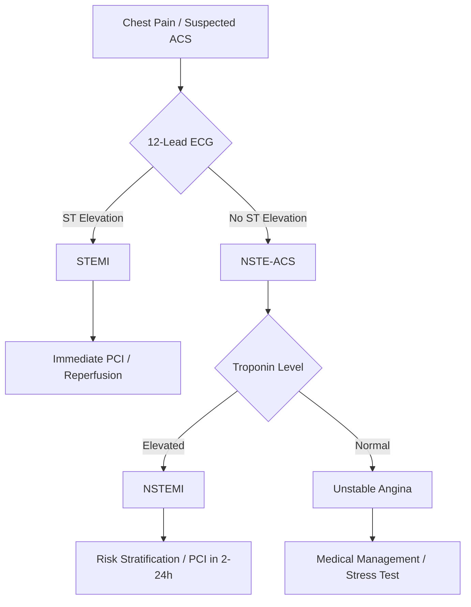

# Acute Coronary Syndromes (ACS)

**Acute coronary syndromes** represent a spectrum of conditions resulting from acute myocardial ischemia, ranging from unstable angina to ST-elevation myocardial infarction. They share a common underlying pathophysiology: **atherosclerotic plaque rupture or erosion with varying degrees of thrombus formation**.

## Classification

| Type | ST changes | Troponin |
| --- | --- | --- |
| Unstable angina (UA) | None / transient | Normal |
| NSTEMI | None / transient | Elevated |
| STEMI | Persistent ST elevation | Elevated |

## Pathophysiology

The central event is **plaque rupture or erosion**, exposing the thrombogenic lipid core to circulating blood.

## Clinical Presentation

Patients typically present with chest pain that is:

-   New-onset (≤ 2 months)
-   Acceleration/worsening of stable angina
-   At rest and prolonged (> 20 minutes)

## Risk Stratification

The **GRACE score** uses age, heart rate, blood pressure, creatinine, Killip class, ST deviation, cardiac arrest at admission, and elevated biomarkers to estimate 6-month mortality.

## Initial Management

All ACS patients receive:

-   Aspirin 162–325 mg chewed
-   P2Y12 inhibitor (ticagrelor preferred; clopidogrel if contraindicated)
-   Anticoagulation (unfractionated heparin, enoxaparin, or fondaparinux)
-   High-intensity statin (atorvastatin 80 mg)
-   Beta-blocker (if no acute heart failure, hypotension, or bradycardia)

> **STEMI vs NSTEMI distinction matters:** STEMI requires *immediate* reperfusion (PCI ≤ 90 min, or fibrinolytics ≤ 30 min).
