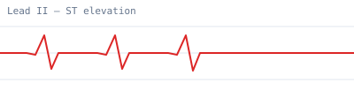

# Using Images in Library Articles

This article demonstrates how Library markdown references images stored in an
`images/` folder next to the `.md` file — the same convention used by the
QBank and Flashcard engines.

## How it works

Place image files in an `images/` subfolder beside your markdown file, then
reference them with a relative path:

```md

```

Bare filenames are also supported and resolve to the `images/` folder
automatically:

```md

```

## Example

Below is an ECG tracing stored at `images/ecg-lead-ii.svg` and referenced as
`images/ecg-lead-ii.svg`:


Absolute URLs, `data:` URIs, and `/`-rooted paths are left untouched and used
verbatim. Tap any image in the reader to open it in the lightbox.
